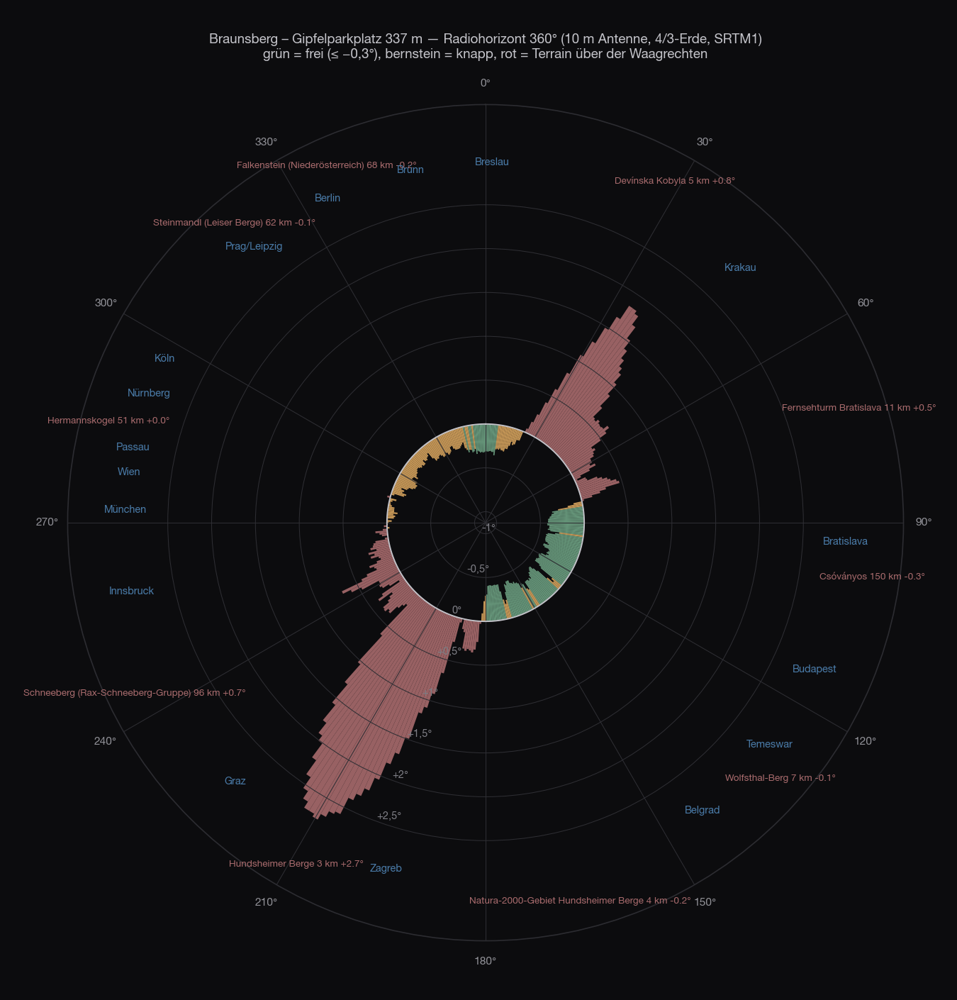
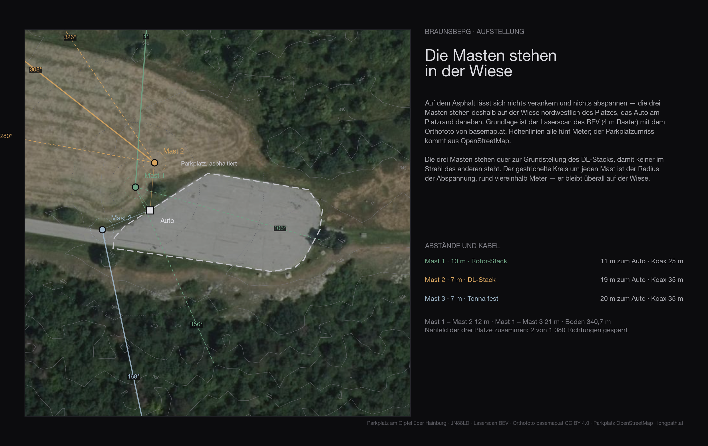
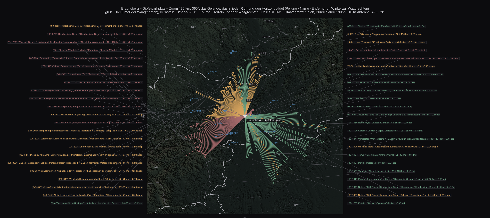
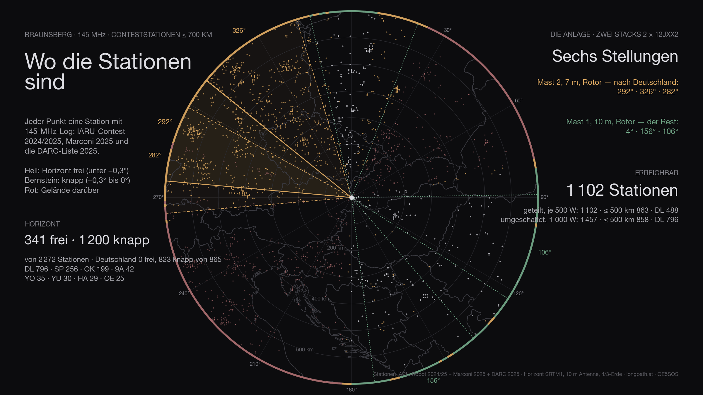
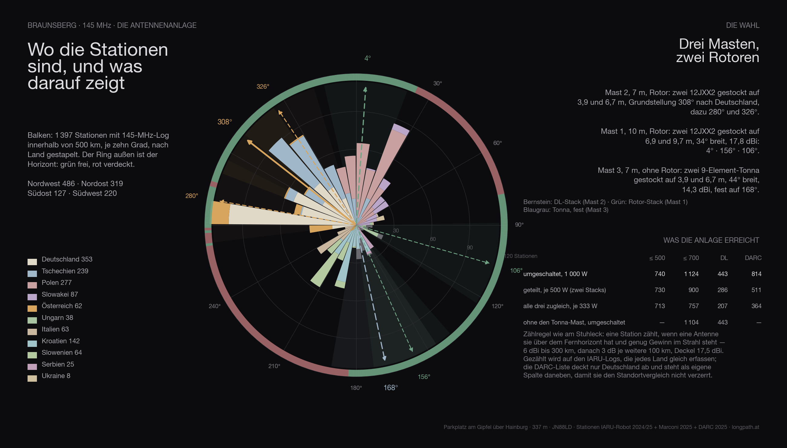
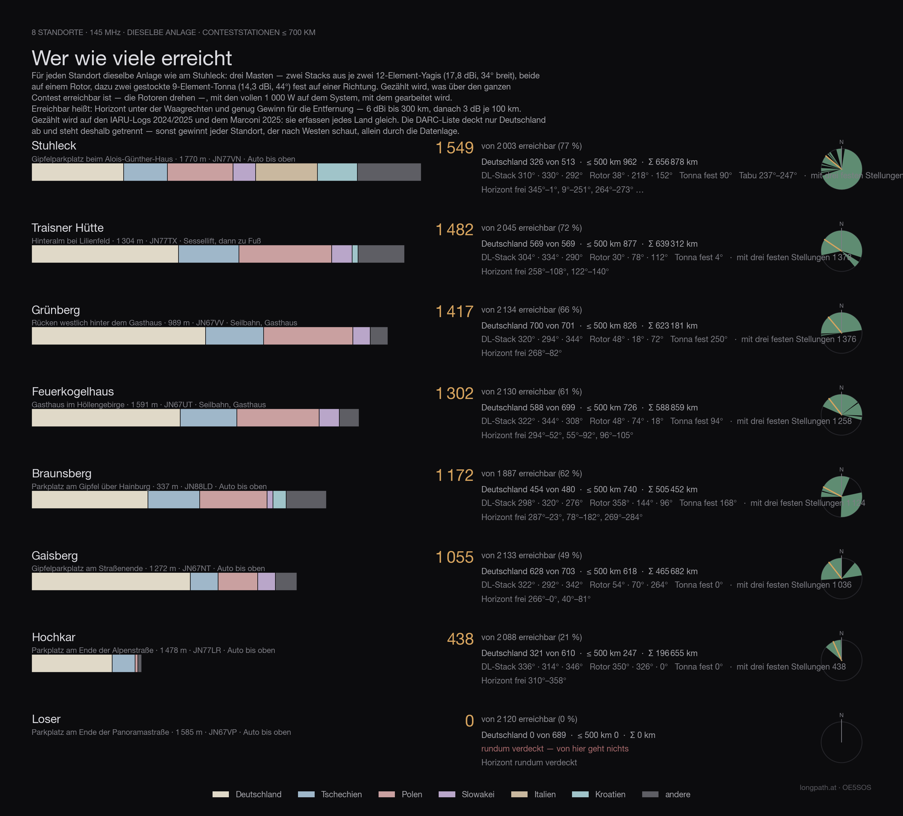

Der Platz ist der Traum jeder Portabel-Station: eine asphaltierte Fläche von sechzig mal
dreißig Metern, Straße bis hinauf, öffentlich, keine Schranke davor, und der Gipfel liegt
vierzig Meter daneben. Hainburg an der Donau unten, Bratislava elf Kilometer östlich, die
March und die slowakische Grenze in Sichtweite.

Die Frage ist nicht der Platz. Die Frage ist, was von dort aus über den Horizont ragt —
und ob Deutschland dazugehört, wo die meisten Gegenstationen sitzen.

## Wie

Die Methode wie bei [Feuerkogel](/blog/feuerkogel-horizont/#wie), [Stuhleck](/blog/stuhleck-horizont/)
und den anderen Standorten dieser Reihe: SRTM-Geländemodell, ein Strahl je Grad bis
500 Kilometer, zehn Meter Antennenhöhe, Erdkrümmung mit dem 4/3-Radius, Namen der
Hindernisse aus der Wikipedia. Dazu diesmal der **Laserscan des BEV** für die ersten
140 Meter rund um den Platz — Bäume, Kuppe, Hütte — und die Contestlogs darübergelegt.

Drei Klassen: **frei** heißt mehr als drei Zehntelgrad unter der Waagrechten, **knapp**
zwischen −0,3° und null, **zu** heißt Gelände über der Waagrechten.

## Rundum

Von 360 Grad sind **107 frei, 113 knapp und 140 zu**. Das ist das schlechteste Verhältnis
der ganzen Reihe — und trotzdem ist der Platz nicht schlecht, weil die freien Grade
dorthin zeigen, wo etwas los ist.

| Richtung | Was den Horizont setzt | Entfernung | Winkel |
|---|---|---|---|
| 353–⁠7° | **frei** — Südmähren: Boleradice, Hustopeče, Ždánický les | 85–117 km | −0,30…⁠−0,35° |
| 8–⁠23° | knapp — Kleine Karpaten, Brdo, Radimov | 5–116 km | −0,29…⁠0,00° |
| 24–⁠77° | **Devínska Kobyla** und die Kleinen Karpaten | 5–20 km | +0,02…⁠+1,84° |
| 81–⁠97° | **frei** — über Bratislava hinweg in die Slowakei | 11–147 km | −0,34…⁠−0,42° |
| 99–⁠129° | **frei** — Donauebene, Csóványos, Bajót | 6–151 km | −0,31…⁠−0,42° |
| 133–⁠179° | **frei** — Kleine Ungarische Tiefebene, Bakony | 3–133 km | −0,30…⁠−0,41° |
| 183–⁠261° | **Hundsheimer Berg** (480 m, 3 km), dahinter Alpen | 2–129 km | +0,00…⁠+2,76° |
| 263–⁠266° | Schöpfl und der Wienerwaldkamm | 54–78 km | +0,05…⁠+0,14° |
| 269–⁠284° | knapp — Wienerwald: Troppberg, Dahaberg | 52–71 km | −0,01…⁠−0,12° |
| 287–⁠346° | knapp — Kahlenberg, Leiser Berge, Weinviertel | 34–99 km | −0,04…⁠−0,27° |

Zwei Berge machen die Hälfte des Kreises zu. Der **Hundsheimer Berg**, 480 Meter hoch und
drei Kilometer südwestlich, steht mit bis zu **+2,76°** im Weg — er nimmt alles von Süden
über Südwest bis West, also Graz, Slowenien, Kroatien, Italien und die ganzen Alpen.
Die **Devínska Kobyla** auf der slowakischen Seite, 514 Meter, fünf Kilometer nordöstlich,
macht mit +1,84° den Nordosten zu: Krakau, Warschau, Ostpolen.

Und dann ist da der Westen. Von 269° bis 346° — der ganze Sektor, in dem Deutschland
liegt — bleibt der Horizont zwischen **−0,27° und −0,01°**. Das ist nicht frei und nicht
zu: Es ist der Wienerwald, 34 bis 99 Kilometer weit, der fast genau auf der Sichtlinie
steht.

## Der Platz

Der Laserscan sagt zum Platz selbst nur Gutes. Der Asphalt liegt auf **343 Metern**
(SRTM rechnet mit 337, der Scan misst genauer), er ist eben, und rundherum steht
in den ersten 140 Metern fast nichts:

| Antennenhöhe | Richtungen, die das Nahfeld sperrt |
|---|---|
| 6 m | 6° |
| 8 m | 1° |
| 10 m | keine |
| 12 m und mehr | keine |

**Aufgestellt wird aber nicht auf dem Asphalt**, sondern daneben: Erdnägel und Abspannung
brauchen Wiese. Das Gelände gibt sie her — nordwestlich schließt an den Platz eine offene
Grasfläche an, die im Laserscan glatt und im Orthofoto baumfrei ist. Die drei Masten
stehen dort quer zur Grundstellung des DL-Stacks, damit keiner im Strahl des anderen
steht, und das Auto am Platzrand daneben:

| | Lage zum Platzmittelpunkt | zum Auto | Koax |
|---|---|---:|---:|
| Mast 1 · 10 m · Rotor-Stack | 32 m west, 14 m nord | 11 m | 25 m |
| Mast 2 · 7 m · DL-Stack | 25 m west, 23 m nord | 19 m | 35 m |
| Mast 3 · 7 m · Tonna fest | 45 m west, 3 m süd | 20 m | 35 m |

Boden an den Mastplätzen 340,7 Meter, gut zwei Meter unter dem Asphalt. Der Radius der
Abspannung — rund viereinhalb Meter — bleibt bei allen dreien auf der Wiese. Das Nahfeld
kostet in dieser Aufstellung zusammen zwei von 1 080 Richtungen; ein Platz weiter
nordwestlich wäre ganz frei, dafür lägen dreiundzwanzig Meter mehr Kabel zwischen Auto
und Mast.

Zwei Dinge, die nicht im Geländemodell stehen: Der Braunsberg ist ein **keltisches
Oppidum** — hundertsiebzig Meter westlich des Parkplatzes liegt eine eingetragene
archäologische Stätte, und am Gipfel stehen mehrere Denkmäler. Wer hier Erdnägel in den
Boden bringt, klärt das vorher. Und die Hundsheimer Berge sind Natura-2000-Gebiet; der
Parkplatz selbst liegt am Rand davon.

## Die Karte

Der Unterschied zu jedem Bergstandort dieser Reihe springt ins Auge: Die Striche nach
Südosten laufen 130 bis 150 Kilometer weit, bis in den Bakony und an die Donau bei
Budapest. Nach Südwesten hören sie nach zwei Kilometern auf — am eigenen Nachbarberg.

## Bis 700 Kilometer

<figure class="zoomkarte" data-basis="/karten/horizont/braunsberg-horizont-" data-min="200" data-max="700" data-schritt="100" data-start="200">
  
  <figcaption>
    <button type="button" data-zoom="-1" aria-label="Radius um 100 km verkleinern">−</button>
    Radius 200 km
    <button type="button" data-zoom="+1" aria-label="Radius um 100 km vergrößern">+</button>
  </figcaption>
</figure>

Auf der [Übersicht bis 800 Kilometer](/karten/braunsberg-horizont-uebersicht-800km.pdf)
stehen die Gebirge mit ihrem Winkel. Über die Waagrechte ragen nur nahe Nachbarn und,
weiter draußen, der Alpenrand nach Westen: Schneeberg +0,72° in 95 Kilometern,
Hochschwab +0,25° in 148, Ötscher +0,21° in 134. Alles, was dahinter liegt — Bayerischer
Wald, Erzgebirge, Harz —, liegt tief unter dem Horizont; es kommt nur nicht dorthin,
weil der Wienerwald davor steht.

Beide Karten als PDF: [Zoom 180 km](/karten/braunsberg-horizont-zoom-180km.pdf) mit allen
Bergnamen und [Übersicht 800 km](/karten/braunsberg-horizont-uebersicht-800km.pdf) mit der
nummerierten Liste.

## Die Stationen

Von den 1 887 Stationen, die in den Logs bis 700 Kilometer auftauchen, stehen **1 172 über dem Horizont** — Deutschland 454 von 480. Das ist die Obergrenze: mehr kann keine Antenne herausholen, egal wie groß sie ist.

Die Zahl hat aber zwei Hälften. **Wirklich frei** — der Horizont liegt mehr als drei Zehntelgrad unter der Waagrechten — sind 341 Stationen, davon 0 in Deutschland. Die übrigen 831 liegen **knapp**: zwischen −0,3° und null, also im Streifschatten einer Kante. Dort geht etwas, aber mit Verlust — drei bis acht Dezibel, je nach Tag. Der Beitrag nennt beide Zahlen, weil nur beide zusammen den Platz beschreiben. Von den 107 Grad, die frei sind, kommen 113 Grad knappe dazu.

## Die Anlage

Gerechnet ist überall dieselbe Anlage wie am Stuhleck, mit **drei Masten**:

- **Mast 2**, 7 Meter, Rotor: zwei 12JXX2 gestockt auf 3,9 und 6,7 m — der Stack, der nach Deutschland schaut.
- **Mast 1**, 10 Meter, Rotor: zwei 12JXX2 gestockt auf 6,9 und 9,7 m, 34° breit, 17,8 dBi.
- **Mast 3**, 7 Meter, ohne Rotor: zwei gestockte 9-Element-Tonna auf 3,9 und 6,7 m, 44° breit, 14,3 dBi — fest auf eine Richtung.

Die Stellungen sind nicht geraten, sondern gesucht: Für Braunsberg fallen sie auf **308° / 280° / 326°** am DL-Stack, **4° / 156° / 106°** am Rotor-Stack und **168°** für die festen Tonnas.

Gespeist wird über einen Umschalter. Liegen die vollen 1 000 Watt auf dem System, auf dem gerade gearbeitet wird, und drehen die beiden Rotoren über den Contest, kommt die Anlage auf **1 172 Stationen** (Deutschland 454, nach der DARC-Liste 814). Teilt man die Leistung auf die beiden Rotor-Stacks, also 500 Watt je Stack, sind es 947; mit nur drei festen Stellungen je Rotor 1 124; auf alle drei Systeme zugleich verteilt nur noch 757 — drei Richtungen kosten mehr Leistung, als sie an Fläche bringen. Der Tonna-Mast allein steuert 20 Stationen bei, die ohne ihn fehlen würden.

## In drei Dimensionen

<figure class="szene">
  <iframe src="/standort-3d.html?ort=braunsberg&v=1" title="Braunsberg in 3D: Laserscan-Gelände mit Orthofoto, die beiden Masten und die Strahlrichtungen" loading="lazy" allowfullscreen></iframe>
  <figcaption>Ziehen dreht, das Rad zoomt. Die Regler drehen die beiden Stacks, die Knöpfe springen auf die gerechneten Stellungen. <a href="/standort-3d.html?ort=braunsberg">Im Vollbild öffnen</a></figcaption>
</figure>

Derselbe Blick für jeden Standort: das Gelände kommt aus dem Laserscan des BEV, darüber liegt das Orthofoto, die beiden Masten stehen mit ihren gerechneten Höhen darauf. Die Schilder am Rand sind Städte — hell heißt über dem Horizont, grau dahinter.

## Der Vergleich

Alle Standorte dieser Reihe mit **derselben Anlage, derselben Zählregel und denselben Logs** — nur so sind die Zahlen vergleichbar. Erreichbar heißt: Horizont unter der Waagrechten und genug Gewinn für die Entfernung (6 dBi bis 300 km, danach 3 dB je weitere 100 km), bei 1 000 Watt auf dem System, mit dem gerade gearbeitet wird. **Beide großen Antennen hängen am Rotor** — gezählt wird deshalb, was über den ganzen Contest erreichbar ist, nicht was eine feste Stellung gerade abdeckt.

Gezählt wird auf den **IARU-Logs 2024/2025 und dem Marconi 2025**: die erfassen jedes Land gleich. Die DARC-Liste deckt nur Deutschland ab — sie steht als eigene Spalte daneben, sonst gewinnt jeder Standort, der nach Westen schaut, allein durch die Datenlage.

| Standort | erreichbar | Deutschland | DARC-Liste | ≤ 500 km | Zugang |
|---|---:|---:|---:|---:|---|
| Stuhleck · 1 770 m | 1 549 | 326 | 569 | 962 | Auto bis oben |
| Traisner Hütte · 1 304 m | 1 482 | 569 | 988 | 877 | Sessellift, dann zu Fuß |
| Grünberg · 989 m | 1 417 | 700 | 1 271 | 826 | Seilbahn, Gasthaus |
| Feuerkogelhaus · 1 591 m | 1 302 | 588 | 1 056 | 726 | Seilbahn, Gasthaus |
| **Braunsberg** · 337 m | 1 172 | 454 | 814 | 740 | Auto bis oben |
| Gaisberg · 1 272 m | 1 055 | 628 | 1 199 | 618 | Auto bis oben |
| Hochkar · 1 478 m | 438 | 321 | 559 | 247 | Auto bis oben |
| Loser · 1 585 m | 0 | 0 | 0 | 0 | Auto bis oben |

Braunsberg steht damit auf **Platz 5 von 8**.

Wer die älteren Beiträge dieser Reihe kennt, findet dort andere Zahlen: Die wurden mit der ersten Bestückung gerechnet — ein Yagi-Stack und ein Vierfachquad-Stack mit 69° Keulenbreite. Seit die Wahl auf zwei schmale 12JXX2-Stacks gefallen ist, verschiebt sich die Reihenfolge: Mehr Gewinn, weniger Breite bevorzugt die Standorte, deren Stationen in einer Richtung gebündelt liegen, und kostet die, die rundum offen sind. Die festen Tonnas auf Mast 3 holen einen Teil dieser Breite zurück.

## Die Daten

| | |
|---|---|
| Standort | Braunsberg — Parkplatz am Gipfel über Hainburg |
| Koordinaten | 48,15348 N / 16,95733 O · 337 m · JN88LD |
| Zugang | Straße bis zum Platz |
| Horizont frei | 287°–23°, 78°–182°, 269°–284° |
| Grad frei / knapp / zu | 107° / 113° / 140° |
| Stationen ≤ 700 km | 341 frei, 831 knapp, von 1 887 |
| Deutschland (IARU) | 0 frei, 454 knapp, von 480 |
| Deutschland (DARC-Liste) | 842 unter der Waagrechten von 882 |
| Anlage | drei Masten · Mast 1 10 m (2 × 12JXX2 auf 6,9/9,7 m, Rotor) · Mast 2 7 m (2 × 12JXX2 auf 3,9/6,7 m, Rotor) · Mast 3 7 m (2 × 9-el-Tonna auf 3,9/6,7 m, fest) |
| Stellungen | DL-Stack 308° / 280° / 326° · Rotor-Stack 4° / 156° / 106° · Tonna fest 168° |
| umgeschaltet · 1 000 W | 1 172 · ≤ 500 km 740 · DL 454 · mit drei festen Stellungen je Rotor 1 124 |
| geteilt · je 500 W | 947 · ≤ 500 km 740 · DL 300 |
| alle drei zugleich · je 333 W | 757 · ≤ 500 km 713 · DL 207 |
| ohne den Tonna-Mast | 1 104 statt 1 124 |
| Σ Kilometer | 505 452 km |
| mit strengem Maß | nur Richtungen unter −0,3°: 297 · ≤ 500 km 240 · DL 0 |

## Was das heißt

Für den Osten und Südosten ist der Braunsberg ein sehr guter Platz, und das mit einem
Komfort, den keiner der Bergstandorte bietet: hinauffahren, aufbauen, fertig. **Bratislava
−0,40°, Budapest −0,33°, Temeswar −0,42°, Belgrad −0,30°, Bukarest −0,32°, Brünn −0,30°,
Breslau −0,31°** — alles frei, das meiste über flaches Land. In der Kleinen Ungarischen
Tiefebene und entlang der Donau sitzt im Contest genug, und die Entfernungen zählen doppelt.

Nach Deutschland ist er der schwächste Platz der Reihe, und zwar nicht ein bisschen.
**Keine einzige der dreißig deutschen Städte steht wirklich frei:** München −0,05°,
Passau −0,02°, Stuttgart −0,07°, Nürnberg −0,12°, Frankfurt −0,09°, Leipzig −0,13°,
Dresden −0,20°, Hamburg −0,21°, Berlin −0,24°, Köln −0,23°. Alle zwischen null und einem
Viertelgrad darunter — der Wienerwald schneidet jede dieser Verbindungen an. Das bedeutet
nicht, dass nichts geht: Eine Kante in fünfzig Kilometern kostet je nach Tag drei bis acht
Dezibel, und mit 1 000 Watt auf einem Stack sind 454 deutsche Stationen in der Rechnung (nach der
DARC-Liste 814), die auch anderswo erreichbar wären. Aber sie kommen nie sauber an, und ein
Tropo-Abend hilft hier weniger als auf einem Berg, der frei steht.

**Masthöhe ändert daran nichts.** Fünf Meter mehr Antenne verschieben den Winkel zu einer
Kante in fünfzig Kilometern um sechs Tausendstel Grad. Was hier fehlt, sind nicht Meter,
sondern Kilometer Abstand zum Wienerwald — oder eine Position dahinter.

Wer vom Braunsberg aus Contest macht, dreht also nach Osten und Südosten und nimmt
Deutschland als das, was es dort ist: ein Sektor, in dem man arbeitet, wenn die
Bedingungen mitspielen, und nicht der, auf den man die feste Antenne stellt. Für
Deutschland bleiben [Grünberg](/blog/gruenberg-horizont/),
[Gaisberg](/blog/gaisberg-horizont/) und [Feuerkogel](/blog/feuerkogel-horizont/) die
Adressen.

## Vorbehalt

Rechnung, keine Messung. Das SRTM-Raster hat dreißig Meter, der Laserscan vier; das
Fernfeld kennt weder Bäume noch Gebäude, nur das Gelände. Die Ausbreitung nimmt die
Standardatmosphäre an — ein Tropo-Abend rechnet anders, und gerade bei den knappen
Richtungen entscheidet er mehr als jedes Zehntelgrad in dieser Tabelle. Die Zählung der
Stationen ist eine Modellrechnung mit Antennendiagrammen aus Herstellerdaten, keine
Vorhersage von Verbindungen.

Was die Rechnung sicher sagt: wohin dieser Platz offen steht, und dass der Westen eine
Kante hat.

Der Rest wird gemessen — oben, mit Antenne.
