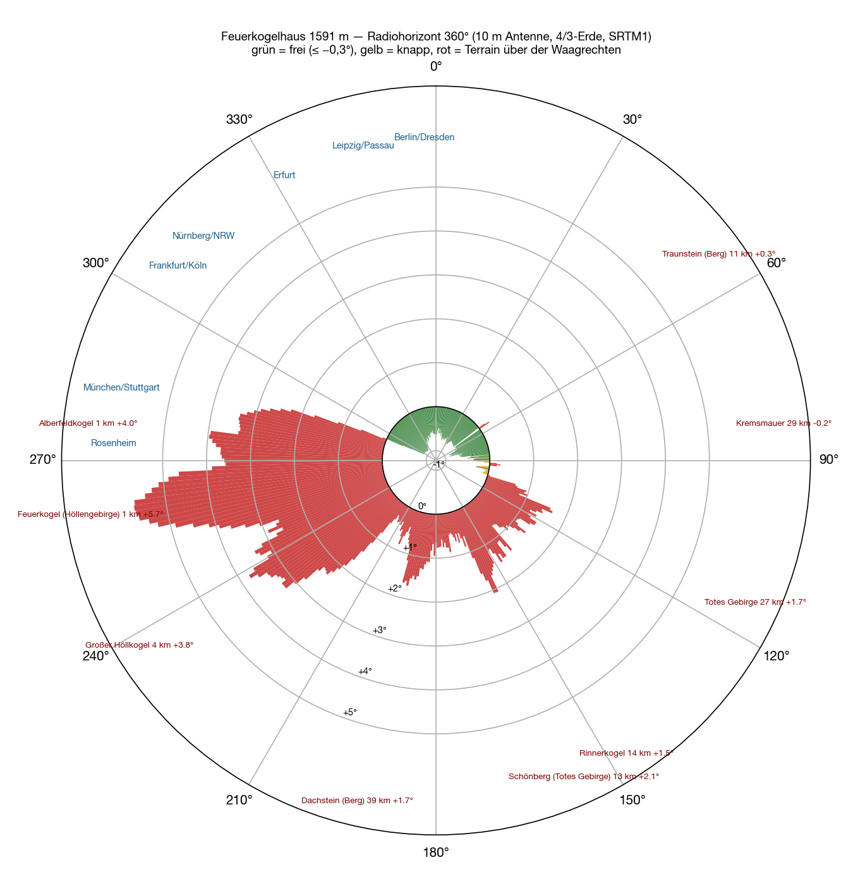
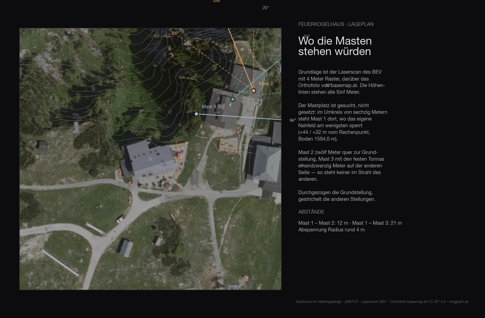
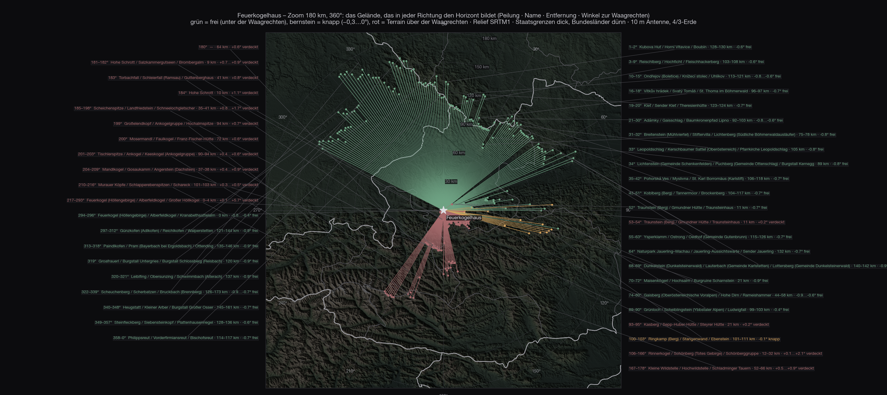
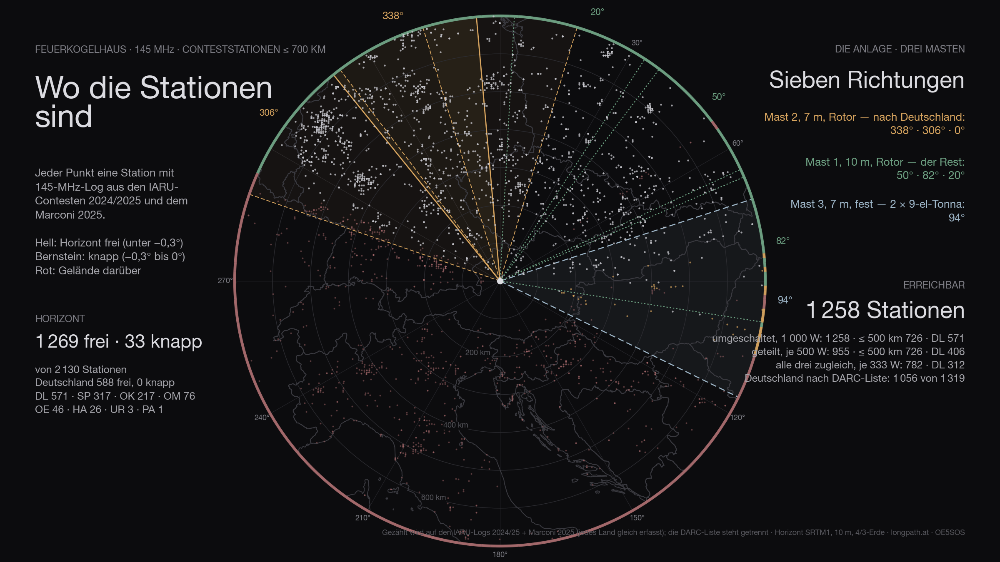
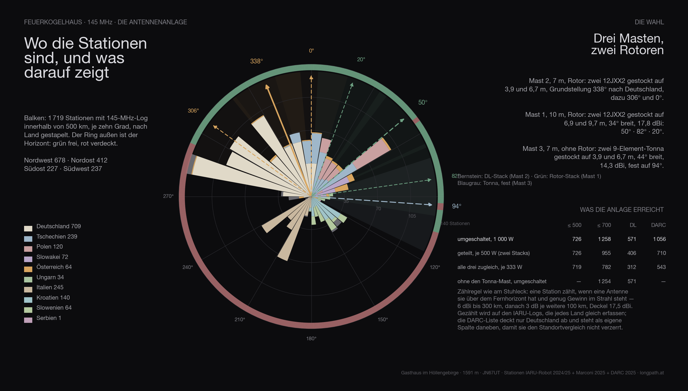

A VHF contest is not won at the rig but at the site. On two metres what counts is how far below the horizontal the antenna can look — every tenth of a degree a mountain takes away in front of it costs range in exactly that direction. The **Gasthaus Feuerkogelhaus** on the Höllengebirge above Ebensee, **1,591 metres**, JN67UT, is a candidate for next season. Before I go up there with mast and Yagi, I wanted to know what the place really sees.

So I calculated it. Not estimated, not read off a map: calculated.

## How

The basis is NASA's **SRTM terrain model**, one elevation value every thirty metres. From the position of the inn a ray runs outward for every whole degree of the compass — sampled every twenty metres over the first three kilometres, every hundred further out, to 500 kilometres. For each point comes the angle at which it appears from a **ten-metre antenna**, with the earth's curvature at the usual 4/3 radius for radio waves. The highest angle along the ray is the horizon in that direction.

A value below zero means the antenna looks over everything; the terrain lies below the horizontal. A value above zero means a mountain stands in the line of sight. In between, from −0.3° to 0°, I call it marginal.

A small tool for this is taking shape as part of my contest logger; the terrain tiles were already on the machine anyway. The names of the mountains come from Wikipedia, looked up at each obstruction point.

## All the way round

The picture is unambiguous, and it has two halves.

**From 294° over north to 52° the horizon is clear**, plus 55° to 83°. The terrain that forms it there lies **75 to 172 kilometres** away — the Bavarian Forest, the Bohemian Forest, the Mühlviertel and Waldviertel, the pre-Alps — and stays **0.5 to 0.95 degrees below the horizontal**. In this half exactly one mountain stands in the way: the **Traunstein**, 10.8 kilometres, at 54°, with +0.26°. A notch two degrees wide; left and right of it it drops straight back to −0.7°. The Kasberg at 94° does the same once more, with +0.25°.

**From 106° over south to 293° it is closed.** The Totes Gebirge, the Dachstein, the Tauern — and above all the mountain itself.

| Direction | What sets the horizon | Distance | Angle |
|---|---|---|---|
| 106–⁠138° | Totes Gebirge: Großer Priel, Feuertalberg, Feigentalhimmel | 16–29 km | +0.7…⁠+1.7° |
| 140–⁠166° | Rinnerkogel, Schönberg, Loser | 12–18 km | +0.5…⁠+2.1° |
| 168–⁠180° | Schladming Tauern: Hochwildstelle, Hochgolling | 52–66 km | +0.5…⁠+1.0° |
| 186–⁠198° | Dachstein: Gjaidstein, Scheichenspitze, Dirndln | 37–41 km | +1.1…⁠+1.6° |
| 200–⁠216° | Radstadt Tauern, Ankogel, Goldberg group with Sonnblick and Hocharn | 72–103 km | +0.3…⁠+0.8° |
| 218–⁠248° | Kranabethsattel, **Großer Höllkogel** | 0.7–4 km | +1.2…⁠+3.8° |
| 250–⁠278° | **Alberfeldkogel** | 0.6–1.3 km | +3.3…⁠+5.7° |
| 280–⁠292° | the **Feuerkogel summit knoll** next to the house | 0.3 km | +0.6…⁠+3.4° |

The biggest obstacle is none of the big names. It is the **Alberfeldkogel, 600 metres from the house**, with almost six degrees — and the knoll of the Feuerkogel itself, 300 metres from the terrace. Everything behind it can be forgotten: the **Großglockner** would actually stand above the horizontal at +0.73°, but on its bearing the Kranabethsattel ridge of the Höllengebirge stands in front at +2.2°. The Watzmann, the Hochkönig, the Großvenediger: the same fate. Zugspitze, Marmolada, Ortler, Bernina, Mont Blanc are below the horizon anyway.

## The site

The terrain of the first 136 metres around the site comes from the **Austrian lidar survey** on a four-metre grid — trees, buildings and knolls included. The ground at the mast is at **1594.0 metres**.

| Antenna height | Directions blocked by the near field |
|---|---|
| 6 m | 57° |
| 8 m | 43° |
| 10 m | 24° |
| 12 m | 17° |
| 15 m | 5° |

Even with ten metres of mast the near field still blocks **24 degrees** — on top of whatever the far horizon closes off anyway.

## The map

Every line is one degree. To the north the green lines run to the Bavarian Forest and the Bohemian Forest, because only there does something come along that forms the horizon. To the south the red ones stop after twelve, twenty, forty kilometres — and to the west after a few hundred metres.

## Out to 700 kilometres

The question came up whether anything further out still interferes: the Harz, the Ore Mountains, the Tatras. The answer lies in the curvature of the earth. With the 4/3 radius the ground at 500 kilometres lies **14.7 kilometres** below the horizontal, at 800 kilometres **37.7 kilometres**. No mountain in Europe gets up there. Beyond roughly 250 kilometres nothing can rise above the horizon any more — and indeed the most distant obstacle that still manages it is the Goldberg group at 103 kilometres.

<figure class="zoomkarte" data-basis="/karten/horizont/feuerkogel-horizont-" data-min="200" data-max="700" data-schritt="100" data-start="200">
  
  <figcaption>
    <button type="button" data-zoom="-1" aria-label="Shrink radius by 100 km">−</button>
    Radius 200 km
    <button type="button" data-zoom="+1" aria-label="Grow radius by 100 km">+</button>
  </figcaption>
</figure>

Plus and minus pull the map out from 200 to 700 kilometres — the green fan to the north does not grow with it, because the horizon there simply lies at 75 to 172 kilometres. The amber fan to the west is the opposite: there the horizon is 300 metres to 4 kilometres from the house — a line that short would be invisible on the map, so blocked bearings are drawn to at least six per cent of the radius. What the map shows there is not distance, but that the direction is closed. The [overview out to 800 kilometres](/karten/feuerkogelhaus-horizont-uebersicht-800km.pdf) lists 78 ranges and peaks with their angle: Giant Mountains −1.2°, High Tatras −1.55°, Harz −1.7°, Eifel −2.0°, Apuseni −2.3°. All below the horizontal, all invisible. Two outliers only turned up in the cross-check: the **Hochgolling** (177°, 61 km, +0.98°) and the **Hochalmspitze** (199°, 95 km, +0.75°) really do rise above the horizon — their summits lay exactly between two of the one-degree rays. To the south that changes nothing; it is closed there anyway.

Both maps as PDF, to zoom into and print: [zoom 180 km](/karten/feuerkogelhaus-horizont-zoom-180km.pdf) with every mountain named, and [overview 800 km](/karten/feuerkogelhaus-horizont-uebersicht-800km.pdf) with the numbered list.

## The stations

Of the 2 130 stations that appear in the logs within 700 kilometres, **1 302 are above the horizon** — Germany 588 of 699. That is the ceiling: no antenna, however large, gets past it.

The figure has two halves. **Genuinely clear** — horizon more than three tenths of a degree below the horizontal — are 1 269 stations, 588 of them in Germany. The other 33 are **marginal**: between −0.3° and zero, in the grazing shadow of an edge. Something works there, but at a loss of three to eight decibels depending on the day. Both numbers are given, because only both together describe the site. Of the 154 degrees that are clear, 13 marginal degrees come on top.

## The antennas

The same array is computed everywhere as the one on the Stuhleck, with **three masts**:

- **Mast 2**, 7 metres, rotator: two 12JXX2 stacked at 3.9 and 6.7 m — the stack that looks at Germany.
- **Mast 1**, 10 metres, rotator: two 12JXX2 stacked at 6.9 and 9.7 m, 34° wide, 17.8 dBi.
- **Mast 3**, 7 metres, no rotator: two stacked 9-element Tonnas at 3.9 and 6.7 m, 44° wide, 14.3 dBi — fixed on one heading.

The headings are not guessed but searched: for Feuerkogelhaus they come out at **338° / 306° / 0°** for the DL stack, **50° / 82° / 20°** for the rotator stack and **94°** for the fixed Tonnas.

Feeding goes through a switch. With the full 1 000 watts on whichever system is being worked, the array reaches **1 302 stations** across the contest (Germany 588, by the DARC list 1 056). Split across the two rotator stacks, 500 watts each, it is 998; with only three fixed headings per rotator 1 258; spread over all three systems at once only 782 — three directions cost more power than they gain in coverage. The Tonna mast alone adds 4 stations that would otherwise be missing.

## In three dimensions

<figure class="szene">
  <iframe src="/feuerkogel-3d.html?v=4" title="Feuerkogelhaus in 3D: orthophoto on the laser-scan terrain with the inn, the Christophorushütte, both antenna masts and the directions towards Germany" loading="lazy" allowfullscreen></iframe>
  <figcaption>Drag to turn, scroll to zoom. The cities stand on a ring at antenna height; bright means clear, grey blocked. <a href="/feuerkogel-3d.html">Open full screen</a></figcaption>
</figure>

The scene shows the summit as the laser scan knows it: the inn, the Christophorushütte, the chapel and the cable-car station with their measured heights, the orthophoto on top. The masts and lobes belong to the installation calculated in [Two times two Yagis](/en/blog/feuerkogel-antennen/); here you mainly see where the Feuerkogel looks out freely — north over the lowlands — and where the Höllengebirge closes off the south.

## The comparison

Every site in this series with **the same array, the same counting rule and the same logs** — only then are the numbers comparable. Reached means: horizon below the horizontal and enough gain for the distance (6 dBi to 300 km, then 3 dB per further 100 km), with 1 000 watts on whichever system is being worked. **Both large antennas sit on rotators** — so the count is what is reachable across the whole contest, not what one fixed heading covers.

The count runs on the **IARU logs 2024/2025 and the Marconi 2025**: they record every country alike. The DARC list covers Germany only — it sits in its own column, otherwise every site that looks west wins on the data alone.

| Site | reached | Germany | DARC list | ≤ 500 km | Access |
|---|---:|---:|---:|---:|---|
| Stuhleck · 1 770 m | 1 549 | 326 | 569 | 962 | drive to the top |
| Traisner Hütte · 1 304 m | 1 482 | 569 | 988 | 877 | chairlift, then on foot |
| Grünberg · 989 m | 1 417 | 700 | 1 271 | 826 | cable car, inn |
| **Feuerkogelhaus** · 1 591 m | 1 302 | 588 | 1 056 | 726 | cable car, inn |
| Braunsberg · 337 m | 1 172 | 454 | 814 | 740 | drive to the top |
| Gaisberg · 1 272 m | 1 055 | 628 | 1 199 | 618 | drive to the top |
| Hochkar · 1 478 m | 438 | 321 | 559 | 247 | drive to the top |
| Loser · 1 585 m | 0 | 0 | 0 | 0 | drive to the top |

Feuerkogelhaus therefore comes **4 of 8**.

Anyone who knows the earlier articles in this series will find different numbers there: those were computed with the first line-up — one Yagi stack and one quad stack with a 69° beamwidth. Since the choice fell on two narrow 12JXX2 stacks, the order shifts: more gain and less width favours the sites whose stations bunch in one direction, and costs the ones that stand open all round. The fixed Tonnas on mast 3 win part of that width back.

## The data

| | |
|---|---|
| Site | Feuerkogelhaus — Gasthaus im Höllengebirge |
| Coordinates | 47,81581 N / 13,72151 O · 1 591 m · JN67UT |
| Access | cable car, inn on site |
| Horizon clear | 294°–52°, 55°–92°, 96°–105° |
| Degrees clear / marginal / blocked | 154° / 13° / 193° |
| Stations ≤ 700 km | 1 269 clear, 33 marginal, of 2 130 |
| Germany (IARU) | 588 clear, 0 marginal, of 699 |
| Germany (DARC list) | 1 094 below the horizontal of 1 319 |
| Array | three masts · mast 1 10 m (2 × 12JXX2 at 6.9/9.7 m, rotator) · mast 2 7 m (2 × 12JXX2 at 3.9/6.7 m, rotator) · mast 3 7 m (2 × 9-el Tonna at 3.9/6.7 m, fixed) |
| Headings | DL-Stack 338° / 306° / 0° · Rotor-Stack 50° / 82° / 20° · Tonna fest 94° |
| switched · 1 000 W | 1 302 · ≤ 500 km 726 · DL 588 · with three fixed headings per rotator 1 258 |
| split · 500 W each | 998 · ≤ 500 km 726 · DL 420 |
| all three at once · 333 W each | 782 · ≤ 500 km 719 · DL 312 |
| without the Tonna mast | 1 254 instead of 1 258 |
| Σ kilometres | 588 859 km |
| strict count | only directions below −0.3°: 933 · ≤ 500 km 701 · DL 406 |

## What it means

For a contest what counts is where the other stations sit — and most of them sit in Germany. From Franconia over North Rhine-Westphalia to Berlin and Saxony the horizon from the Feuerkogelhaus is as clear as it can be on a mountain: Nuremberg −0.9°, Cologne −0.9°, Erfurt −0.8°, Berlin −0.6°, Passau −1.0°.

The sore spot lies at 281° to 292°: **Munich, Stuttgart, Rosenheim**. Exactly there the Feuerkogel knoll stands in front of the house. But the calculation also shows the way out: **200 to 300 metres to the west, up on the knoll** — 1,610 metres — Munich (−0.35°) and Stuttgart (−0.88°) are open, without losing anything to the north. Rosenheim and the Allgäu stay behind the Alberfeldkogel; the mountain won't give that up.

## Caveat

This is a calculation, not a measurement. The terrain model knows neither trees nor buildings nor the transmitter mast at the cable-car station, it has a thirty-metre grid, and the propagation assumes a standard atmosphere — a tropo evening calculates differently. What the calculation says for certain: where you need not even try, and where every decibel is worth it.

The rest gets measured — up there, with an antenna.
