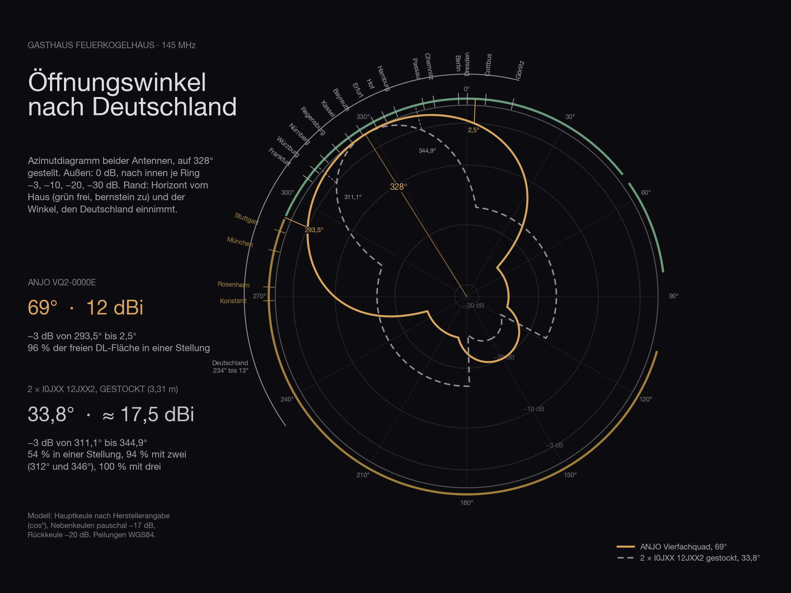

[What the Feuerkogel sees](/en/blog/feuerkogel-horizont/), I have worked out: clear from 294° through north to 92°, closed from 106° through south to 293°. That is half the answer. The other half is who sits in that clear half — because an antenna that looks towards the finest horizon is worth nothing if nobody transmits there. For the site at the **Gasthaus Feuerkogelhaus** I wanted to put both halves together: where the two fixed antennas should point, and where the rotatable one.

This too I did not guess.

## Where the numbers come from

Every station that submits a log after a VHF contest appears with callsign and locator in a results list. The DARC publishes its lists with all entrants, the **IARU Region 1 robot** collects the logs of every country. I took what exists for 145 MHz: the five DARC contests of 2025 — March, May, July, IARU September, Marconi — with **1,357 distinct German stations**, and from the robot the IARU contest 2024, the IARU contest 2025 and the Marconi 2025 with **3,215 logs from 35 countries** between them.

Each locator yields bearing and distance from the Feuerkogelhaus, and the horizon calculation from the day before says whether that bearing is clear or a mountain stands in front of it. Anything beyond 700 kilometres does not count — not because it would be impossible, but because you do not align an antenna to what works once a year in a tropo opening.

A log is a station that means it. Whoever makes a handful of contacts and submits nothing is missing from the lists. That skews the numbers towards the big stations — for the question of where to point the antenna, that is the right skew.

## Germany

Three quarters of all German contest stations lie, seen from the Feuerkogel, **between 300° and 340°**. The Ruhr and the Rhineland make up the largest locator field, followed by Hanover, Cologne, Frankfurt, Thuringia.

| Field | Region | Stations 2025 | Bearing | Distance | clear |
|---|---|---|---|---|---|
| JO31 | Ruhr, Rhineland | 161 | 312° | 625 km | all |
| JO52 | Hanover, Magdeburg | 108 | 339° | 544 km | all |
| JO30 | Cologne, Eifel, Westerwald | 96 | 305° | 583 km | all |
| JN58 | Munich, Upper Bavaria | 92 | 287° | 188 km | **10** |
| JO40 | Frankfurt, Rhine-Main | 86 | 309° | 458 km | all |
| JO50 | Thuringia, North Hesse | 80 | 329° | 360 km | all |
| JN48 | Stuttgart, Swabia | 72 | 287° | 361 km | **5** |
| JN49 | Rhine-Neckar, Odenwald | 66 | 298° | 406 km | 54 |
| JO62 | Berlin, Brandenburg | 56 | 357° | 518 km | all |
| JO42 | East Westphalia, Weser | 54 | 328° | 609 km | all |
| JN59 | Nuremberg, Franconia | 51 | 319° | 268 km | all |
| JO61 | Saxony, Dresden | 47 | 353° | 395 km | all |

The column on the far right is the one that matters. **Munich and Stuttgart**, 164 stations together and the nearest big fields of all, lie at 287° — exactly behind the Feuerkogel summit and the Alberfeldkogel. Of 92 Munich stations the house sees ten. With the Allgäu, Lake Constance and the Saarland that makes **212 of the 1,357 German stations that cannot be reached from the Feuerkogel**, whatever the antenna. The mountain does not give that away, and it is the price of this site.

The centre of gravity of the reachable German stations lies at **327°**. That is, to the degree, the direction the plain area calculation had already given — Germany is densest where it is largest.

## The east is as big as Germany

That was the surprise. Within 700 kilometres and with a clear horizon the Feuerkogelhaus reaches **1,388 stations**: Germany 622, **Poland 356, Czechia 236**, Slovakia 87, Austria 48, Hungary 24. Poland and Czechia together are as many as Germany, and they are closer — Prague 300 kilometres, Brno 300, Ostrava 410, Kraków 470.

The bars show it more clearly than any map: there are **two blocks**. One from 300° to 350°, that is Germany. One from 0° to 70°, that is Bohemia, Moravia, Silesia, Poland. Between them, around north, it thins out briefly. And whatever would lie beyond 106° stands behind the Totes Gebirge and the Tauern: Hungary but for 24 stations, Slovenia, Croatia with 151, **Italy with 377 stations within range** — from the Feuerkogel not a single one of them.

## Two fixed antennas

For the two fixed antennas I calculated with the ANJO quad array, because it is 69° wide — wide enough for a whole block to fit in without anyone turning anything. Two of them one above the other on one mast, switched by relay.

**The first at 328°.** Its sector from 293.5° to 2.5° holds **620 of the 622 reachable German stations** — Cologne and Frankfurt at the left edge, Berlin and Dresden at the right, everything between at full gain.

**The second at 37°.** Not at Prague, which was the first thought. Prague lies at 11.5°, and a quad pointed there would look from 337° to 46° — the left half of that the first antenna already has, the right half ends short of Kraków, Katowice, Ostrava and the whole of Slovakia. At 37° instead, from 2.5° to 71.5°, sit **all 356 Polish and all 236 Czech stations**, plus 37 Slovak and 25 Austrian ones. Prague is then 25° off the axis, which costs 1.6 dB and bothers nobody. Together the two fixed antennas cover **92 percent of all reachable stations**, and neither ever has to be turned.

A second quad for Germany, by the way, would have added five percent. The second antenna belongs to the east.

## Where the stack turns

What is missing is the rest — and the gain. The rotatable antenna is a stack of two 12-element Yagis, 33.8° wide, with a good five decibels more than the quad. For that it has five positions.

| Position | Sector | Who sits there |
|---|---|---|
| 312° | 295–329° | Cologne, Frankfurt, the Ruhr, Nuremberg — western Germany, the farthest |
| 346° | 329–3° | Thuringia, Hanover, Hamburg, Berlin, Dresden |
| 16° | 359–33° | Prague, Budweis, Wrocław, Poznań, central Poland — 346 stations; the quad already has them, the stack adds five decibels for the far ones |
| **54°** | 37–71° | Brno, Ostrava, Kraków, Katowice, southern Poland — 300 stations with the most active logs in the east |
| **88°** | 71–105° | Slovakia, Vienna, Bratislava, western Hungary — 108 stations no fixed quad sees |

The 54° position has one more reason. At 53° stands the **Traunstein**, the one notch in the clear horizon: 1.6 degrees wide, +0.27° high, and right behind it Brno and Katowice. It costs three to five decibels of troposcatter there. No mast helps against it — you would need fifty metres more — but the stack pays it back with its gain. And 88° is the position for which there is otherwise no antenna: Slovakia and Vienna lie outside both quads, and a third fixed quad for them would have half its beam in the Totes Gebirge.

## Caveat

These are logs, not stations. Whoever does not submit is missing; whoever was not on in 2024 and 2025, too. Two years are a sample, and a good tropo evening shifts everything north. The horizon calculation still knows neither the house nor the cable-car station next to the mast, and the Kasberg at 94° makes Budapest, at +0.16°, a question of diffraction rather than yes or no.

What the calculation says for certain: the first antenna looks at Germany, the second at Czechia and Poland, and the third turns. The rest gets measured — up there, with an antenna.
