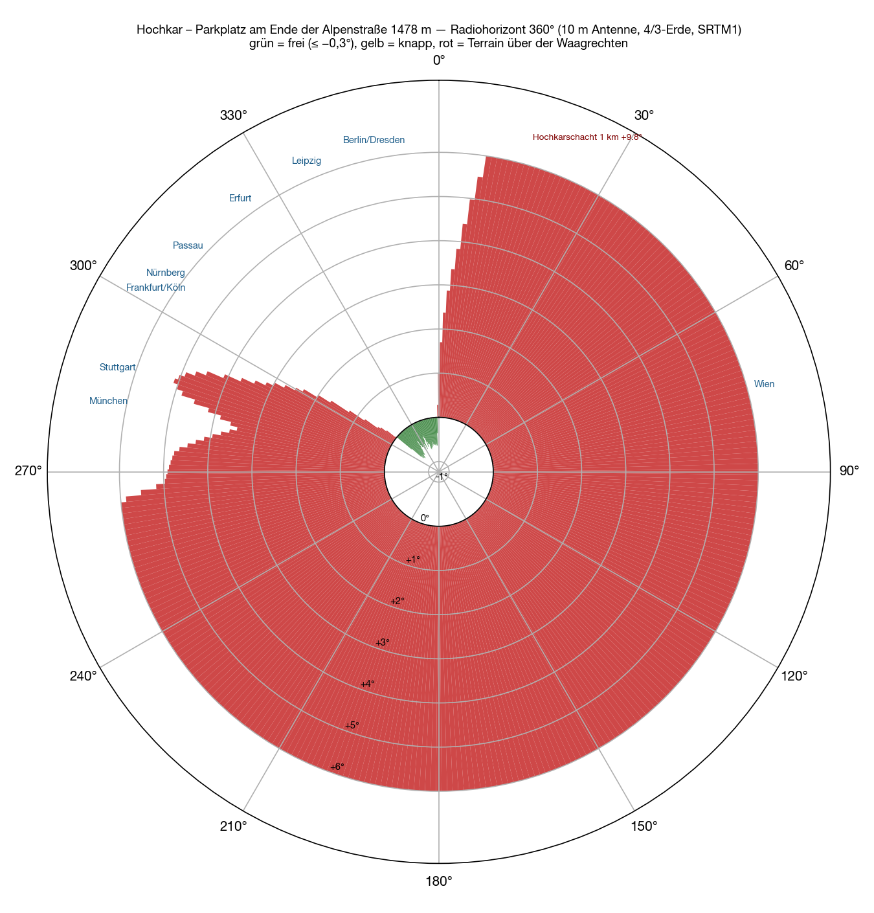
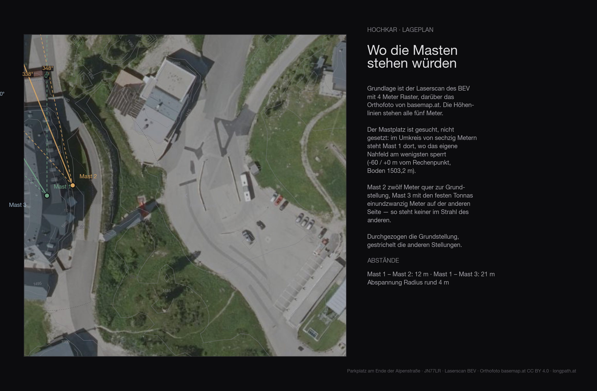
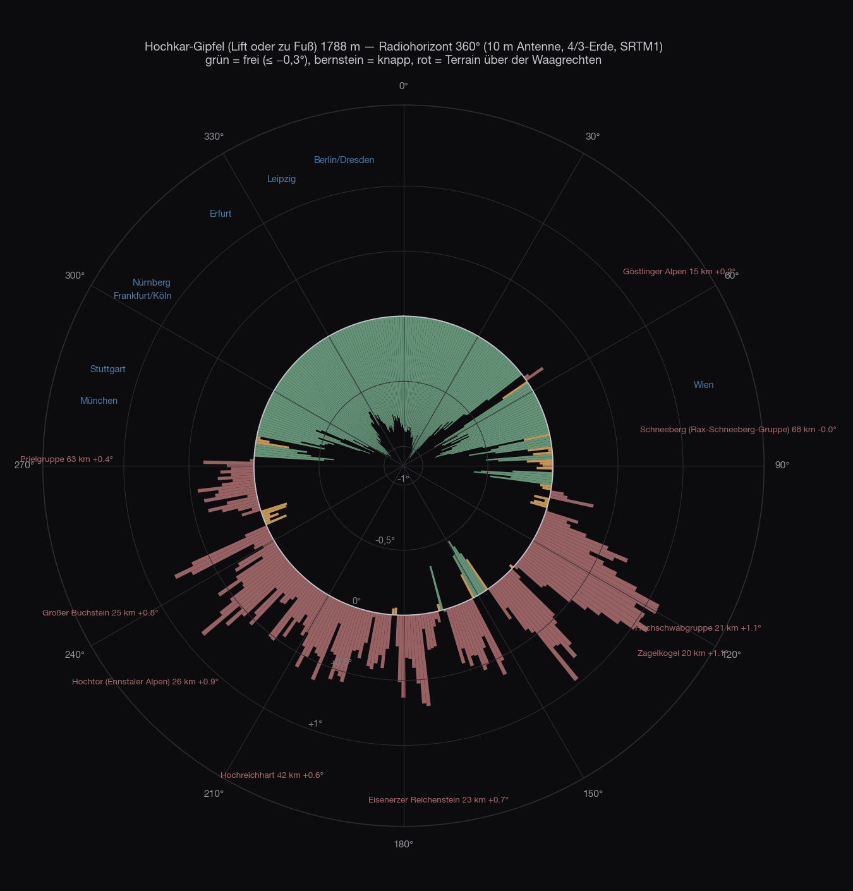
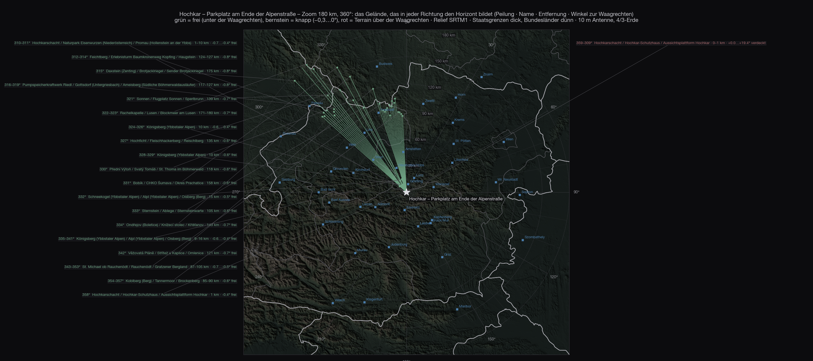
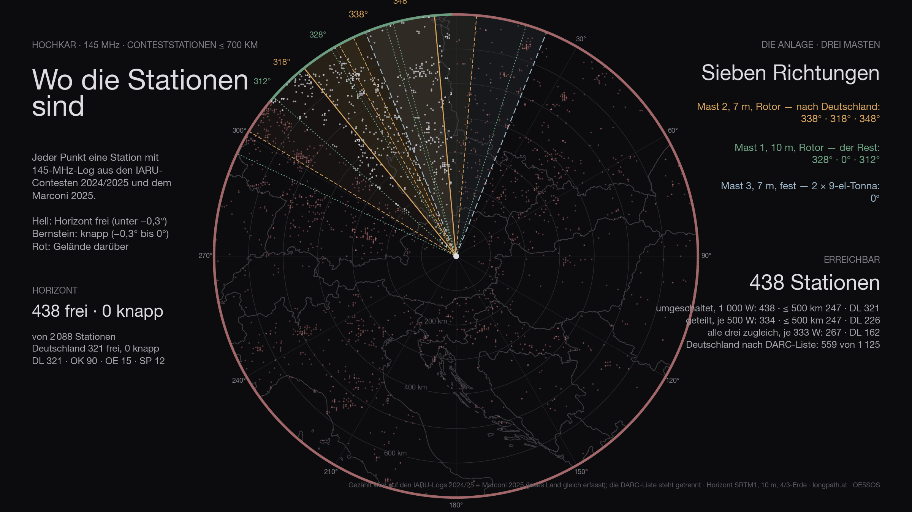
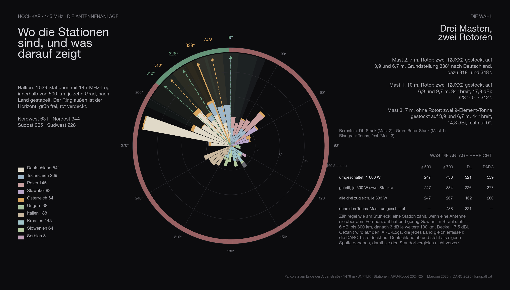

The fourth site, and the first outside the Salzkammergut: the **Hochkar** near Göstling an der Ybbs, 1,808 metres, with the **Hochkar Alpenstraße** up to the ski area. The toll road ends at the Hochkarhof at **1,478 metres**, JN77LR — you cannot get higher by car in Lower Austria. Exactly this point is calculated: the car park at the end of the road.

## How

The method is the same for every site in this series: **SRTM terrain model**, one ray per degree out to 500 kilometres, ten metres of antenna height, earth curvature with the 4/3 radius, obstacle names from Wikipedia. It is set out in full in the [Feuerkogel article](/en/blog/feuerkogel-horizont/#how). Added to it: the **Austrian lidar survey** for the first 140 metres around the site, and the contest logs laid over the result.

Three classes: **clear** means more than three tenths of a degree below the horizontal, **marginal** between −0.3° and zero, **blocked** means terrain above the horizontal.

Plus a 400-metre grid around the car park, to see whether one corner of it is better than another.

## All the way round

The car park lies in a bowl. To the south and south-west stands the Hochkar ridge with the summit, 400 to 1,200 metres away, **+12° to +19°**. To the east the ridges of the ski area, 600 metres, +8° to +15°. To the north and north-east another ridge at 600 to 900 metres, +1° to +13°. To the west, where Munich and Stuttgart lie, a knoll at 900 metres with +3° to +5°.

**Clear is only a wedge from 310° to 358°** — but a good one: −0.4 to −0.8°, formed by the Königsberg at nine kilometres and further out by the Bohemian Forest and the Bavarian Forest at 100 to 175 kilometres. That is the direction of Passau, Erfurt, Leipzig, Berlin and Dresden.

| Direction | What sets the horizon | Distance | Angle |
|---|---|---|---|
| 0–⁠59° | ridges north and north-east of the car park | 0.6–0.9 km | +1…⁠+13° |
| 60–⁠149° | ridges of the ski area to the east | 0.6–1.0 km | +7…⁠+15° |
| 150–⁠239° | **Hochkar ridge and summit** | 0.3–1.2 km | +12…⁠+19° |
| 240–⁠299° | knoll west of the car park | 0.1–0.9 km | +2.8…⁠+13° |
| 300–⁠309° | the same knoll, tailing off | 0.9 km | +0.1…⁠+2.5° |
| 310–⁠358° | **clear** — Königsberg, Bohemian Forest, Bavarian Forest | 9–175 km | −0.4…⁠−0.8° |

The grid around the car park changes nothing: within the car park all points are alike. It only gets better 400 metres up the piste, at 1,640 metres — and no car goes there.

## The site

The terrain of the first 136 metres around the site comes from the **Austrian lidar survey** on a four-metre grid — trees, buildings and knolls included. The ground at the mast is at **1503.2 metres**.

| Antenna height | Directions blocked by the near field |
|---|---|
| 6 m | 54° |
| 8 m | 39° |
| 10 m | 39° |
| 12 m | 32° |
| 15 m | 31° |

Even with ten metres of mast the near field still blocks **39 degrees** — on top of whatever the far horizon closes off anyway.

## The summit

As on the Loser, the good view sits 330 metres of altitude above the car park. From the **Hochkar summit**, 1,808 metres, it is **clear from 282° over north to 52°**, −0.3 to −1.1°: Munich −0.53°, Stuttgart −0.46°, Nuremberg −1.03°, Cologne −0.99°, Erfurt −0.74°, Berlin −0.79°, Dresden −0.75°. To the east and south the Dürrenstein, the Hochschwab and the Enns Valley Alps close it, +0.2 to +1.1°, with marginal gaps towards the Rax and the Schneeberg. A first-class north-west site — by lift or on foot, not by car.

## The map

## Out to 700 kilometres

<figure class="zoomkarte" data-basis="/karten/horizont/hochkar-horizont-" data-min="200" data-max="700" data-schritt="100" data-start="200">
  
  <figcaption>
    <button type="button" data-zoom="-1" aria-label="Shrink radius by 100 km">−</button>
    Radius 200 km
    <button type="button" data-zoom="+1" aria-label="Grow radius by 100 km">+</button>
  </figcaption>
</figure>

Of the 78 ranges on the [overview out to 800 kilometres](/karten/hochkar-horizont-uebersicht-800km.pdf) none rises above the horizontal from the car park that does not vanish behind the bowl anyway. Both maps as PDF: [zoom 180 km](/karten/hochkar-horizont-zoom-180km.pdf) and [overview 800 km](/karten/hochkar-horizont-uebersicht-800km.pdf).

## The stations

Of the 2 088 stations that appear in the logs within 700 kilometres, **438 are above the horizon** — Germany 321 of 610. That is the ceiling: no antenna, however large, gets past it.

The figure has two halves. **Genuinely clear** — horizon more than three tenths of a degree below the horizontal — are 438 stations, 321 of them in Germany. The other 0 are **marginal**: between −0.3° and zero, in the grazing shadow of an edge. Something works there, but at a loss of three to eight decibels depending on the day. Both numbers are given, because only both together describe the site. Of the 49 degrees that are clear, 0 marginal degrees come on top.

## The antennas

The same array is computed everywhere as the one on the Stuhleck, with **three masts**:

- **Mast 2**, 7 metres, rotator: two 12JXX2 stacked at 3.9 and 6.7 m — the stack that looks at Germany.
- **Mast 1**, 10 metres, rotator: two 12JXX2 stacked at 6.9 and 9.7 m, 34° wide, 17.8 dBi.
- **Mast 3**, 7 metres, no rotator: two stacked 9-element Tonnas at 3.9 and 6.7 m, 44° wide, 14.3 dBi — fixed on one heading.

The headings are not guessed but searched: for Hochkar they come out at **338° / 318° / 348°** for the DL stack, **328° / 0° / 312°** for the rotator stack and **0°** for the fixed Tonnas.

Feeding goes through a switch. With the full 1 000 watts on whichever system is being worked, the array reaches **438 stations** (Germany 321, by the DARC list 559). Split across the two rotator stacks, 500 watts each, it is 334; spread over all three systems at once only 267 — three directions cost more power than they gain in coverage. The Tonna mast alone adds 0 stations that would otherwise be missing.

## In three dimensions

<figure class="szene">
  <iframe src="/standort-3d.html?ort=hochkar&v=1" title="Hochkar in 3D: lidar terrain with orthophoto, the two masts and the beam headings" loading="lazy" allowfullscreen></iframe>
  <figcaption>Drag to turn, wheel to zoom. The sliders turn the two stacks, the buttons jump to the computed headings. <a href="/standort-3d.html?ort=hochkar">Open full screen</a></figcaption>
</figure>

The same view for every site: the terrain comes from the Austrian lidar survey, the orthophoto lies on top, and the two masts stand on it at their computed heights. The labels around the rim are cities — bright means above the horizon, grey means behind it.

## The comparison

Every site in this series with **the same array, the same counting rule and the same logs** — only then are the numbers comparable. Reached means: horizon below the horizontal and enough gain for the distance (6 dBi to 300 km, then 3 dB per further 100 km), with 1 000 watts on whichever system is being worked.

The count runs on the **IARU logs 2024/2025 and the Marconi 2025**: they record every country alike. The DARC list covers Germany only — it sits in its own column, otherwise every site that looks west wins on the data alone.

| Site | reached | Germany | DARC list | ≤ 500 km | Access |
|---|---:|---:|---:|---:|---|
| Traisner Hütte · 1 304 m | 1 378 | 543 | 988 | 875 | chairlift, then on foot |
| Grünberg · 989 m | 1 376 | 672 | 1 271 | 826 | cable car, inn |
| Stuhleck · 1 770 m | 1 298 | 307 | 569 | 921 | drive to the top |
| Feuerkogelhaus · 1 591 m | 1 258 | 571 | 1 056 | 726 | cable car, inn |
| Braunsberg · 337 m | 1 124 | 443 | 814 | 740 | drive to the top |
| Gaisberg · 1 272 m | 1 036 | 620 | 1 199 | 618 | drive to the top |
| **Hochkar** · 1 478 m | 438 | 321 | 559 | 247 | drive to the top |
| Loser · 1 585 m | 0 | 0 | 0 | 0 | drive to the top |

Hochkar therefore comes **7 of 8**.

Anyone who knows the earlier articles in this series will find different numbers there: those were computed with the first line-up — one Yagi stack and one quad stack with a 69° beamwidth. Since the choice fell on two narrow 12JXX2 stacks, the order shifts: more gain and less width favours the sites whose stations bunch in one direction, and costs the ones that stand open all round. The fixed Tonnas on mast 3 win part of that width back.

## The data

| | |
|---|---|
| Site | Hochkar — Parkplatz am Ende der Alpenstraße |
| Coordinates | 47,71884 N / 14,91741 O · 1 478 m · JN77LR |
| Access | road all the way up |
| Horizon clear | 310°–358° |
| Degrees clear / marginal / blocked | 49° / 0° / 311° |
| Stations ≤ 700 km | 438 clear, 0 marginal, of 2 088 |
| Germany (IARU) | 321 clear, 0 marginal, of 610 |
| Germany (DARC list) | 562 below the horizontal of 1 125 |
| Array | three masts · mast 1 10 m (2 × 12JXX2 at 6.9/9.7 m, rotator) · mast 2 7 m (2 × 12JXX2 at 3.9/6.7 m, rotator) · mast 3 7 m (2 × 9-el Tonna at 3.9/6.7 m, fixed) |
| Headings | DL-Stack 338° / 318° / 348° · Rotor-Stack 328° / 0° / 312° · Tonna fest 0° |
| switched · 1 000 W | 438 · ≤ 500 km 247 · DL 321 · DARC 559 |
| split · 500 W each | 334 · ≤ 500 km 247 · DL 226 |
| all three at once · 333 W each | 267 · ≤ 500 km 247 · DL 162 |
| without the Tonna mast | 438 instead of 438 |
| Σ kilometres | 196 655 km |
| strict count | only directions below −0.3°: 334 · ≤ 500 km 247 · DL 226 |

## What it means

From the car the Hochkar is a **one-direction site**: Passau −0.77°, Erfurt −0.56°, Berlin −0.59°, Dresden −0.55°, Hanover −0.51°, Kassel −0.70°, Dortmund −0.71° — everything between 310° and 358° works about as well as from the Feuerkogel. But Nuremberg (+0.47°), Cologne (+0.82°), Frankfurt (+1.7°), Munich (+3.4°) and Stuttgart (+5.0°) stand behind the knoll to the west, and the bulk of German VHF stations sits exactly there. Not enough for a contest; for targeted contacts into eastern Germany it is a very deep horizon.

Whoever takes the summit has the best north-west horizon of these four sites. From the car park, the [Grünberg](/en/blog/gruenberg-horizont/) and the [Feuerkogel](/en/blog/feuerkogel-horizont/) remain the addresses for Germany.

## Caveat

A calculation, not a measurement. The bowl is a close-range problem — ridges at 300 to 900 metres, thirty-metre grid: the order of magnitude is right, the single degree is not. The Wikipedia names of the nearby obstacles on the maps are the nearest entry in each case, not always the ridge itself.
