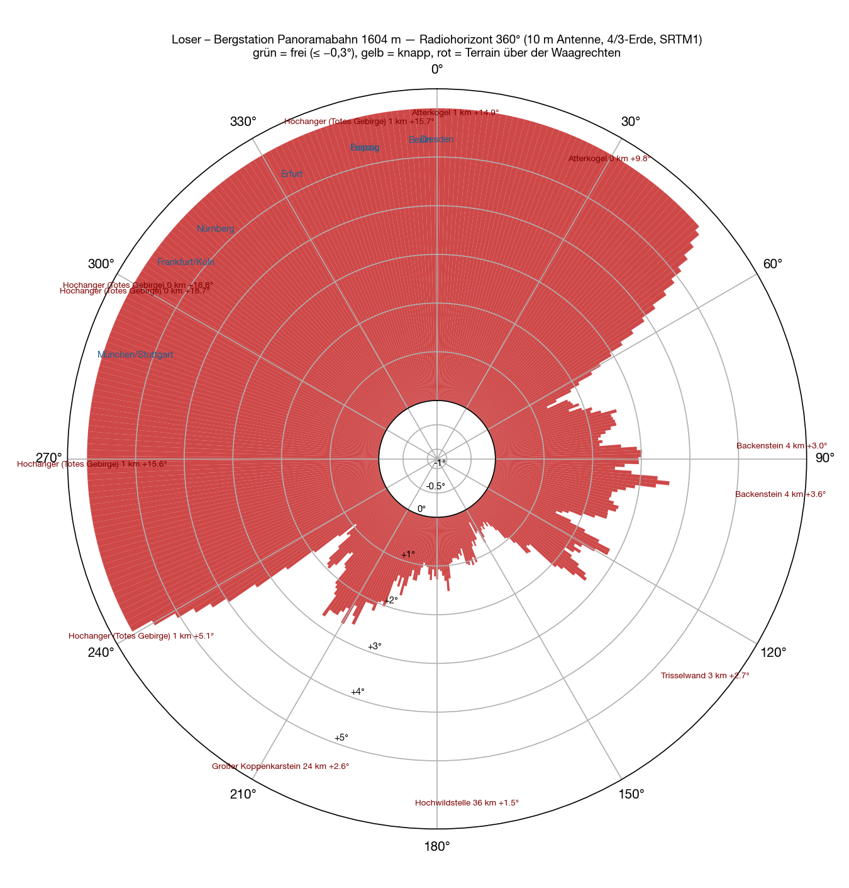
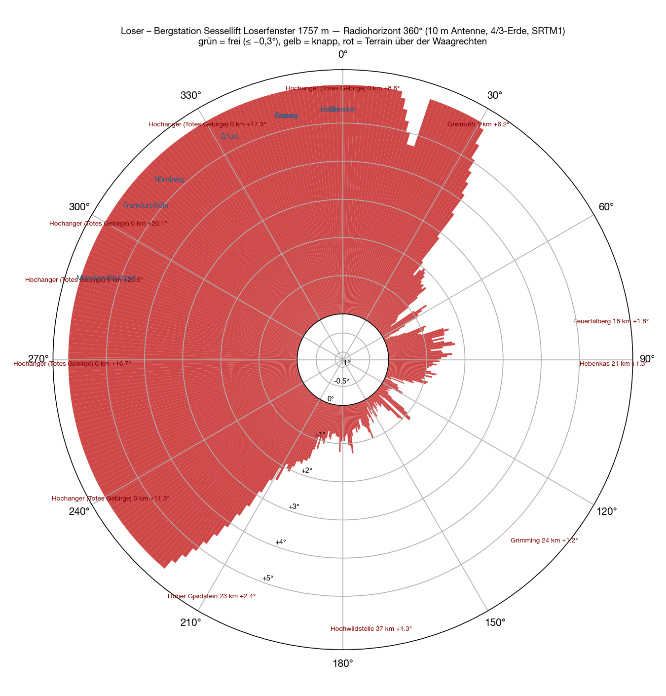
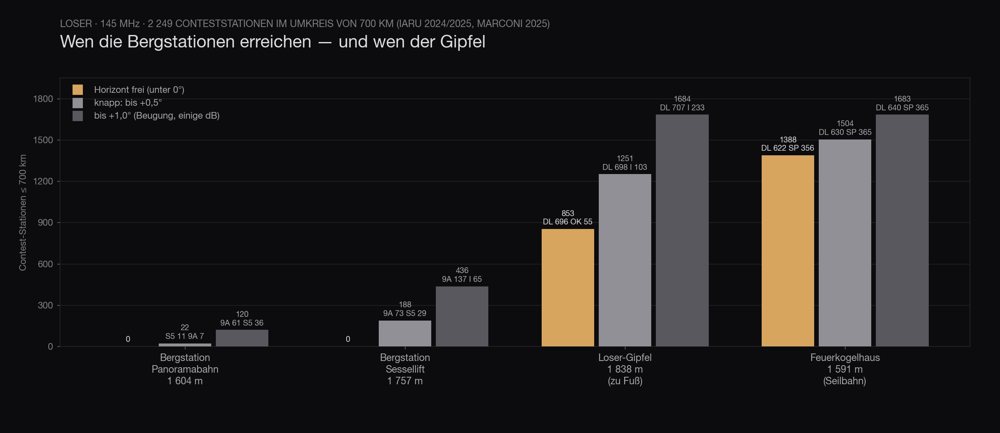
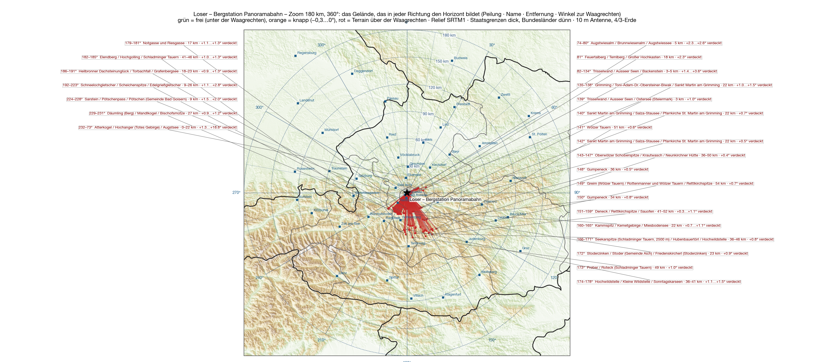

The best site is the one where you do not have to walk. Mast, antennas, amplifier, batteries, tent — anyone who has carried that up a ridge understands the sentence. A cable car has recently been running up the **Loser**: the **Panoramabahn** from Altaussee, 856 metres at the bottom, **1,604 metres** at the top, and whoever prefers to drive parks a hundred metres away at the end of the panorama road. The car park has [already been done](/en/blog/loser-horizont/): closed all the way round. But a top station usually stands a little higher and a little freer than the car park, and the Loser even has two — above the gondola the **Loserfenster chairlift** ends at **1,757 metres**.

So I calculated both, in full.

## How

The method is the same as for the [five sites before](/en/blog/feuerkogel-horizont/#how): SRTM terrain model, one ray per degree, ten-metre antenna, 4/3 earth, 500 kilometres out, the names of the obstacles from Wikipedia. New is the second step from the [last post](/en/blog/feuerkogel-stationen/): the 3,215 contest logs of the IARU contests 2024 and 2025 recalculated for this site — for every station bearing, distance and the question whether the horizon in its direction is clear.

The coordinates of the top stations come from OpenStreetMap, the heights from the terrain model: gondola 47.66137 N / 13.78712 E, chairlift 47.66389 N / 13.78130 E.

## The gondola

**All 360 bearings are closed.** The station stands at the foot of the Hochanger ridge that runs east from the Loser summit: to the north and west the ground rises by sixty to two hundred metres within one to seven hundred metres. That is **+14° to +19° towards Germany** — and Salzburg is just the same, +17°.

| Direction | What sets the horizon | Distance | Angle |
|---|---|---|---|
| 330–⁠60° | Augstsee saddle, **Atterkogel** | 0.1–1 km | +3…⁠+16° |
| 60–⁠140° | Backenstein, **Trisselwand** | 0.2–23 km | +1.0…⁠+3.6° |
| 140–⁠200° | Grimming, Kammspitz, Wölz Tauern, Hochwildstelle | 9–54 km | +0.3…⁠+1.7° |
| 200–⁠240° | Dachstein, Sarstein | 0.6–27 km | +0.9…⁠+5.1° |
| 240–⁠330° | the **ridge above the Loserhütte**, Hochanger | 0.1–1 km | +5.5…⁠+18.8° |

Munich +17.2°, Nuremberg +16.4°, Berlin +14.3°, Prague +12.5°, Linz +10.3°. To the east the Trisselwand does not help either: Vienna +2.2°, Bratislava +2.5°, Budapest +3.0°, Graz +2.5°. Flattest is the south-east, where only the Tauern stand forty, fifty kilometres away — Zagreb +0.7°, Ljubljana +1.1°. Close, but closed.

What does that mean in stations? Within 700 kilometres there are 2,249 contest stations with a log. **With a clear horizon the gondola station reaches not a single one of them.** If you count generously and include everything up to +0.5° of horizon angle — that is diffraction over the edge, a few decibels, not a wall — it is 22: eleven Slovenes, seven Croats. Up to +1.0° it is 120, almost all in Croatia and Slovenia. Not one German, not one Czech, not one Pole.

## The chairlift

A hundred and fifty metres higher, and to the north nothing changes: the Hochanger stands a hundred metres from the station, **+9° to +20°**, Munich +20.4°, Nuremberg +18.7°, Berlin +9.2°, Prague +6.6°. The ridge simply has not been overcome yet — that only happens at the summit, another eighty metres of height further up.

What changes is the south-east. From 110° to 170° the horizon lies only **+0.1° to +1.0°** above the horizontal: Graz +0.4°, Zagreb +0.4°, Ljubljana +0.6°, Vienna +1.0°. Still closed, but so close that it works with diffraction. In stations: with a clear horizon again **zero**; up to +0.5° then **188** (Croatia 73, Slovenia 29, Slovakia 24); up to +1.0° **436**, among them 137 Croats, 65 Italians, 62 Slovenes. That would be, if you want it, a south-east site for the Adriatic region — with a handicap of several decibels in every direction and without a single German log within reach. And whether the chairlift runs in September you have to ask beforehand.

## The comparison

The chart says what the maps say, only in one number. The two top stations: zero. The [Loser summit](/en/blog/loser-horizont/#the-summit), half an hour on foot above the chairlift: **853 stations** with a clear horizon, 696 of them in Germany. And the [Feuerkogelhaus](/en/blog/feuerkogel-stationen/), which a cable car also runs up to: **1,388**.

The top station that looks at Germany is not on the Loser. It is on the Feuerkogel.

## The maps

On the zoom you can see how short the lines are: to the north and west they end after a hundred metres, at the ridge above the Loserhütte. Only to the south-east do they reach the Tauern.

<figure class="zoomkarte" data-basis="/karten/horizont/loser-bergstation-" data-min="200" data-max="700" data-schritt="100" data-start="200">
  
  <figcaption>
    <button type="button" data-zoom="-1" aria-label="Reduce radius by 100 km">−</button>
    Radius 200 km
    <button type="button" data-zoom="+1" aria-label="Increase radius by 100 km">+</button>
  </figcaption>
</figure>

Obstructed directions are drawn to at least six percent of the radius so that they can be seen — the real lines would be a hundred metres long. Both maps as PDF: [zoom 180 km](/karten/loser-bergstation-zoom-180km.pdf) with the mountain names and [overview 800 km](/karten/loser-bergstation-uebersicht-800km.pdf) with the numbered list — 78 ranges and peaks, of which exactly one, the Hochgolling at 183°, actually rises above the horizontal. All the others have disappeared behind the ridge next to the station before they even count.

## Caveat

The terrain model has a thirty-metre grid, knows neither the station itself nor the restaurant beside it, and assumes the standard atmosphere. At a site that is +14° closed to the north, none of that changes anything. The station counts are logs, not stations, and two years old.

The Loser remains what it was after the first calculation: a mountain you have to walk all the way up if you want to work Germany from it. For the site without walking, it is out of the running.
