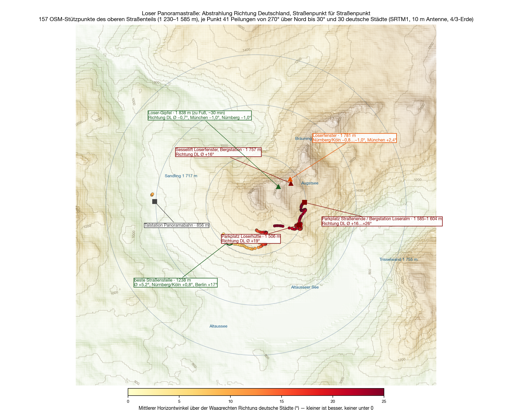

The third site after the [Feuerkogel](/en/blog/feuerkogel-horizont/) and the [Grünberg](/en/blog/gruenberg-horizont/), and the first with a road: the **Loser Panoramastraße** climbs from Altaussee to **1,585 metres**, at the top a car park with a turning area, the mountain restaurant, the top station of the Panoramabahn gondola. Below it, at the Loserhütte, a second car park at 1,506 metres. Drive up, set up, done — that was the idea.

The calculation is the same as before: SRTM terrain model, one ray per degree, ten-metre antenna, 4/3 earth, [method on the Feuerkogel page](/en/blog/feuerkogel-horizont/#how). This time, however, not just for one point but for **the whole road**, point by point.

## All the way round

There is no second half. **All 360 bearings are closed.** The car park sits in a hollow below the Loser summit: to the north and west the ground rises fifty, sixty metres within a hundred — that is **+15° to +27°** in exactly the direction where Germany lies. To the east the Bräuning Zinken and the Trisselwand, +1.5 to +4°. Only to the south-east, between 120° and 180°, does the horizon come down to +0.4 to +1.5° — there the Tauern and the Dachstein stand forty, fifty kilometres away. That is the direction of Graz and Slovenia, not Nuremberg.

From the Loserhütte car park, eighty metres lower, the picture is the same: 360 bearings closed, towards Germany +15 to +22°, Munich +8.5°, Rosenheim +4.6°.

| Direction | What sets the horizon | Distance | Angle |
|---|---|---|---|
| 240–⁠60° | the **Loser summit knoll** and the Augstsee saddle right above the car park | 0.1–0.4 km | +4…⁠+27° |
| 60–⁠120° | Bräuning Zinken, Trisselwand | 0.3–4 km | +1.5…⁠+3.8° |
| 120–⁠180° | Wölz Tauern, Sölk pass, Hochwildstelle | 36–50 km | +0.4…⁠+1.5° |
| 180–⁠240° | Elendberg, Koppenkarstein, Dachstein | 22–41 km | +1.0…⁠+2.5° |

## The road

The question was whether anywhere along the road does better. So for **157 road points** from OpenStreetMap I calculated 41 bearings each from 270° over north to 30°, plus the angles to thirty German cities. The answer is unambiguous: **nowhere.** The whole road lies on the south and east flank of the mountain, and the mountain is always to the north. The least bad spot lies at 1,238 metres in the hairpins below the Loserhütte — there Nuremberg and Cologne come down to +0.8°, Munich to +2.7°, Berlin stays at +17°. Still everything above the horizontal.

The lifts do not help either: the top station of the **Panoramabahn** (1,604 m) stands a hundred metres from the car park and sees the same, +14 to +18°. The top station of the **Loserfenster chairlift** (1,757 m) is a hundred and fifty metres higher, but still below the ridge: +7 to +20°.

## The summit

Only at the very top does the picture change. From the **Loser summit**, 1,838 metres, half an hour on foot from the top station, the ridge is behind you: **clear from 269° over north to 359°**, −0.3 to −1.0°. Munich −0.97°, Nuremberg −1.02°, Cologne −1.01°, Berlin −0.75°, Passau −0.77°, Dresden −0.77°. Marginal only Rosenheim (−0.55°, behind the Untersberg) and Erfurt (−0.17°, the Großer Höllkogel at 333°). To the north-east the Schönberg closes it (+2.3°), to the south everything else. A north-west site — as good as the Feuerkogel in that direction, but without a car and without a roof.

The Loserfenster at 1,781 metres, a few minutes below the summit, would be the compromise: Nuremberg, Cologne, Berlin clear, Munich at +2.4° behind the ridge.

## Out to 700 kilometres

<figure class="zoomkarte" data-basis="/karten/horizont/loser-horizont-" data-min="200" data-max="700" data-schritt="100" data-start="200">
  
  <figcaption>
    <button type="button" data-zoom="-1" aria-label="Shrink radius by 100 km">−</button>
    Radius 200 km
    <button type="button" data-zoom="+1" aria-label="Grow radius by 100 km">+</button>
  </figcaption>
</figure>

The map shows what the numbers say: the lines from the car park end after a hundred metres to fifty kilometres, however far you pull out the radius. On the [overview out to 800 kilometres](/karten/loser-horizont-uebersicht-800km.pdf) only the Hochgolling (43 km, 182°, +1.5°) of 78 ranges rises above the horizontal, and it is to the south.

Both maps as PDF: [zoom 180 km](/karten/loser-horizont-zoom-180km.pdf) and [overview 800 km](/karten/loser-horizont-uebersicht-800km.pdf).

## What it means

From the car the Loser is not a contest site — in no direction, least of all towards Germany. The Panoramastraße has no better spot, the lifts end below the ridge. Whoever wants to work north from here carries the station to the summit and gets in return a horizon that lies −0.75 to −1.0° deep from Munich to Dresden. For everything else the [Grünberg](/en/blog/gruenberg-horizont/) and the [Feuerkogel](/en/blog/feuerkogel-horizont/) are the better addresses.

## Caveat

A calculation, not a measurement. Especially at close range — the knoll a hundred metres from the car park — the result hangs on the thirty-metre grid of the terrain model; the order of magnitude is right, the single degree is not. Whether there is still a corner of the car park that looks around the knoll is better judged on the spot than in the calculation.
