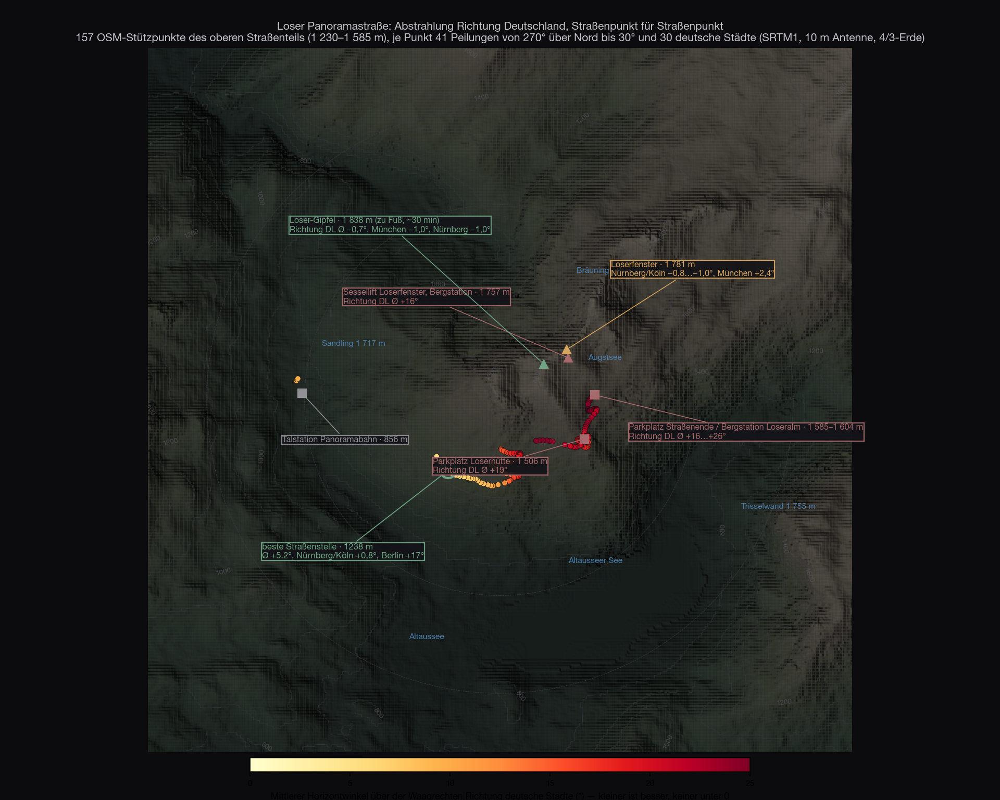
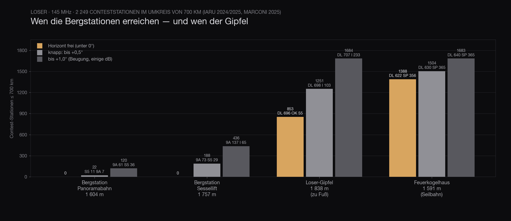

The third site after the [Feuerkogel](/en/blog/feuerkogel-horizont/) and the [Grünberg](/en/blog/gruenberg-horizont/), and the first with a road: the **Loser Panoramastraße** climbs from Altaussee to **1,585 metres**, at the top a car park with a turning area, the mountain restaurant, the top station of the Panoramabahn gondola. Below it, at the Loserhütte, a second car park at 1,506 metres. Drive up, set up, done — that was the idea.

But the road is not the only way up the Loser. The **Panoramabahn** gondola runs from Altaussee to **1,604 metres**, and above it the **Loserfenster chairlift** ends at **1,757 metres** — a top station usually stands a little higher and clearer than the car park. So everything was calculated: car parks, road, both top stations and the summit.

## How

The method is the same as for the [five sites before](/en/blog/feuerkogel-horizont/#how): SRTM terrain model, one ray per degree, ten-metre antenna, 4/3 earth, 500 kilometres out, the names of the obstacles from Wikipedia. New is the second step from the [last post](/en/blog/feuerkogel-stationen/): the 3,215 contest logs of the IARU contests 2024 and 2025 recalculated for this site — for every station bearing, distance and the question whether the horizon in its direction is clear. This time not just for one point but for **the whole road**, point by point, plus both top stations and the summit.

## The car park

There is no second half. **All 360 bearings are closed.** The car park sits in a hollow below the Loser summit: to the north and west the ground rises fifty, sixty metres within a hundred — that is **+15° to +27°** in exactly the direction where Germany lies. To the east the Bräuning Zinken and the Trisselwand, +1.5 to +4°. Only to the south-east, between 120° and 180°, does the horizon come down to +0.4 to +1.5° — there the Tauern and the Dachstein stand forty, fifty kilometres away. That is the direction of Graz and Slovenia, not Nuremberg.

From the Loserhütte car park, eighty metres lower, the picture is the same: 360 bearings closed, towards Germany +15 to +22°, Munich +8.5°, Rosenheim +4.6°.

| Direction | What sets the horizon | Distance | Angle |
|---|---|---|---|
| 240–⁠60° | the **Loser summit knoll** and the Augstsee saddle right above the car park | 0.1–0.4 km | +4…⁠+27° |
| 60–⁠120° | Bräuning Zinken, Trisselwand | 0.3–4 km | +1.5…⁠+3.8° |
| 120–⁠180° | Wölz Tauern, Sölk pass, Hochwildstelle | 36–50 km | +0.4…⁠+1.5° |
| 180–⁠240° | Elendberg, Koppenkarstein, Dachstein | 22–41 km | +1.0…⁠+2.5° |

## The road

The question was whether anywhere along the road does better. So for **157 road points** from OpenStreetMap I calculated 41 bearings each from 270° over north to 30°, plus the angles to thirty German cities. The answer is unambiguous: **nowhere.** The whole road lies on the south and east flank of the mountain, and the mountain is always to the north. The least bad spot lies at 1,238 metres in the hairpins below the Loserhütte — there Nuremberg and Cologne come down to +0.8°, Munich to +2.7°, Berlin stays at +17°. Still everything above the horizontal.

## The top stations

Two lifts end high on the Loser, both just below the ridge. The coordinates of the top stations come from OpenStreetMap, the heights from the terrain model: gondola 47.66137 N / 13.78712 E, chairlift 47.66389 N / 13.78130 E.

### The gondola

**All 360 bearings are closed.** The station stands at the foot of the Hochanger ridge that runs east from the Loser summit: to the north and west the ground rises by sixty to two hundred metres within one to seven hundred metres. That is **+14° to +19° towards Germany** — and Salzburg is just the same, +17°.

| Direction | What sets the horizon | Distance | Angle |
|---|---|---|---|
| 330–⁠60° | Augstsee saddle, **Atterkogel** | 0.1–1 km | +3…⁠+16° |
| 60–⁠140° | Backenstein, **Trisselwand** | 0.2–23 km | +1.0…⁠+3.6° |
| 140–⁠200° | Grimming, Kammspitz, Wölz Tauern, Hochwildstelle | 9–54 km | +0.3…⁠+1.7° |
| 200–⁠240° | Dachstein, Sarstein | 0.6–27 km | +0.9…⁠+5.1° |
| 240–⁠330° | the **ridge above the Loserhütte**, Hochanger | 0.1–1 km | +5.5…⁠+18.8° |

Munich +17.2°, Nuremberg +16.4°, Berlin +14.3°, Prague +12.5°, Linz +10.3°. To the east the Trisselwand does not help either: Vienna +2.2°, Bratislava +2.5°, Budapest +3.0°, Graz +2.5°. Flattest is the south-east, where only the Tauern stand forty, fifty kilometres away — Zagreb +0.7°, Ljubljana +1.1°. Close, but closed.

What does that mean in stations? Within 700 kilometres there are 2,249 contest stations with a log. **With a clear horizon the gondola station reaches not a single one of them.** If you count generously and include everything up to +0.5° of horizon angle — that is diffraction over the edge, a few decibels, not a wall — it is 22: eleven Slovenes, seven Croats. Up to +1.0° it is 120, almost all in Croatia and Slovenia. Not one German, not one Czech, not one Pole.

### The chairlift

A hundred and fifty metres higher, and to the north nothing changes: the Hochanger stands a hundred metres from the station, **+9° to +20°**, Munich +20.4°, Nuremberg +18.7°, Berlin +9.2°, Prague +6.6°. The ridge simply has not been overcome yet — that only happens at the summit, another eighty metres of height further up.

What changes is the south-east. From 110° to 170° the horizon lies only **+0.1° to +1.0°** above the horizontal: Graz +0.4°, Zagreb +0.4°, Ljubljana +0.6°, Vienna +1.0°. Still closed, but so close that it works with diffraction. In stations: with a clear horizon again **zero**; up to +0.5° then **188** (Croatia 73, Slovenia 29, Slovakia 24); up to +1.0° **436**, among them 137 Croats, 65 Italians, 62 Slovenes. That would be, if you want it, a south-east site for the Adriatic region — with a handicap of several decibels in every direction and without a single German log within reach. And whether the chairlift runs in September you have to ask beforehand.

## The summit

Only at the very top does the picture change. From the **Loser summit**, 1,838 metres, half an hour on foot from the top station, the ridge is behind you: **clear from 269° over north to 359°**, −0.3 to −1.0°. Munich −0.97°, Nuremberg −1.02°, Cologne −1.01°, Berlin −0.75°, Passau −0.77°, Dresden −0.77°. Marginal only Rosenheim (−0.55°, behind the Untersberg) and Erfurt (−0.17°, the Großer Höllkogel at 333°). To the north-east the Schönberg closes it (+2.3°), to the south everything else. A north-west site — as good as the Feuerkogel in that direction, but without a car and without a roof.

The Loserfenster at 1,781 metres, a few minutes below the summit, would be the compromise: Nuremberg, Cologne, Berlin clear, Munich at +2.4° behind the ridge.

## The stations

The chart says what the maps say, only in one number. The two top stations: zero. The [Loser summit](#the-summit), half an hour on foot above the chairlift: **853 stations** with a clear horizon, 696 of them in Germany. And the [Feuerkogelhaus](/en/blog/feuerkogel-stationen/), which a cable car also runs up to: **1,388**.

The top station that looks at Germany is not on the Loser. It is on the Feuerkogel.

## The maps

<figure class="zoomkarte" data-basis="/karten/horizont/loser-horizont-" data-min="200" data-max="700" data-schritt="100" data-start="200">
  
  <figcaption>
    <button type="button" data-zoom="-1" aria-label="Shrink radius by 100 km">−</button>
    Radius 200 km
    <button type="button" data-zoom="+1" aria-label="Grow radius by 100 km">+</button>
  </figcaption>
</figure>

The map shows what the numbers say: the lines from the car park end after a hundred metres to fifty kilometres, however far you pull out the radius. On the [overview out to 800 kilometres](/karten/loser-horizont-uebersicht-800km.pdf) only the Hochgolling (43 km, 182°, +1.5°) of 78 ranges rises above the horizontal, and it is to the south.

Both maps as PDF: [zoom 180 km](/karten/loser-horizont-zoom-180km.pdf) and [overview 800 km](/karten/loser-horizont-uebersicht-800km.pdf).

On the zoom you can see how short the lines are: to the north and west they end after a hundred metres, at the ridge above the Loserhütte. Only to the south-east do they reach the Tauern.

Obstructed directions are drawn to at least six percent of the radius so that they can be seen — the real lines would be a hundred metres long. Both maps as PDF: [zoom 180 km](/karten/loser-bergstation-zoom-180km.pdf) with the mountain names and [overview 800 km](/karten/loser-bergstation-uebersicht-800km.pdf) with the numbered list — 78 ranges and peaks, of which exactly one, the Hochgolling at 183°, actually rises above the horizontal. All the others have disappeared behind the ridge next to the station before they even count.

## The data

| | |
|---|---|
| Car park Panoramastraße | 47.66047 N / 13.78493 E · 1,585 m · JN67VP · all 360° closed, towards Germany +15…+27° |
| Car park Loserhütte | 1,506 m · all 360° closed, towards Germany +15…+22° |
| Road | 157 points calculated, best spot at 1,238 m: Nuremberg, Cologne +0.8°, Munich +2.7° |
| Top station Panoramabahn | 47.66137 N / 13.78712 E · 1,604 m · all 360° closed, towards Germany +14…+19° |
| Top station Loserfenster chairlift | 47.66389 N / 13.78130 E · 1,757 m · towards Germany +9…+20°, south-east +0.1…+1.0° |
| Loser summit | 47.6633 N / 13.7780 E · 1,838 m · clear 269°–359°, −0.3…−1.0° |
| Stations ≤ 700 km clear | gondola 0 · chairlift 0 · summit 853, 696 of them in Germany · Feuerkogelhaus 1,388 |
| up to +0.5° / +1.0° horizon | gondola 22 / 120 · chairlift 188 / 436, almost all Croatia, Slovenia, Italy |

## What it means

From the car the Loser is not a contest site — in no direction, least of all towards Germany. The Panoramastraße has no better spot, the lifts end below the ridge. Whoever wants to work north from here carries the station to the summit and gets in return a horizon that lies −0.75 to −1.0° deep from Munich to Dresden. For everything else the [Grünberg](/en/blog/gruenberg-horizont/) and the [Feuerkogel](/en/blog/feuerkogel-horizont/) are the better addresses.

## Caveat

A calculation, not a measurement. Especially at close range — the knoll a hundred metres from the car park — the result hangs on the thirty-metre grid of the terrain model; the order of magnitude is right, the single degree is not. Whether there is still a corner of the car park that looks around the knoll is better judged on the spot than in the calculation.

The terrain model has a thirty-metre grid, knows neither the station itself nor the restaurant beside it, and assumes the standard atmosphere. At a site that is +14° closed to the north, none of that changes anything. The station counts are logs, not stations, and two years old.
