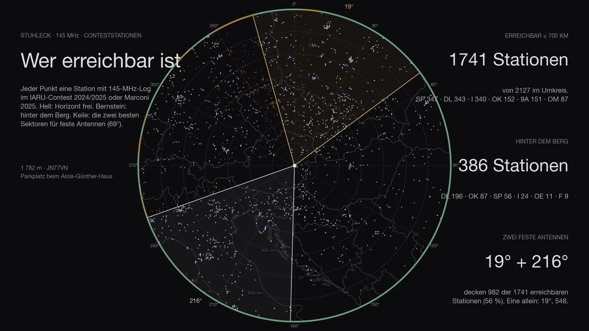
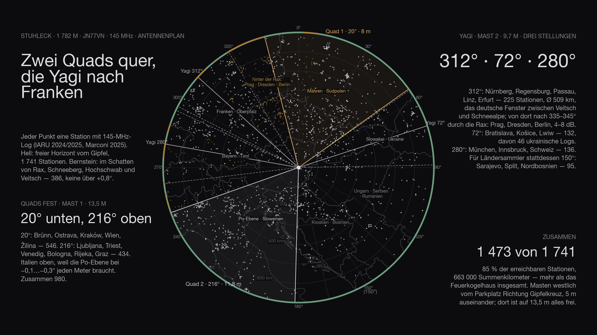

Five sites have been calculated, and all five had the same question: how far into Germany. The **Stuhleck** turns the question round. At **1,782 metres** it is the highest peak of the Fischbacher Alpen, it stands on the eastern edge of the Alps, and east of it, all the way to the Tatra, nothing stands higher. On the summit is the **Alois-Günther-Haus**, next to it a gravel car park with a road leading up to it — the site where you do not have to walk, this time right at the top. In the IARU contest 2025 a station made 155 contacts from here with five watts and a ten-element Yagi. That was the reason to calculate it.

## How

The method is the same as for the [five sites before](/en/blog/feuerkogel-horizont/#how): SRTM terrain model, one ray per degree, ten-metre antenna, 4/3 earth, 500 kilometres out, the names of the obstacles from Wikipedia; plus the second step from the [Feuerkogel post](/en/blog/feuerkogel-stationen/), the 3,215 contest logs of the IARU contests 2024 and 2025 recalculated for this site. New is the third step: for the last hundred metres — the hut, the car park, the summit cross — the laser-scan surface model of the Austrian Federal Office of Metrology and Surveying, one-metre grid, half a metre accurate. The terrain model knows no roof; the laser scan knows every one.

The reference point is the car park by the hut, 47.57444 N / 15.79055 E, locator JN77VN. The laser scan gives 1,779 metres for the car park and 1,786 for the ridge of the hut.

## The horizon

**From 11° to 226° the horizon is clear**, 215 degrees in one piece, and not by a whisker: −0.3° to −1.1° below the horizontal. What forms it stands far away — the Altvater at 298 kilometres, the Greater Fatra at 286, the Low Tatra at 322, the Papuk at 269, the Snežnik at 243. Vienna lies at −1.04°, Bratislava at −1.07°, Budapest at −1.05°, Belgrade at −1.11°, Zagreb at −0.88°, Ljubljana at −0.52°, Graz at −0.75°. That is not a window, that is half a circle.

| Direction | What sets the horizon | Distance | Angle |
|---|---|---|---|
| 11–⁠117° | Altvater, Greater Fatra, Low Tatra, Bakony | 150–320 km | −1.1…⁠−0.3° |
| 119–⁠226° | Papuk, Medvednica, Pohorje, Snežnik, Karawanks | 100–270 km | −1.1…⁠−0.3° |
| 227–⁠273° | Amering, Gleinalpe, Zirbitzkogel, Wildfeld, Trenchtling | 40–120 km | −0.3…⁠+0.1° |
| 274–⁠280° | **Hochschwab** | 49 km | +0.0…⁠+0.4° |
| 285–⁠290° | **Hohe Veitsch** | 30 km | +0.0…⁠+0.2° |
| 291–⁠305° | Dürrenstein, Tonion, Ötscher | 35–60 km | −0.6…⁠−0.3° |
| 311–⁠316° | **Schneealpe** | 21 km | +0.1…⁠+0.2° |
| 328–⁠344° | **Rax** | 15 km | +0.0…⁠+0.8° |
| 2–⁠8° | **Schneeberg** | 22 km | +0.1…⁠+0.6° |

The other half is not closed, it is just not clear. Four mountains stand to the north-west and north barely above the horizontal: the Hochschwab at +0.4°, the Veitsch at +0.2°, the Schneealpe at +0.2° and the Rax at +0.8° — and the Schneeberg at +0.6° to the north. Behind them lie Salzburg (+0.25°), Stuttgart (+0.1°), Budweis, Prague and Dresden (+0.4° each), Leipzig (+0.5°), Berlin (+0.2°), Poznań (+0.1°). Those are diffraction losses of three to eight decibels, not a wall — on the Feuerkogel the Traunstein at +0.27° was the same case. In between remains the one German window: **291° to 305°**, through between Veitsch and Schneealpe, Nuremberg −0.46°, Regensburg −0.54°, Würzburg −0.53°, Passau −0.49°. Munich lies at 283° and −0.20°, just clear.

## Within 500 kilometres

Whoever wants to know what works on VHF without restriction gets a short list here. Clear, below −0.3°: everything from **11° to 117°** — Wrocław, Brno, Ostrava, Kraków, Žilina, Bratislava, Košice, Győr, Budapest, Debrecen, Szeged, that is Moravia, southern Poland, Slovakia, Hungary and western Ukraine; everything from **119° to 226°** — Timișoara, Novi Sad, Belgrade, Pécs, Sarajevo, Split, Zagreb, Rijeka, Ancona, Graz, Ljubljana, Bologna; the window **291° to 305°** into Franconia; and **352° to 1°** to Szczecin. Marginal, between −0.3° and 0°: the Po valley from 227° to 242° (Trieste, Klagenfurt, Venice, Verona), Munich, Linz, Erfurt, Pilsen. Not clear, but below +0.8°: Salzburg, Stuttgart, Budweis, Prague, Dresden, Leipzig, Berlin, Poznań. Above +0.8° there is nothing. Of the 1,274 logs within 500 kilometres, 1,035 have the horizon below the horizontal, 215 lie at 0° to +0.5°, 24 at +0.5° to +0.8°, not a single one above.

## The stations

Within 700 kilometres there are 2,127 contest stations with a log. **The Stuhleck reaches 1,741 of them with a clear horizon** — more than any site before, and from 18 countries instead of ten: SP 347, DL 343, I 340, OK 152, 9A 151, OM 87, S5 64, OE 53, UR 46, YO 41, HA 38, YU 30. The 386 others lie in the diffraction shadow of the four mountains, DL 196, OK 87, SP 56 — all of them below +0.8°. No site in the series has so many stations, and none has so even a spread: the Feuerkogel had two blocks, Germany and Poland; the Stuhleck has them all round.

That has a price, and its name is Germany. 343 German logs clear, 196 behind the Rax — the Feuerkogelhaus has 622, the Traisner Hütte 596. Whoever wants to collect German kilometres in the contest is better off there. Whoever wants Italy, Croatia, Serbia, Slovakia and Ukraine is right here, and the kilometres are not shorter: the sum of the distances of all reachable stations is 754,000 on the Stuhleck, 627,000 at the Feuerkogelhaus.

## The antennas

The Feuerkogel plan — two fixed quads towards Germany, the Yagi for the rest — does not fit here. Two quads both looking at Germany would bring 360 stations. The two largest blocks lie exactly opposite each other: Moravia and southern Poland at 20°, the Po valley at 216°. **Quad 1 at 20°**, below at eight metres: Brno, Ostrava, Kraków, Vienna, Žilina, 546 stations. **Quad 2 at 216°**, above at 11.8 metres: Ljubljana, Trieste, Venice, Bologna, Rijeka, Graz, 434 stations — Italy gets the upper place because the Po valley at −0.1° to −0.3° needs every metre of height and the east at −1.0° needs none. Together 980, 56 percent.

On mast 2 sit two 12-element Yagis one above the other, at 6.4 and 9.7 metres, mounted at the middle of the boom and turning together on the rotating tube — here there is no roof to stand in the way of the lower one. The stack has three positions. **312°** is the one you cannot leave out: the German window, Nuremberg, Regensburg, Passau, Linz, Erfurt, 225 stations at 509 kilometres on average — and from there twenty degrees further to 335° to 345° through the Rax, where Prague, Dresden and Berlin wait at four to eight decibels. **72°** is the gap between the quads: Bratislava, Košice, Lviv, 132 stations, among them 46 Ukrainian logs. **280°** brings Munich, Innsbruck and Switzerland, 136. Whoever would rather collect countries than Bavaria takes **150°** instead of 280°: Sarajevo, Split, northern Bosnia, 95. With the three positions it is 1,473 of the 1,741 reachable stations, 85 percent, 663,000 kilometres in total — more than the Feuerkogelhaus has altogether.

The laser scan decides where the masts stand. The summit is a flat dome; car park, summit cross and hut lie within five metres of height; the hut stands south-east of the car park, its ridge seven metres above it. From the middle of the car park an antenna at ten metres pays up to eight decibels between 121° and 175° — northern Croatia, Bosnia. Thirty metres further west, on the dome between car park and summit cross, the hut has moved to 100° and does nothing any more: both quads are clear in their sectors, the lower one at eight metres too, and the stack loses only between 96° and 119° — Budapest, Szeged — four decibels above and seven below, a direction none of its three positions needs. That is where the masts stand, twelve metres apart, mast 1 twelve metres from the summit cross and 42 from the hut, mast 2 nineteen and 51. The car stays on the car park, 45 metres of cable, one to two decibels. The Stuhleck is the first site in the series where no roof matters.

## In three dimensions

<figure class="szene">
  <iframe src="/stuhleck-3d.html" title="Stuhleck summit in 3D: orthophoto on the laser-scan terrain with the fixed Yagi stack towards Germany, the rotatable quad stack, the car, the Steinbachalmbahn top station and the no-go sector towards the chairlift" loading="lazy" allowfullscreen></iframe>
  <figcaption>Drag to turn, scroll to zoom, the degree buttons set the quad stack, “Bergstation” swings to the chairlift. Red: the no-go sector. <a href="/stuhleck-3d.html">Open full screen</a></figcaption>
</figure>

The orthophoto from basemap.at lies on the laser-scan terrain, one pixel is twenty centimetres, the masts, the quads and the stack are to scale. What the scene shows is not the view — that comes from the terrain model — but what stands in the first hundred and fifty metres: the hut, the car park, the summit cross, the dome — and 120 metres to the south-west the top station of the Steinbachalmbahn, a roofed structure of eighteen by seven metres on columns, eight metres high, with the two rope strands running down the valley over two pylons. Seen from the antennas its roof lies five to eight degrees below the horizontal; it stands in no sector’s way, and the “Bergstation” button shows that from the masts’ point of view. None of it is in the way. The scene shows the installation as it is finally planned — the Yagi stack fixed on Germany, the quads on the rotator, plus the red sector; how that came about, the next two sections tell.

## Two sites, one no-go

After the first sheet came a second mark: not the dome, but the meadow south of the hut, 34 metres from its southern corner, 153 from the top station — **site B**. And a condition that had not been in the calculation before: **no transmitting towards the chairlift**, and not 180 degrees turned either, because the back lobe of a Yagi should not point at the lift. So both were calculated again, with the same laser scan and the same rule.

The rule, in degrees: top station and line as they appear from the Yagi mast, plus 17 degrees — half the beam of the 12JXX2 — on either side. From the dome (A) that is **215° to 262°**, turned **35° to 82°**. From the meadow (B), from where the lift lies due west, **244° to 288°** and **64° to 108°**. No main beam may enter, none of the quads’ either; with their 69 degrees they have their own, wider margin.

What lies in the red sectors differs between the two sites. From A it is Italy forward: Trieste, Venice, Bologna, Verona, Milan, 281 Italian logs, plus Slovenia — 298 stations the Yagi otherwise reaches. Backward it is Poland, Slovakia, Ukraine and Czechia: Ostrava, Kraków, Žilina, Bratislava, Košice, Lviv, 267. From B the west lies forward: Munich, Innsbruck, Salzburg, Zurich, Milan, 157 stations, 49 of them German; backward Hungary, eastern Slovakia, Romania, Ukraine — Košice, Budapest, Debrecen, Cluj, 119.

Recalculated under the rule, the plan looks different. On the dome, quad 2 goes from 216° to **294°** — Nuremberg, Regensburg, Passau, Munich, Linz: the German window thus gets the fixed antenna on top at 11.8 metres —, quad 1 stays on 20°, and the stack has its three positions in the south, **138°, 172°, 212°**: Belgrade, Zagreb, Split, Rijeka, Ljubljana, Trieste. 1,342 stations under three decibels, 131 fewer than without the rule. On the meadow the hut stands due north, its ridge nine metres above the ground: the lower quad at eight metres sees nothing from 343° to 18°, the upper one loses four decibels there, the upper Yagi nine, and the lower Yagi is blind from 259° to 45° — thirteen decibels. The best plan turns the quads around: **216°** below for Italy, **42°** above over the hut towards Brno and Kraków, the stack on **118°, 164°, 294°**. 1,325 stations.

Without the no-go the dome is clearly the better site, 1,473 against 1,331. With it the two come almost level — A loses its Italian direction, B loses the west instead, and the north to the hut. What the number does not show: on the meadow the stack’s lower Yagi is blind to north and west, leaving a single Yagi with two and a half decibels less, and everything German has to go over the upper quad. The dome remains the site where all four antennas work.

While calculating, a second question came up: Germany is the country with the most stations — does the quad belong there, or a fixed Yagi? The answer turned the plan around once more; it is in the next section.

The [site plan with both sites](/karten/stuhleck-lageplan-standorte-a-b.pdf) has the distances to hut, top station and pylons for mast 1, mast 2 and the point on the meadow.

## The choice

The brief was clear: every long contact is better than a near one, but most QSOs are to be had in Germany, and many small stations sit there — being able to reach them matters more than the last kilometre. So one more calculation, with a counting rule that reflects that: a station counts if an antenna has it above the far horizon, under three decibels of near-field loss and with the required gain in the beam — six dBi up to 300 kilometres, from there three decibels per hundred kilometres. Small stations, under fifty QSOs in their best contest, need four decibels more, big ones three less. For Germany the DARC contest lists joined the IARU logs: 1,070 stations within 750 kilometres, 567 of them small. Then 42 combinations: two quads or two Yagis fixed, one stack fixed, quad and Yagi mixed — against a Yagi stack, a quad stack or a single antenna on the rotator, ANJO’s 14-element Yagi as a candidate too.

The result turns the first plan around. **The two 12JXX2 go stacked and fixed on the mast towards 302°** — Regensburg, Nuremberg, Passau, Bayreuth, Hof, with 17.8 dBi around the clock, Munich at the beam’s edge with thirteen, which is enough for two hundred kilometres. **The two quads go stacked on the rotator**, 69 degrees wide, 14.5 dBi, three positions: **20°** Wrocław, Brno, Ostrava, Kraków, Vienna — the second big block, 405 stations; **108°** Budapest, Belgrade, Hungary, Serbia; **200°** Zagreb, Rijeka, Ljubljana, Trieste, Venice, as far as the no-go allows. The near range lies in two broad blocks that a wide antenna serves without constant turning; the far range needs the gain only the stack has — and Germany needs both, fixed.

The numbers: 968 stations within 500 kilometres and 1,205 within 750, against 872 and 987 for the first plan. In Germany 349 of the 1,070, 107 of them small — the first plan had 159 and 49, because a quad with twelve dBi no longer reaches a small station beyond four hundred kilometres. Two single Yagis in two directions would be as good in the near range but lose forty between 500 and 750 kilometres; the ANJO 14 el as a stack would add seventeen, nothing else; a single antenna on the rotator instead of a stack costs two hundred. And 169 of the 406 near German stations lie behind Hochschwab, Veitsch and Rax, Saxony and Thuringia above all — in no number, because the model cuts off hard there; in reality troposcatter with three to eight decibels extra, which is exactly the terrain where the 17.8 dBi make the difference.

The masts are shorter than thought: ten metres for the rotator, seven and a half for the fixed stack. On the dome that changes nothing — the laser scan recalculated for every height gives the same numbers at eight metres as at thirteen, because in every direction only the hut stands in the near field, and nothing fixed points there. What counts is the stack, not the height: a mast with only one antenna costs a hundred stations in the near range. The masts’ roles are swapped so that the fixed stack does not point at the other mast: mast 1 on the dome, twelve metres from the summit cross, now carries the quads at 6.4 and 9.7 metres; mast 2, twelve metres further north-west, the Yagis at 4.0 and 7.5 — from the quad mast the Yagi mast lies at 328°, outside every quad position, and from the Yagi mast the quads lie at 148°, behind the stack. The Yagi mast is guyed at 3.5 metres, below the lower Yagi, so that no wire runs through the elements.

The [site plan as PDF, revision 3](/karten/stuhleck-lageplan-antennenanlage.pdf) has the installation as it stands: coordinates, mast heights, directions, distances, sources.

## The data

| | |
|---|---|
| Site | summit car park by the Alois-Günther-Haus, municipality of Spital am Semmering, JN77VN |
| Mast 1 | 47.574278 N / 15.790072 E · 10 m · 2 × quad stacked at 6.4 and 9.7 m, rotator · 20° / 108° / 200° |
| Mast 2 | 47.574368 N / 15.789992 E · 7.5 m · 2 × 12JXX2 stacked at 4.0 and 7.5 m, fixed on 302° |
| Ground | 1,780 m (laser scan), summit cross 1,782 m, ridge of the hut 1,786.9 m |
| Distances | hut 42 / 51 m · summit cross 12 / 19 m · Steinbachalmbahn top station 120 / 121 m · car 45 m |
| Site B | 47.573805 N / 15.790728 E · meadow south of the hut, ground 1,778 m · hut 34 m · top station 153 m · summit cross 72 m |
| No-go towards the chairlift | from the rotator mast 220°–265° and 40°–85° (top station and line ± 17°, forward and turned 180°); from site B 244°–288° and 64°–108° |
| Horizon | clear 11°–226°, 291°–305°, 352°–1°; marginal 227°–273°, 281°–284°, 306°–327°; above the horizontal 274°–280°, 285°–290°, 311°–316°, 328°–344°, 2°–8°, at most +0.8° |
| Stations ≤ 700 km | 1,741 clear of 2,127, 386 in the diffraction shadow, 18 countries, Σ 754,000 km |
| First plan | quads fixed 20° / 216°, Yagi stack 312° / 72° / 280°: 1,473 of 1,741 in the main beam (85 %), Σ 663,000 km; with no-go 20° / 294° and 138° / 172° / 212°: 1,342 |
| Installation | Yagi stack fixed 302°, quad stack 20° / 108° / 200°: 968 stations within 500 km, 1,205 within 750 km (counting rule with range and size); Germany 349 of 1,070, 107 of them small — first plan by the same rule 872 / 987, Germany 159 / 49 |

The [site plan as PDF](/karten/stuhleck-lageplan-antennenanlage.pdf) has it all on one sheet, overview and detail, with coordinates, mast heights, distances and sources — the way you can hand it in.

## The comparison

Six sites, one number. The Stuhleck leads, but the bars also say with what: its German share is the smallest in the series, its Italian and south-eastern European shares the largest. The Traisner Hütte and the Feuerkogelhaus are the Germany sites; the Stuhleck is the Europe site. What you want, you have to know beforehand.

## The maps

On the zoom you can see how unequal the lines are: to the east and south they run out of the map, to the north-west they end after fifteen to fifty kilometres at the Rax, the Schneealpe, the Veitsch, the Hochschwab.

<figure class="zoomkarte" data-basis="/karten/horizont/stuhleck-horizont-" data-min="200" data-max="700" data-schritt="100" data-start="200">
  
  <figcaption>
    <button type="button" data-zoom="-1" aria-label="Reduce radius by 100 km">−</button>
    Radius 200 km
    <button type="button" data-zoom="+1" aria-label="Increase radius by 100 km">+</button>
  </figcaption>
</figure>

Both maps as PDF: [zoom 180 km](/karten/stuhleck-horizont-zoom-180km.pdf) with the mountain names and [overview 800 km](/karten/stuhleck-horizont-uebersicht-800km.pdf) with the numbered list — of the ranges all round only Schneeberg and Hochschwab rise above the horizontal, all the others form the horizon from below.

## Caveat

The terrain model has a thirty-metre grid; for the summit itself the laser scan at one metre stands against it, for the rest the standard atmosphere. The station counts are logs, not stations, and two years old. Whether you may drive up to the hut, no map says; the road is a forest road, and the hut belongs to the Alpine Club. And the Steinbachalmbahn ends 120 metres south-west of the summit cross — whether it runs in September is a question for the lift company, not for the terrain model.

What the calculation says: the Stuhleck is the mountain from which you see Europe. Germany you see from others.
