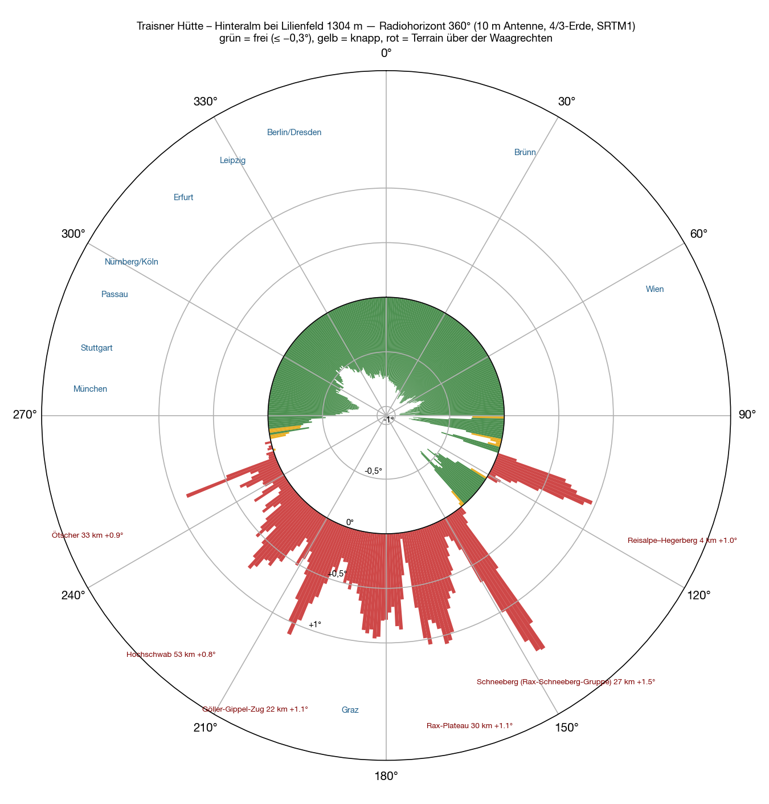
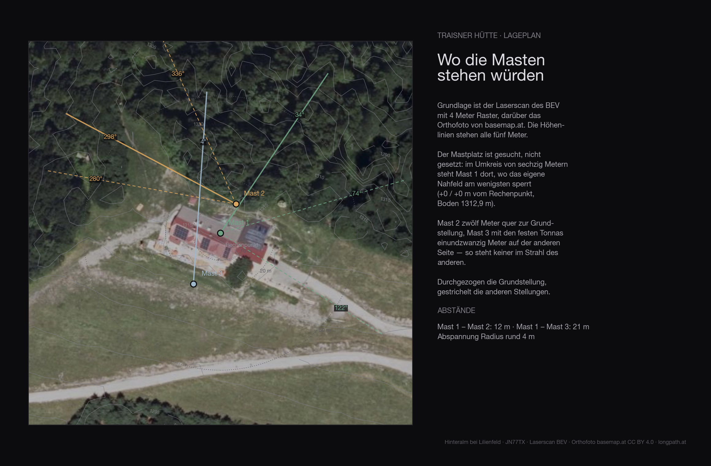
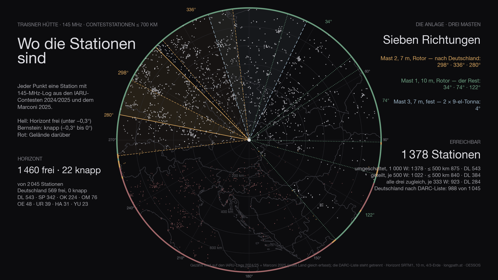
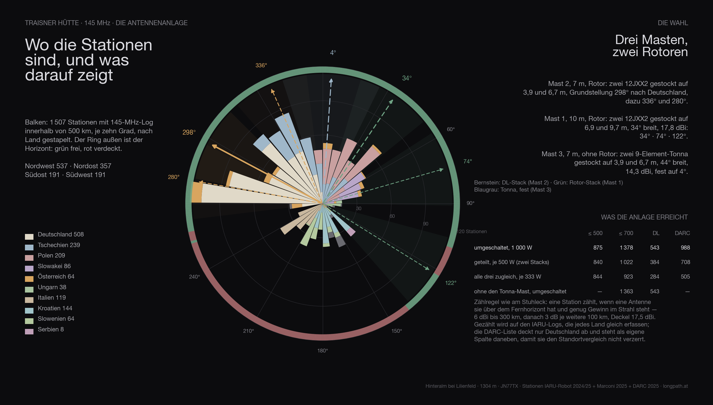

The **Traisner Hütte** stands on the Hinteralm, a kilometre south of the Muckenkogel, high above Lilienfeld: built by the Naturfreunde in 1922, **1,311 metres**, JN77TX. The terrain model gives 1,304 metres for the spot; the antenna is calculated ten metres above that. The hut is in the site list of my contest logger — I had never calculated it.

There is no public road up. Wikipedia names the chairlift to the Muckenkogel and then 45 minutes on foot, or two and a half hours from Lilienfeld. OpenStreetMap knows only forest roads: gravel to within sixty metres of the hut, one stretch by the lift explicitly closed. Whether a car may go up is not a question for the terrain model.

## How

The method is the same for every site in this series: **SRTM terrain model**, one ray per degree out to 500 kilometres, ten metres of antenna height, earth curvature with the 4/3 radius, obstacle names from Wikipedia. It is set out in full in the [Feuerkogel article](/en/blog/feuerkogel-horizont/#how). Added to it: the **Austrian lidar survey** for the first 140 metres around the site, and the contest logs laid over the result.

Three classes: **clear** means more than three tenths of a degree below the horizontal, **marginal** between −0.3° and zero, **blocked** means terrain above the horizontal.

Plus a 400-metre grid around the hut.

## All the way round

The picture is unlike the four sites before it: nothing all the way round rises above **one and a half degrees**. The hut stands on the top of the knoll, and the only obstacle nearby is the Reisalpe.

**From 264° over north to 101° it is clear**, 198 degrees in one piece, −0.3 to −0.96° — only at 91° does the Hochstaff graze the mark, with −0.29°. To the west and north-west the Upper Austrian pre-Alps, the Hausruck, the Mühlviertel, the Bohemian Forest and the Waldviertel form the horizon, 45 to 156 kilometres away. To the north and east it lies even further out: the Bohemian-Moravian Highlands, the Pavlov Hills, the Leiser Berge, the Little and White Carpathians, mostly 90 to 260 kilometres, −0.7 to −0.96°. Add two smaller windows: 106° to 108° and 123° to 138°, across the Dürre Wand to the south-east.

**From 141° to 252° it is closed** — not by a ridge in front of the door, but by the big mountains to the south, all 21 to 122 kilometres away: Schneeberg +1.5°, Rax +1.1°, Schneealpe +1.0°, Göller and Gippel +1.1°, Hochschwab +0.8°, Ötscher +0.9°. The only exception nearby is the **Reisalpe**, four kilometres to the south-east and just under ninety metres higher: it closes 109° to 121°, with at most +1.0°.

| Direction | What sets the horizon | Distance | Angle |
|---|---|---|---|
| 264–⁠359° | **clear** — Upper Austrian pre-Alps, Hausruck, Mühlviertel, Bohemian Forest, Waldviertel | 45–156 km | −0.3…⁠−0.8° |
| 0–⁠88° | **clear** — Bohemian-Moravian Highlands, Pavlov Hills, Leiser Berge, Little and White Carpathians | 90–260 km | −0.7…⁠−1.0° |
| 89–⁠101° | clear — Hochstaff, Almesbrunnberg, Unterberg | 6–24 km | −0.3…⁠−0.9° |
| 102–⁠105° | Unterberg, marginal | 16 km | −0.05…⁠−0.3° |
| 109–⁠121° | **Reisalpe** | 4 km | +0.1…⁠+1.0° |
| 123–⁠138° | clear — Dürre Wand, Öhler, Schober | 24–30 km | −0.3…⁠−0.6° |
| 141–⁠152° | **Schneeberg** | 24–31 km | +0.1…⁠+1.5° |
| 153–⁠201° | Wechsel, Rax, Schneealpe, Hohe Veitsch | 21–57 km | +0.1…⁠+1.1° |
| 202–⁠213° | Göller, Gippel, Tonion | 21–34 km | +0.3…⁠+1.1° |
| 214–⁠229° | Hochschwab group: Aflenzer Staritzen, Seeberg | 44–62 km | +0.4…⁠+0.8° |
| 230–⁠240° | Ennstal Alps, Kräuterin, Gemeindealpe | 33–106 km | +0.1…⁠+0.35° |
| 241–⁠249° | Dürrenstein, Hochkar, **Ötscher** | 33–60 km | +0.2…⁠+0.9° |
| 250–⁠257° | Totes Gebirge: Warscheneck, Hochmölbing, Großer Hochkasten | 69–122 km | +0.0…⁠+0.1° |
| 258–⁠263° | Sengsengebirge, Kasberg, Höllengebirge — marginal | 98–145 km | −0.0…⁠−0.3° |

The grid around the hut confirms what the knoll suggests: the hut itself is the highest point, every one of the 289 grid points within 400 metres lies level with it or lower. In the whole sector from 270° over north to 30° **not a single bearing is closed** from the hut — zero of 41.

## The site

The terrain of the first 136 metres around the site comes from the **Austrian lidar survey** on a four-metre grid — trees, buildings and knolls included. The ground at the mast is at **1312.9 metres**.

| Antenna height | Directions blocked by the near field |
|---|---|
| 6 m | 82° |
| 8 m | 25° |
| 10 m | none |
| 12 m | none |
| 15 m | none |

With ten metres of mast the site is **free of its own near field in all 360 directions**. Whatever is blocked from here is blocked by distant terrain, not by the site.

## Top station and Muckenkogel

Whoever takes the lift and does not walk on to the hut loses less than you might think. The **top station of the Muckenkogel chairlift**, 1,114 metres, 1.4 kilometres to the north: Munich −0.49°, Nuremberg −0.50°, Cologne −0.47°, Erfurt −0.34°, Berlin −0.61°, Stuttgart −0.75°, one of 41 bearings in the Germany sector closed. The **Muckenkogel summit**, 1,248 metres: Munich −0.71°, Nuremberg −0.57°, Cologne −0.53°, Berlin −0.67°, all clear. The whole ridge works; the hut is its best point.

## The map

Two details at the western edge. At 264° the **Höllengebirge** forms the horizon, 145 to 148 kilometres out, −0.3° — and on exactly that bearing, 142 kilometres away, stands the [Feuerkogelhaus](/en/blog/feuerkogel-horizont/): seen from the Traisner Hütte it sits right on the line of sight, −0.37°. And at 241° the [Hochkar](/en/blog/hochkar-horizont/) rises above the horizontal, 60 kilometres, +0.23°: you can see the summit, not the car park.

## Out to 700 kilometres

<figure class="zoomkarte" data-basis="/karten/horizont/traisnerhuette-horizont-" data-min="200" data-max="700" data-schritt="100" data-start="200">
  
  <figcaption>
    <button type="button" data-zoom="-1" aria-label="Shrink radius by 100 km">−</button>
    Radius 200 km
    <button type="button" data-zoom="+1" aria-label="Grow radius by 100 km">+</button>
  </figcaption>
</figure>

Of the 78 ranges on the [overview out to 800 kilometres](/karten/traisnerhuette-horizont-uebersicht-800km.pdf) four rise above the horizontal, all in the south: Schneeberg +1.53°, Ötscher +0.91°, Hochschwab +0.87°, Hochwechsel +0.26°. To the north the Bohemian-Moravian Highlands form the horizon (Javořice, 131 km, −0.65°), to the north-east even the Altvater — the Praděd at 262 kilometres, −0.85°. Everything else lies below: Giant Mountains −0.98°, High Tatras −0.99°, Ore Mountains −1.15°, Harz −1.89°, Eifel −2.34°. Both maps as PDF: [zoom 180 km](/karten/traisnerhuette-horizont-zoom-180km.pdf) and [overview 800 km](/karten/traisnerhuette-horizont-uebersicht-800km.pdf).

## The stations

Of the 2 045 stations that appear in the logs within 700 kilometres, **1 482 are above the horizon** — Germany 569 of 569. That is the ceiling: no antenna, however large, gets past it.

The figure has two halves. **Genuinely clear** — horizon more than three tenths of a degree below the horizontal — are 1 460 stations, 569 of them in Germany. The other 22 are **marginal**: between −0.3° and zero, in the grazing shadow of an edge. Something works there, but at a loss of three to eight decibels depending on the day. Both numbers are given, because only both together describe the site. Of the 217 degrees that are clear, 14 marginal degrees come on top.

## The antennas

The same array is computed everywhere as the one on the Stuhleck, with **three masts**:

- **Mast 2**, 7 metres, rotator: two 12JXX2 stacked at 3.9 and 6.7 m — the stack that looks at Germany.
- **Mast 1**, 10 metres, rotator: two 12JXX2 stacked at 6.9 and 9.7 m, 34° wide, 17.8 dBi.
- **Mast 3**, 7 metres, no rotator: two stacked 9-element Tonnas at 3.9 and 6.7 m, 44° wide, 14.3 dBi — fixed on one heading.

The headings are not guessed but searched: for Traisner Hütte they come out at **298° / 336° / 280°** for the DL stack, **34° / 74° / 122°** for the rotator stack and **4°** for the fixed Tonnas.

Feeding goes through a switch. With the full 1 000 watts on whichever system is being worked, the array reaches **1 482 stations** across the contest (Germany 569, by the DARC list 988). Split across the two rotator stacks, 500 watts each, it is 1 153; with only three fixed headings per rotator 1 378; spread over all three systems at once only 923 — three directions cost more power than they gain in coverage. The Tonna mast alone adds 15 stations that would otherwise be missing.

## In three dimensions

<figure class="szene">
  <iframe src="/standort-3d.html?ort=traisnerhuette&v=1" title="Traisner Hütte in 3D: lidar terrain with orthophoto, the two masts and the beam headings" loading="lazy" allowfullscreen></iframe>
  <figcaption>Drag to turn, wheel to zoom. The sliders turn the two stacks, the buttons jump to the computed headings. <a href="/standort-3d.html?ort=traisnerhuette">Open full screen</a></figcaption>
</figure>

The same view for every site: the terrain comes from the Austrian lidar survey, the orthophoto lies on top, and the two masts stand on it at their computed heights. The labels around the rim are cities — bright means above the horizon, grey means behind it.

## The comparison

Every site in this series with **the same array, the same counting rule and the same logs** — only then are the numbers comparable. Reached means: horizon below the horizontal and enough gain for the distance (6 dBi to 300 km, then 3 dB per further 100 km), with 1 000 watts on whichever system is being worked. **Both large antennas sit on rotators** — so the count is what is reachable across the whole contest, not what one fixed heading covers.

The count runs on the **IARU logs 2024/2025 and the Marconi 2025**: they record every country alike. The DARC list covers Germany only — it sits in its own column, otherwise every site that looks west wins on the data alone.

| Site | reached | Germany | DARC list | ≤ 500 km | Access |
|---|---:|---:|---:|---:|---|
| Stuhleck · 1 770 m | 1 549 | 326 | 569 | 962 | drive to the top |
| **Traisner Hütte** · 1 304 m | 1 482 | 569 | 988 | 877 | chairlift, then on foot |
| Grünberg · 989 m | 1 417 | 700 | 1 271 | 826 | cable car, inn |
| Feuerkogelhaus · 1 591 m | 1 302 | 588 | 1 056 | 726 | cable car, inn |
| Braunsberg · 337 m | 1 172 | 454 | 814 | 740 | drive to the top |
| Gaisberg · 1 272 m | 1 055 | 628 | 1 199 | 618 | drive to the top |
| Hochkar · 1 478 m | 438 | 321 | 559 | 247 | drive to the top |
| Loser · 1 585 m | 0 | 0 | 0 | 0 | drive to the top |

Traisner Hütte therefore comes **2 of 8**.

Anyone who knows the earlier articles in this series will find different numbers there: those were computed with the first line-up — one Yagi stack and one quad stack with a 69° beamwidth. Since the choice fell on two narrow 12JXX2 stacks, the order shifts: more gain and less width favours the sites whose stations bunch in one direction, and costs the ones that stand open all round. The fixed Tonnas on mast 3 win part of that width back.

## The data

| | |
|---|---|
| Site | Traisner Hütte — Hinteralm bei Lilienfeld |
| Coordinates | 47,97192 N / 15,61055 O · 1 304 m · JN77TX |
| Access | chairlift, then on foot |
| Horizon clear | 258°–108°, 122°–140° |
| Degrees clear / marginal / blocked | 217° / 14° / 129° |
| Stations ≤ 700 km | 1 460 clear, 22 marginal, of 2 045 |
| Germany (IARU) | 569 clear, 0 marginal, of 569 |
| Germany (DARC list) | 1 045 below the horizontal of 1 045 |
| Array | three masts · mast 1 10 m (2 × 12JXX2 at 6.9/9.7 m, rotator) · mast 2 7 m (2 × 12JXX2 at 3.9/6.7 m, rotator) · mast 3 7 m (2 × 9-el Tonna at 3.9/6.7 m, fixed) |
| Headings | DL-Stack 298° / 336° / 280° · Rotor-Stack 34° / 74° / 122° · Tonna fest 4° |
| switched · 1 000 W | 1 482 · ≤ 500 km 877 · DL 569 · with three fixed headings per rotator 1 378 |
| split · 500 W each | 1 153 · ≤ 500 km 877 · DL 420 |
| all three at once · 333 W each | 923 · ≤ 500 km 844 · DL 284 |
| without the Tonna mast | 1 363 instead of 1 378 |
| Σ kilometres | 639 312 km |
| strict count | only directions below −0.3°: 1 026 · ≤ 500 km 827 · DL 384 |

## What it means

For the first time in this series **every one of the thirty German cities** is below the horizontal: Stuttgart −0.82°, Munich −0.75°, Passau −0.73°, Berlin −0.70°, Dresden −0.70°, Hamburg −0.63°, Leipzig −0.62°, Frankfurt −0.62°, Nuremberg −0.61°, Cologne −0.59°, Rosenheim −0.56°, Hanover −0.50°, Erfurt −0.49°, Kassel −0.47°. The Feuerkogel looks deeper to the north-west — it stands 280 metres higher — but has its hole towards Munich and Stuttgart. The Grünberg is flat, the Hochkar a window, the Loser closed. The Traisner Hütte has no hole.

Add the east, which none of the other four had: Vienna −1.2°, Bratislava −0.82°, Brno −0.87°, Budapest −0.58°, Kraków −0.86°, Warsaw −0.80°. Closed remain Graz +0.68°, Klagenfurt +0.34°, Ljubljana +0.75°, Zagreb +0.11°; Innsbruck sits right on the edge at −0.06°.

For a contest this is the site you wish for: towards Germany, Czechia, Poland, Slovakia and Hungary not one sector to write off. What is missing is the south — Slovenia, Croatia and the Po valley stand behind the Hochschwab and the Totes Gebirge. The price is the altitude, 1,311 metres instead of 1,591, and the way up.

## Caveat

A calculation, not a measurement. The terrain model knows neither trees nor the hut itself nor the lift, it has a thirty-metre grid, and the propagation assumes a standard atmosphere. The Reisalpe at four kilometres is the only near-field obstacle; everything else is far enough away for the individual degree to hold. The Wikipedia names on the maps are the nearest entry in each case — in the south often a hut rather than the mountain.

The rest gets measured — up there, with an antenna.
