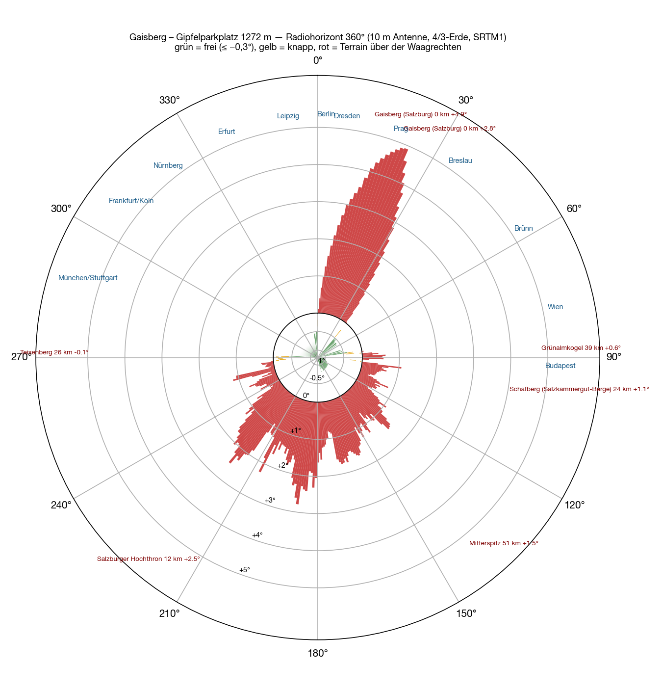
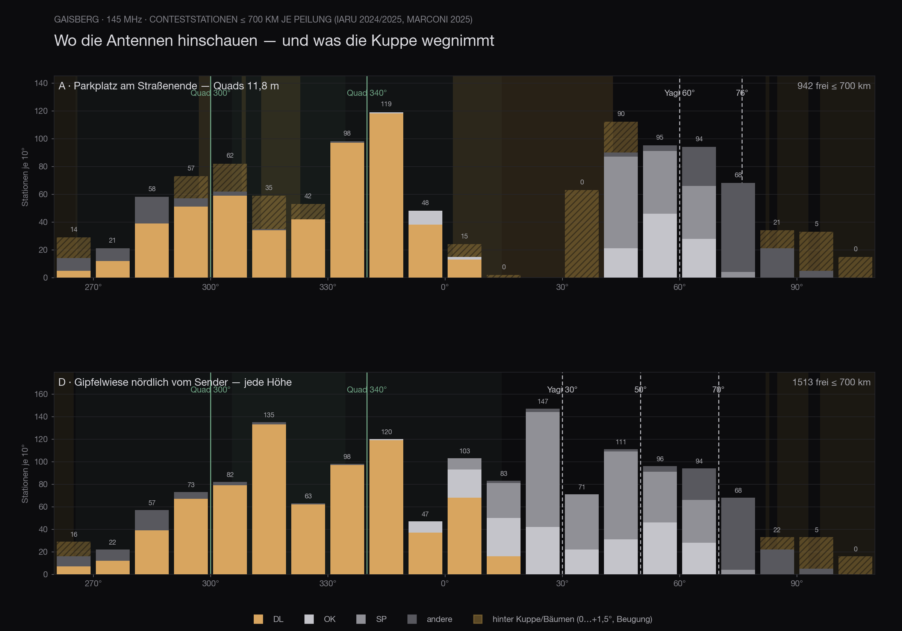

El Gaisberg es la montaña más cómoda de la zona. Una carretera sube hasta arriba del todo, allí hay un aparcamiento y un prado al lado, y quien venga de Salzburgo llega en veinte minutos. De los emplazamientos salzburgueses accesibles en coche era el único que entraba en consideración hacia Alemania, ya en la [primera ronda](/es/blog/feuerkogel-horizont/). Así que lo he calculado entero.

El resultado por delante: el horizonte hacia Alemania está tan libre como uno podría desear. Y aun así no sale nada.

## Cómo

El mismo método que en los emplazamientos anteriores: modelo del terreno SRTM, un rayo por grado, tierra 4/3, 700 kilómetros, diez metros de antena. Encima — y en una meseta de cumbre esa es la parte decisiva — el **modelo de superficie del BEV a partir del escaneo láser**, malla de un metro, para todo lo que hay en trescientos metros a la redonda: edificios, torres emisoras, árboles, la propia cúpula. Campo lejano y campo cercano se combinan; gana el más alto de los dos.

Sobre eso van los logs de concurso: 2.262 estaciones de los concursos IARU de 2024 y 2025 y del Marconi 2025 que están dentro de 700 kilómetros, cada una con demora y distancia. Además la lista del DARC de participantes alemanes de VHF — 1.327 de ellas están dentro de 700 kilómetros.

He calculado tres puntos de la meseta: el **aparcamiento al final de la carretera** (47,80336 N / 13,11151 E, suelo según el escaneo 1.274 m, JN67NT), la superficie **junto al repetidor**, ciento cuarenta metros al noroeste, y el **prado de la cima** al norte de la emisora.

## El aparcamiento

De 273° a 359° todo está libre, −0,4 a −0,8 grados. Múnich, Stuttgart, Fráncfort, Colonia, Hannover, Hamburgo — nada por medio hasta que la Tierra se curva. Es el mejor sector alemán que ofrece por aquí un emplazamiento con carretera.

Luego viene la cúpula. La cima con la torre emisora del ORF está **doscientos metros al norte** del aparcamiento y cierra **de 2° a 43°** con una antena de diez metros, hasta +5,2 grados. Detrás quedan Berlín (+1,4°), Dresde (+3,4°), Praga (+2,8°), Breslavia (+1,4°), Passau (+2,5°) y Núremberg (+3,6°) — todo lo que está al nordeste del Danubio se mira cuesta arriba. Un segundo agujero, más pequeño, lo hace una casa con árboles de 15 a 18 metros, noventa metros al noroeste: **313° a 322°**, +4,5 grados.

La altura ayuda, pero despacio. Lo que queda libre en el aparcamiento:

| Altura de antena | libres de 2.262 | de ellas Alemania | lista DARC |
|---|---|---|---|
| 8 m | 711 | 347 | 634 de 1.327 |
| 10 m | 803 | 414 | 758 |
| 11,8 m | 942 | 508 | 941 |
| 13,5 m | 1.016 | 568 | 1.050 |

Trece metros y medio de mástil solo para ver por encima de una cúpula que está a doscientos metros — y Núremberg sigue quedando +1,4 grados por encima.

## Ciento cuarenta metros más allá

Si desde el aparcamiento se va hacia el noroeste, a la superficie **junto al repetidor** (47,80393 N / 13,10985 E, 1.277 m), la imagen se da la vuelta: la cúpula queda entonces a la espalda y no por medio. Quedan libres 1.200 estaciones con diez metros, 1.253 con 11,8 y 1.295 con 13,5 — y de la lista del DARC **1.325 de 1.327 están libres, a cualquier altura**. A cambio se cierra el sector de 44° a 68°, es decir Polonia y Chequia, que desde allí quedan detrás de la cúpula.

Mejor todavía es el **prado de la cima al norte de la emisora** (suelo 1.284 m): **1.513 estaciones libres, independientemente de la altura del mástil** — salvo el sur, donde están los Alpes, allí está todo abierto. El precio son doscientos cincuenta metros de acarreo y sesenta metros de distancia a la torre de 100 kW.

Para la instalación prevista — un stack de Yagis y un stack de cuadros, cada uno en tres posiciones de rotor, 500 vatios cada uno — eso significa, en el aparcamiento: **827 estaciones alcanzables, 506 de ellas en Alemania**, con el stack de Yagis en 312°, 342° y 60° y el de cuadros en 88°, 282° y 284°. Contando solo las estaciones alemanas y solo los dos cuadros, 300° y 340° juntos dan 852 de 1.327 — desde el prado de la cima, las mismas direcciones darían 1.319.

## Hasta 700 kilómetros

<figure class="zoomkarte" data-basis="/karten/horizont/gaisberg-horizont-" data-min="200" data-max="700" data-schritt="100" data-start="200">
  
  <figcaption>
    <button type="button" data-zoom="-1" aria-label="Reducir el radio en 100 km">−</button>
    Radio 200 km
    <button type="button" data-zoom="+1" aria-label="Aumentar el radio en 100 km">+</button>
  </figcaption>
</figure>

Ambos mapas en PDF: [zoom 180 km](/karten/gaisberg-horizont-zoom-180km.pdf) y [vista general 800 km](/karten/gaisberg-horizont-uebersicht-800km.pdf). Hacia el sur sobresalen por encima de la horizontal el Watzmann (31 km, 208°, +2,6°), el Großglockner (87 km, +1,4°) y el Hochalmspitze — hacia el norte y el oeste, nada hasta ochocientos kilómetros.

## Por qué aun así no sale nada

El Gaisberg no es una montaña vacía. En la cima hay desde hace décadas un parque de emisoras, y en medio de él no se entra sin más con una estación de concurso:

- El **repetidor de 2 m OE2XZR en 145,6875 MHz** está a 139 metros del aparcamiento — y precisamente en 297°, justo en la dirección hacia la que se quiere radiar a Alemania. Además el **digipeater APRS en 144,800 MHz**. Los dos están en la misma banda en la que uno pretende trabajar dos días con un kilovatio. Y al revés: lo que un amplificador a 139 metros mete en la entrada de un repetidor lo deja inservible mientras dure el concurso.
- Doscientos diez metros más allá está la **emisora del ORF**: cuatro programas de FM de 100 kW cada uno y DAB+. Un receptor que debe escuchar en 145 MHz está allí en un campo frente al cual cualquier preselección es un compromiso.
- El sitio además está **ocupado**: en los logs IARU de 2024 y 2025 aparece **OE2M** con JN67NT y 1.270 metros — el radioclub de Salzburgo opera desde allí. Dos estaciones en 145 MHz en la misma meseta no son buena idea.
- Y el prado de la cima, que sobre el papel sería el mejor, es **zona de despegue de parapente**.

Esa es la verdadera respuesta a la pregunta «¿Gaisberg?»: no la geografía, sino la vecindad.

## Cinco emplazamientos, uno al lado del otro

Como la pregunta vuelve una y otra vez, aquí están los cinco emplazamientos con **la misma instalación** prevista para el Stuhleck: un stack de dos Yagis de 12 elementos (17,8 dBi, 34° de apertura) y un stack de dos cuadros (14,5 dBi, 69°), cada uno en tres posiciones de rotor, y 1.000 vatios sobre los dos a la vez — es decir, **500 vatios por stack**. Alcanzable no significa aquí solo «horizonte libre», sino también: ganancia suficiente para la distancia — 6 dBi hasta 300 kilómetros y 3 dB más por cada cien, referido a un kilovatio. El horizonte SRTM y los logs de concurso son los mismos para los cinco. El campo cercano, el tamaño de las estaciones y los sectores prohibidos quedan fuera — las cifras se comparan entre sí, pero no con las del [artículo del Stuhleck](/es/blog/stuhleck-horizont/), que calcula con más detalle.

| Emplazamiento | alcanzables ≤ 700 km | Alemania | ≤ 500 km (DL) | Stack Yagi | Stack cuadros | Acceso |
|---|---|---|---|---|---|---|
| **Stuhleck** · 1.779 m | **1.068** (50 %) | 141 | **946 (120)** | 306° · 34° · 230° | 22° · 66° · 156° | en coche hasta arriba |
| **Grünberg** · 989 m | 1.015 (45 %) | 473 | 861 (**388**) | 346° · 292° · 42° | 18° · 62° · 290° | teleférico, restaurante |
| **Traisner Hütte** · 1.304 m | 1.015 (47 %) | 305 | 902 (264) | 322° · 20° · 74° | 10° · 114° · 276° | solo a pie |
| **Feuerkogelhaus** · 1.591 m | 945 (42 %) | 407 | 772 (287) | 346° · 308° · 40° | 8° · 70° · 88° | teleférico, restaurante |
| **Gaisberg, aparcamiento** · 1.272 m | 827 (37 %) | **506** | 652 (368) | 312° · 342° · 60° | 88° · 282° · 284° | en coche hasta arriba |

Cinco sitios, cinco caracteres — y con la potencia la imagen cambia otra vez. Quinientos vatios por stack son tres decibelios menos que un kilovatio en una sola antena; los contactos lejanos son los primeros en caer, el corto alcance se mantiene.

El **Stuhleck** es el que más alcanza en total y también en el corto alcance, con 946 estaciones por debajo de 500 kilómetros — está en el rincón más denso de Europa, con Hungría, Croacia, Eslovenia, Eslovaquia y Chequia al alcance. Hacia Alemania, en cambio, solo quedan 141 estaciones: desde allí hay de 400 a 700 kilómetros hasta los emplazamientos alemanes, y 500 vatios en un stack rara vez bastan. El **Gaisberg** es justo lo contrario: el más débil en total, pero **el más fuerte hacia Alemania** con 506 estaciones — su sector oeste libre es precisamente el que cuenta allí, con Múnich a 145 kilómetros en lugar de 500.

Los otros tres quedan en medio. El **Grünberg** es el más equilibrado: 473 estaciones alemanas, 388 de ellas en el corto alcance, más que nadie, y eso desde 989 metros. La **Traisner Hütte** vive del este — Polonia, Chequia, Eslovaquia — y hacia Alemania es la penúltima. El **Feuerkogelhaus** está a media tabla en todo y es el único con techo, teleférico y cocina.

Llama la atención lo poco que decide la altura: el más bajo de los cinco, el Grünberg con 989 metros, es segundo para Alemania; el más alto, el Feuerkogelhaus con 1.591, queda a media tabla en todo. Cuenta hacia dónde está abierto el horizonte y a qué distancia están las estaciones, no hasta qué altura se ha subido en coche.

Las cifras de arriba están calculadas sin campo cercano y sin sectores prohibidos, o sea que son generosas. En el Gaisberg, de las 1.112 estaciones con horizonte lejano libre solo **803** lo están de verdad al incluir el escaneo láser — su propia cúpula se lleva una cuarta parte. En el Stuhleck falta en este cálculo el sector hacia el telesilla, hacia el que no se transmite. Y en el Gaisberg se suman además el repetidor, la emisora y OE2M.

El Feuerkogel se queda.
