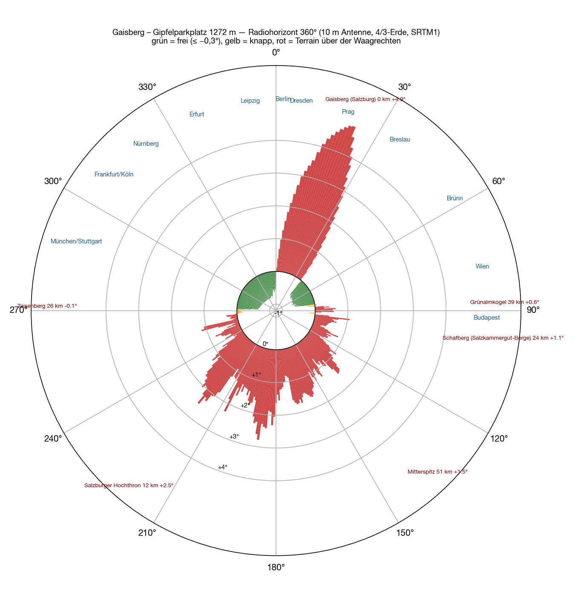
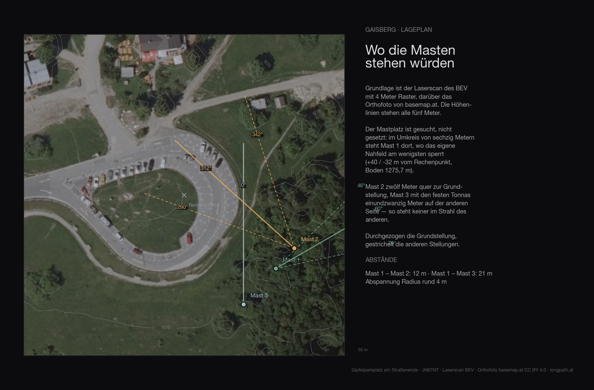
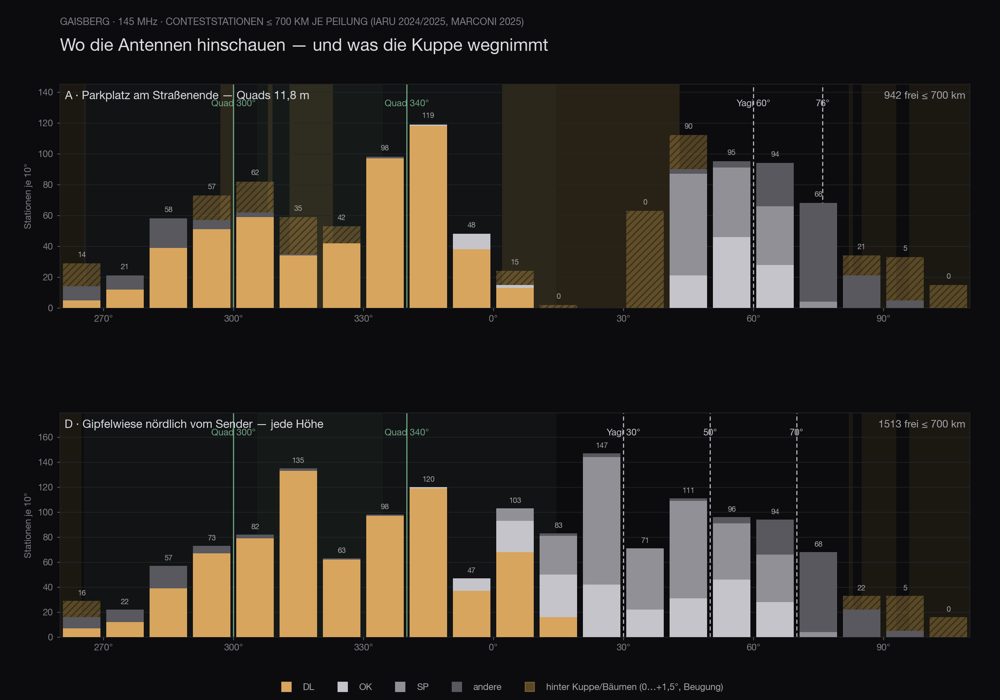
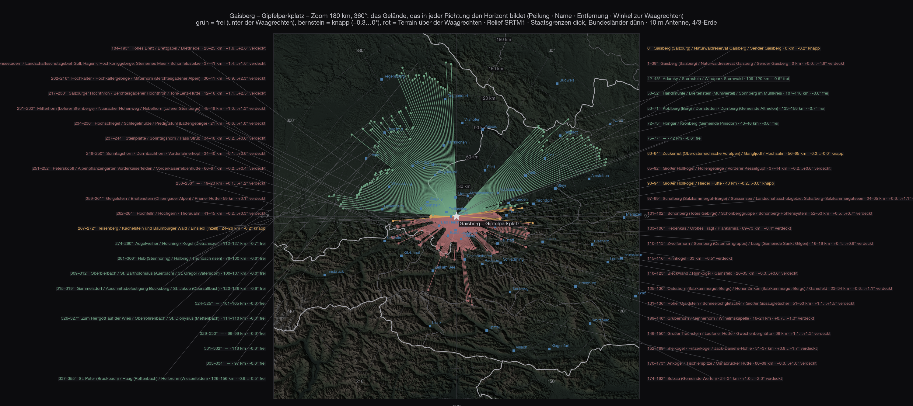
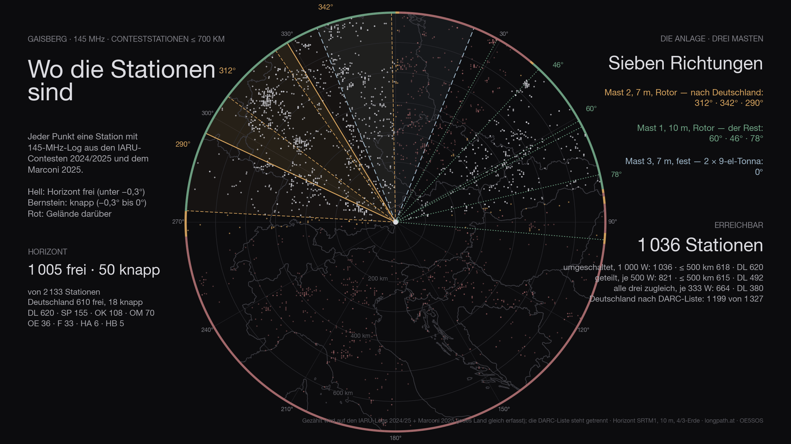
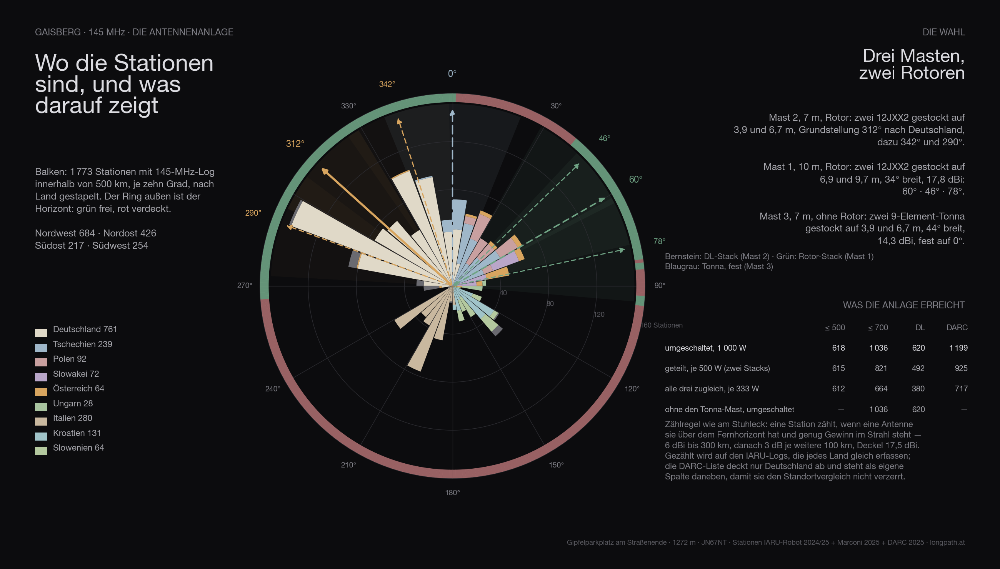

El Gaisberg es la montaña más cómoda de la zona. Una carretera sube hasta arriba del todo, allí hay un aparcamiento y un prado al lado, y quien venga de Salzburgo llega en veinte minutos. De los emplazamientos salzburgueses accesibles en coche era el único que entraba en consideración hacia Alemania, ya en la [primera ronda](/es/blog/feuerkogel-horizont/). Así que lo he calculado entero.

El resultado por delante: el horizonte hacia Alemania está tan libre como uno podría desear. Y aun así no sale nada.

## Cómo

El mismo método que en los emplazamientos anteriores: modelo del terreno SRTM, un rayo por grado, tierra 4/3, 700 kilómetros, diez metros de antena. Encima — y en una meseta de cumbre esa es la parte decisiva — el **modelo de superficie del BEV a partir del escaneo láser**, malla de un metro, para todo lo que hay en trescientos metros a la redonda: edificios, torres emisoras, árboles, la propia cúpula. Campo lejano y campo cercano se combinan; gana el más alto de los dos.

Sobre eso van los logs de concurso: 2.262 estaciones de los concursos IARU de 2024 y 2025 y del Marconi 2025 que están dentro de 700 kilómetros, cada una con demora y distancia. Además la lista del DARC de participantes alemanes de VHF — 1.327 de ellas están dentro de 700 kilómetros.

He calculado tres puntos de la meseta: el **aparcamiento al final de la carretera** (47,80336 N / 13,11151 E, suelo según el escaneo 1.274 m, JN67NT), la superficie **junto al repetidor**, ciento cuarenta metros al noroeste, y el **prado de la cima** al norte de la emisora.

## Alrededor

De 273° a 359° todo está libre, −0,4 a −0,8 grados. Múnich, Stuttgart, Fráncfort, Colonia, Hannover, Hamburgo — nada por medio hasta que la Tierra se curva. Es el mejor sector alemán que ofrece por aquí un emplazamiento con carretera.

Luego viene la cúpula. La cima con la torre emisora del ORF está **doscientos metros al norte** del aparcamiento y cierra **de 2° a 43°** con una antena de diez metros, hasta +5,2 grados. Detrás quedan Berlín (+1,4°), Dresde (+3,4°), Praga (+2,8°), Breslavia (+1,4°), Passau (+2,5°) y Núremberg (+3,6°) — todo lo que está al nordeste del Danubio se mira cuesta arriba. Un segundo agujero, más pequeño, lo hace una casa con árboles de 15 a 18 metros, noventa metros al noroeste: **313° a 322°**, +4,5 grados.

La altura ayuda, pero despacio. Lo que queda libre en el aparcamiento:

| Altura de antena | libres de 2.262 | de ellas Alemania | lista DARC |
|---|---|---|---|
| 8 m | 711 | 347 | 634 de 1.327 |
| 10 m | 803 | 414 | 758 |
| 11,8 m | 942 | 508 | 941 |
| 13,5 m | 1.016 | 568 | 1.050 |

Trece metros y medio de mástil solo para ver por encima de una cúpula que está a doscientos metros — y Núremberg sigue quedando +1,4 grados por encima.

## El sitio

El terreno de los primeros 136 metros alrededor del sitio procede del **escaneo láser del BEV** con retícula de cuatro metros — árboles, edificios y lomas incluidos. El suelo en el mástil está a **1275,7 metros**.

| Altura de antena | Direcciones que bloquea el campo cercano |
|---|---|
| 6 m | 73° |
| 8 m | 31° |
| 10 m | 13° |
| 12 m | 6° |
| 15 m | 2° |

Incluso con diez metros de mástil el campo cercano bloquea aún **13 grados** — además de lo que cierre el horizonte lejano.

## Ciento cuarenta metros más allá

Si desde el aparcamiento se va hacia el noroeste, a la superficie **junto al repetidor** (47,80393 N / 13,10985 E, 1.277 m), la imagen se da la vuelta: la cúpula queda entonces a la espalda y no por medio. Quedan libres 1.200 estaciones con diez metros, 1.253 con 11,8 y 1.295 con 13,5 — y de la lista del DARC **1.325 de 1.327 están libres, a cualquier altura**. A cambio se cierra el sector de 44° a 68°, es decir Polonia y Chequia, que desde allí quedan detrás de la cúpula.

Mejor todavía es el **prado de la cima al norte de la emisora** (suelo 1.284 m): **1.513 estaciones libres, independientemente de la altura del mástil** — salvo el sur, donde están los Alpes, allí está todo abierto. El precio son doscientos cincuenta metros de acarreo y sesenta metros de distancia a la torre de 100 kW.

Para la instalación prevista — un stack de Yagis y un stack de cuadros, cada uno en tres posiciones de rotor, la potencia repartida — eso significa, en el aparcamiento: **827 estaciones alcanzables, 506 de ellas en Alemania**, con el stack de Yagis en 312°, 342° y 60° y el de cuadros en 88°, 282° y 284°. Contando solo las estaciones alemanas y solo los dos cuadros, 300° y 340° juntos dan 852 de 1.327 — desde el prado de la cima, las mismas direcciones darían 1.319.

## El mapa

Cada trazo es un grado. Hacia el oeste y el noroeste llegan hasta la llanura bávara, porque allí empieza el terreno que forma el horizonte; hacia el este y el sur terminan en la propia loma y en el borde de los Alpes.

## Hasta 700 kilómetros

<figure class="zoomkarte" data-basis="/karten/horizont/gaisberg-horizont-" data-min="200" data-max="700" data-schritt="100" data-start="200">
  
  <figcaption>
    <button type="button" data-zoom="-1" aria-label="Reducir el radio en 100 km">−</button>
    Radio 200 km
    <button type="button" data-zoom="+1" aria-label="Aumentar el radio en 100 km">+</button>
  </figcaption>
</figure>

Ambos mapas en PDF: [zoom 180 km](/karten/gaisberg-horizont-zoom-180km.pdf) y [vista general 800 km](/karten/gaisberg-horizont-uebersicht-800km.pdf). Hacia el sur sobresalen por encima de la horizontal el Watzmann (31 km, 208°, +2,6°), el Großglockner (87 km, +1,4°) y el Hochalmspitze — hacia el norte y el oeste, nada hasta ochocientos kilómetros.

## Las estaciones

De las 2 133 estaciones que aparecen en los registros hasta 700 kilómetros, **1 055 están por encima del horizonte** — Alemania 628 de 703. Ese es el techo: ninguna antena, por grande que sea, lo supera.

La cifra tiene dos mitades. **Realmente libres** — el horizonte más de tres décimas de grado por debajo de la horizontal — son 1 005 estaciones, 610 de ellas en Alemania. Las otras 50 quedan **justas**: entre −0,3° y cero, en la sombra rasante de un borde. Algo se hace, pero con pérdida de tres a ocho decibelios según el día. Se dan ambas cifras porque solo juntas describen el emplazamiento. A los 127 grados libres se suman 15 grados justos.

## Las antenas

En todos los emplazamientos se calcula la misma instalación que en el Stuhleck, con **tres mástiles**:

- **Mástil 2**, 7 metros, rotor: dos 12JXX2 apiladas a 3,9 y 6,7 m — la pila que mira a Alemania.
- **Mástil 1**, 10 metros, rotor: dos 12JXX2 apiladas a 6,9 y 9,7 m, 34° de ancho, 17,8 dBi.
- **Mástil 3**, 7 metros, sin rotor: dos Tonna de 9 elementos apiladas a 3,9 y 6,7 m, 44° de ancho, 14,3 dBi — fijas en una dirección.

Las posiciones no están supuestas, sino buscadas: para Gaisberg salen **312° / 342° / 290°** en la pila DL, **60° / 46° / 78°** en la pila del rotor y **0°** para las Tonna fijas.

La alimentación pasa por un conmutador. Con los 1 000 vatios completos en el sistema con el que se trabaja y girando ambos rotores a lo largo del concurso, la instalación alcanza **1 055 estaciones** (Alemania 628, según la lista DARC 1 199). Repartida entre las dos pilas con rotor, 500 vatios cada una, son 862; con solo tres posiciones fijas por rotor 1 036; repartida entre los tres sistemas a la vez, solo 664 — tres direcciones cuestan más potencia de la que aportan en cobertura. El mástil con las Tonna aporta por sí solo 0 estaciones que de otro modo faltarían.

## En tres dimensiones

<figure class="szene">
  <iframe src="/standort-3d.html?ort=gaisberg&v=1" title="Gaisberg en 3D: terreno del escaneo láser con ortofoto, los dos mástiles y las direcciones de radiación" loading="lazy" allowfullscreen></iframe>
  <figcaption>Arrastra para girar, la rueda hace zoom. Los deslizadores giran las dos pilas, los botones saltan a las posiciones calculadas. <a href="/standort-3d.html?ort=gaisberg">Abrir a pantalla completa</a></figcaption>
</figure>

La misma vista para cada emplazamiento: el terreno procede del escaneo láser del BEV, encima va la ortofoto y sobre ella los tres mástiles con sus alturas calculadas — dos pilas con rotor y, en gris azulado, las Tonna fijas. Las etiquetas del borde son ciudades: claro significa por encima del horizonte.

## La comparación

Todos los emplazamientos de la serie con **la misma instalación, la misma regla de recuento y los mismos registros** — solo así las cifras son comparables. Alcanzable significa: horizonte por debajo de la horizontal y ganancia suficiente para la distancia (6 dBi hasta 300 km, después 3 dB por cada 100 km), con 1 000 vatios en el sistema con el que se trabaja. **Las dos antenas grandes van sobre rotor** — por eso se cuenta lo alcanzable a lo largo de todo el concurso, no lo que cubre una posición fija.

El recuento se hace sobre los **registros IARU 2024/2025 y el Marconi 2025**: registran todos los países por igual. La lista DARC cubre solo Alemania — va en columna aparte, si no, cualquier emplazamiento que mire al oeste gana solo por los datos.

| Emplazamiento | alcanzadas | Alemania | lista DARC | ≤ 500 km | Acceso |
|---|---:|---:|---:|---:|---|
| Stuhleck · 1 770 m | 1 549 | 326 | 569 | 962 | coche hasta arriba |
| Traisner Hütte · 1 304 m | 1 482 | 569 | 988 | 877 | telesilla y luego a pie |
| Grünberg · 989 m | 1 417 | 700 | 1 271 | 826 | teleférico, posada |
| Feuerkogelhaus · 1 591 m | 1 302 | 588 | 1 056 | 726 | teleférico, posada |
| Braunsberg · 337 m | 1 172 | 454 | 814 | 740 | coche hasta arriba |
| **Gaisberg** · 1 272 m | 1 055 | 628 | 1 199 | 618 | coche hasta arriba |
| Hochkar · 1 478 m | 438 | 321 | 559 | 247 | coche hasta arriba |
| Loser · 1 585 m | 0 | 0 | 0 | 0 | coche hasta arriba |

Gaisberg ocupa así el **puesto 6 de 8**.

Quien conozca los artículos anteriores de la serie encontrará allí otras cifras: se calcularon con la primera configuración — una pila Yagi y una pila de cuads con 69° de anchura de haz. Desde que la elección recayó en dos pilas estrechas de 12JXX2, el orden cambia: más ganancia y menos anchura favorece a los sitios cuyas estaciones se concentran en una dirección y perjudica a los que están abiertos en todo el horizonte. Las Tonna fijas del mástil 3 recuperan parte de esa anchura.

## Los datos

| | |
|---|---|
| Emplazamiento | Gaisberg — Gipfelparkplatz am Straßenende |
| Coordenadas | 47,80336 N / 13,11151 O · 1 272 m · JN67NT |
| Acceso | carretera hasta arriba |
| Horizonte libre | 266°–0°, 40°–81° |
| Grados libres / justos / cerrados | 127° / 15° / 218° |
| Estaciones ≤ 700 km | 1 005 libres, 50 justas, de 2 133 |
| Alemania (IARU) | 610 libres, 18 justas, de 703 |
| Alemania (lista DARC) | 1 217 por debajo de la horizontal de 1 327 |
| Instalación | tres mástiles · mástil 1 10 m (2 × 12JXX2 a 6,9/9,7 m, rotor) · mástil 2 7 m (2 × 12JXX2 a 3,9/6,7 m, rotor) · mástil 3 7 m (2 × Tonna 9 el a 3,9/6,7 m, fijo) |
| Posiciones | DL-Stack 312° / 342° / 290° · Rotor-Stack 60° / 46° / 78° · Tonna fest 0° |
| conmutada · 1 000 W | 1 055 · ≤ 500 km 618 · DL 628 · con tres posiciones fijas por rotor 1 036 |
| repartida · 500 W cada una | 862 · ≤ 500 km 618 · DL 526 |
| las tres a la vez · 333 W | 664 · ≤ 500 km 612 · DL 380 |
| sin el mástil de las Tonna | 1 036 en vez de 1 036 |
| Σ kilómetros | 465 682 km |
| recuento estricto | solo direcciones por debajo de −0,3°: 788 · ≤ 500 km 578 · DL 483 |

## Qué significa

El Gaisberg no es una montaña vacía. En la cima hay desde hace décadas un parque de emisoras, y en medio de él no se entra sin más con una estación de concurso:

- El **repetidor de 2 m OE2XZR en 145,6875 MHz** está a 139 metros del aparcamiento — y precisamente en 297°, justo en la dirección hacia la que se quiere radiar a Alemania. Además el **digipeater APRS en 144,800 MHz**. Los dos están en la misma banda en la que uno pretende trabajar dos días con mucha potencia. Y al revés: lo que un amplificador a 139 metros mete en la entrada de un repetidor lo deja inservible mientras dure el concurso.
- Doscientos diez metros más allá está la **emisora del ORF**: cuatro programas de FM de 100 kW cada uno y DAB+. Un receptor que debe escuchar en 145 MHz está allí en un campo frente al cual cualquier preselección es un compromiso.
- El sitio además está **ocupado**: en los logs IARU de 2024 y 2025 aparece **OE2M** con JN67NT y 1.270 metros — el radioclub de Salzburgo opera desde allí. Dos estaciones en 145 MHz en la misma meseta no son buena idea.
- Y el prado de la cima, que sobre el papel sería el mejor, es **zona de despegue de parapente**.

Esa es la verdadera respuesta a la pregunta «¿Gaisberg?»: no la geografía, sino la vecindad.

## Reserva

Un cálculo, no una medición. La retícula SRTM es de treinta metros, el escaneo láser de cuatro; el campo lejano no conoce árboles ni edificios, solo el terreno. La propagación supone atmósfera estándar — una noche de tropo calcula distinto, y justo en las direcciones justas decide más que cualquier décima de grado de esta tabla. El recuento de estaciones es un cálculo de modelo con diagramas de antena de datos del fabricante, no una predicción de contactos.

El resto se mide — allí arriba, con antena.
