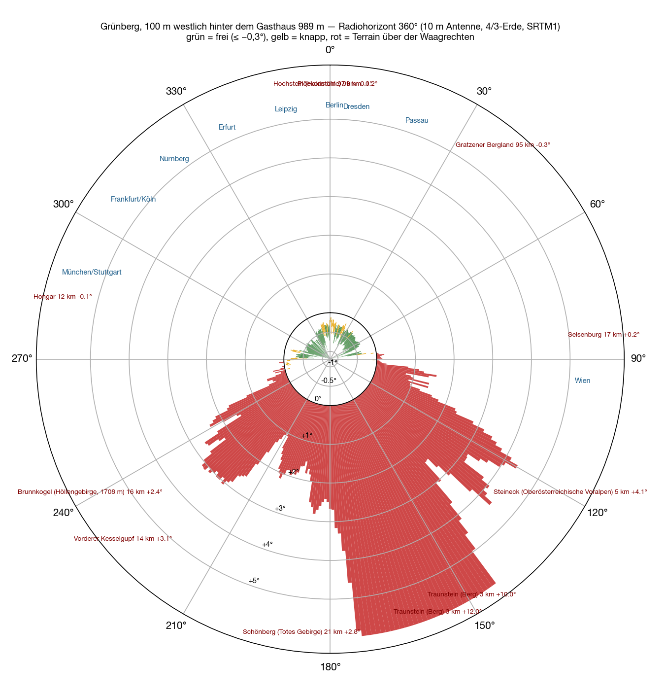
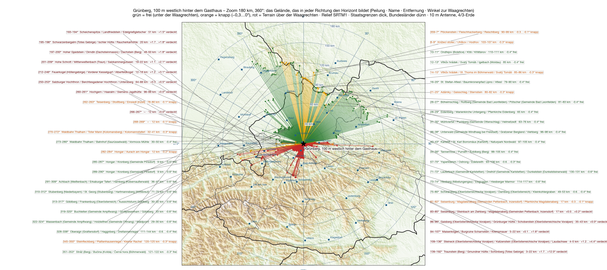

Después del [Feuerkogel](/es/blog/feuerkogel-horizont/), la montaña del otro lado del lago: el **Grünberg sobre Gmunden**, **989 metros**, JN67VV. No es una cumbre sino un lomo — diez minutos en teleférico desde Gmunden, la hostería está en el extremo superior. Calculé para el punto **cien metros al oeste detrás de la casa**, porque de todos los puntos del lomo es el que tiene la vista más libre hacia el oeste. Tampoco cambia mucho: toda la loma queda dentro de dos centésimas de grado.

El método es el mismo que para el Feuerkogel — modelo del terreno SRTM, un rayo por grado, antena de diez metros, Tierra 4/3, nombres de la Wikipedia. Quien quiera leerlo: [está allí](/es/blog/feuerkogel-horizont/#cómo).

## Alrededor

Dos mitades, como en el Feuerkogel — solo que cortadas de otra manera.

**De 92° por el sur hasta 256° está cerrado.** Y no un poco: el **Traunstein** se levanta tres kilómetros al sur, 1691 metros, y sube **+12°** en el cielo. Eso no es una muesca, es una pared de 139° a 192°. A su izquierda el Hochsalm y la Kremsmauer, a su derecha el Höllengebirge y el Dachstein, todo entre +1° y +4°. Además dos puntas pequeñas: la Seisenburg junto a Steinbach am Ziehberg (83–90°, +0,2°) y, apenas, el Hochstaufen en el Chiemgau (258–261°, 74 km, +0,3°).

**De 262° por el norte hasta 80° está abierto** — con matices. Realmente libre, 0,3 a 0,6 grados bajo la horizontal, está de 285° a 344° (Selva de Baviera, 30 a 145 km) y de 40° a 80° (Mühlviertel y Waldviertel, Prealpes). Entre medias hay puntos justos: el Hongar a 282–284° (12 km, −0,2°), la Selva de Bohemia a 345–350° y 0–9° (Lusen, Plöckenstein, 100 a 120 km, −0,1 a −0,3°), el Sternstein a 21–25° (81 km, −0,2°). Justo significa aquí: bajo la horizontal, pero por un pelo.

| Dirección | Qué pone el horizonte | Distancia | Ángulo |
|---|---|---|---|
| 83–⁠90° | Seisenburg / Magdalenaberg | 17 km | +0,0…⁠+0,2° |
| 92–⁠107° | Hochsalm | 5–22 km | +0,1…⁠+1,6° |
| 109–⁠136° | Steineck, Katzenstein, Laudachsee | 4–5 km | +1,2…⁠+4,4° |
| 139–⁠192° | **Traunstein** | 3 km | +1,7…⁠+12,0° |
| 193–⁠209° | Dachstein: Scheichenspitze, Gjaidstein, Hohe Schrott | 19–51 km | +1,1…⁠+2,1° |
| 212–⁠246° | Höllengebirge: Kranabethsattel, Feuerkogel, Rieder Hütte, Hochlecken | 12–18 km | +1,2…⁠+3,1° |
| 250–⁠261° | Alpes de Berchtesgaden, Hochstaufen | 64–99 km | +0,0…⁠+0,5° |

## El mapa

El abanico verde es más ancho que en el Feuerkogel, porque se suma el oeste: nada de la propia montaña se interpone. En cambio no llega tan hondo — 989 en vez de 1591 metros, y se nota en el ángulo: el horizonte aquí queda a −0,3…−0,6°, en el Feuerkogel a −0,6…−0,95°.

## Hasta 700 kilómetros

<figure class="zoomkarte" data-basis="/karten/horizont/gruenberg-horizont-" data-min="200" data-max="700" data-schritt="100" data-start="200">
  
  <figcaption>
    <button type="button" data-zoom="-1" aria-label="Reducir el radio 100 km">−</button>
    Radio 200 km
    <button type="button" data-zoom="+1" aria-label="Ampliar el radio 100 km">+</button>
  </figcaption>
</figure>

Más lejos ya no estorba nada — la curvatura de la Tierra se encarga, como ya se calculó para el Feuerkogel. De las 78 sierras de la [vista general hasta 800 kilómetros](/karten/gruenberg-horizont-uebersicht-800km.pdf) exactamente una asoma sobre la horizontal, y está en Austria: el **Ötscher**, 103 km a 91°, con +0,15°. Todo lo de Alemania, Chequia, Polonia queda debajo — la propia Selva de Baviera, que forma la vista hacia el norte, ya está a −0,4°.

Ambos mapas en PDF: [zoom 180 km](/karten/gruenberg-horizont-zoom-180km.pdf) con todos los nombres de las montañas y [vista general 800 km](/karten/gruenberg-horizont-uebersicht-800km.pdf) con la lista numerada.

## Qué significa

Hacia Alemania el Grünberg está **abierto por todas partes, Múnich incluido**: Núremberg −0,61°, Colonia −0,59°, Stuttgart −0,60°, Fráncfort −0,50°, Múnich −0,45°, Erfurt −0,44°, Berlín −0,36°, Passau −0,41°. Solo se pone justo hacia Rosenheim (−0,08°, el Hongar) y hacia Sajonia — Dresde −0,19°, Leipzig −0,26° — donde la Selva de Bohemia llega casi a la horizontal.

Comparado con el Feuerkogel: allí el norte está medio grado más hondo, pero Múnich ha desaparecido detrás de la propia loma. Aquí todo es más plano, pero nada está cerrado. Para el grueso de las estaciones alemanas — Baviera, Franconia, Baden-Wurtemberg — el Grünberg es así el emplazamiento más equilibrado; para los trayectos largos hacia el norte el Feuerkogel es el mejor.

Hacia el sur no hay nada que sacar, y no sorprende a quien haya mirado una vez desde la terraza hacia el Traunstein.

## Reserva

Cálculo, no medición — modelo del terreno de treinta metros de malla, sin árboles, sin edificios, atmósfera estándar. El lomo del Grünberg está arbolado; dónde exactamente la antena supera los árboles lo decide el terreno más que cualquier décima de grado de esta tabla.
