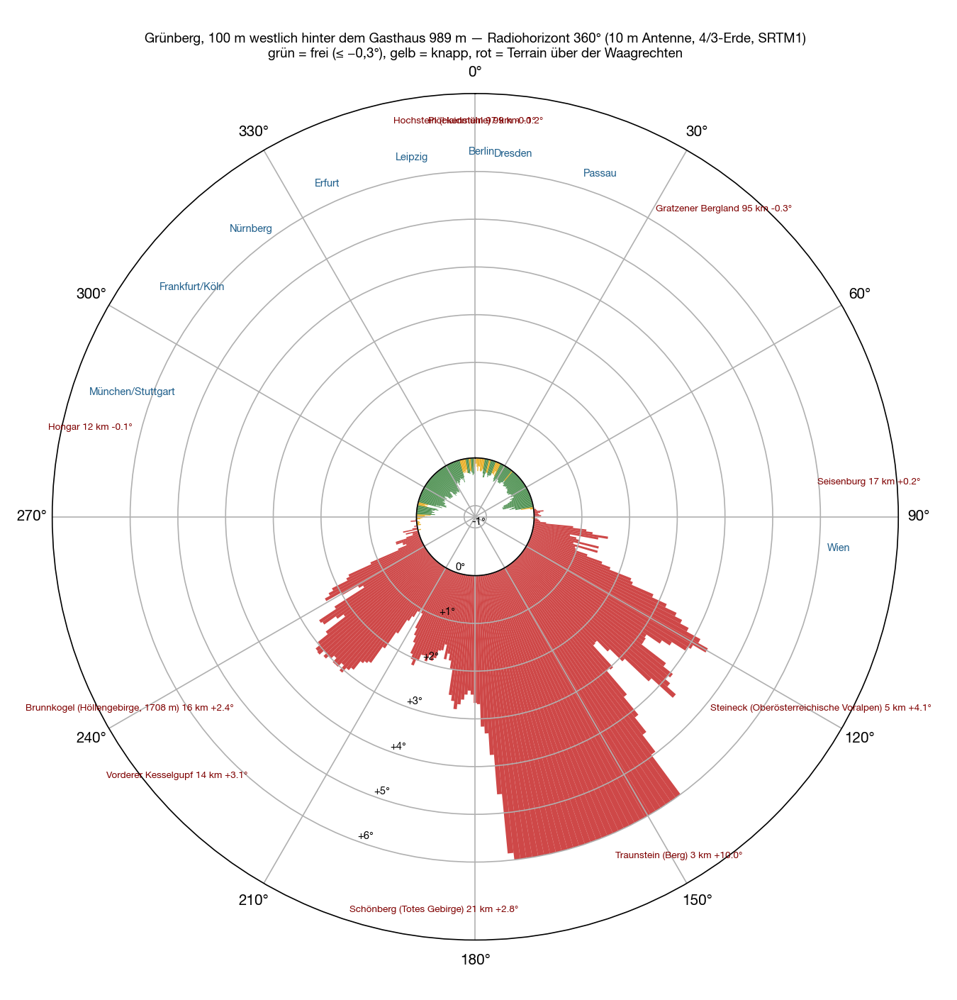
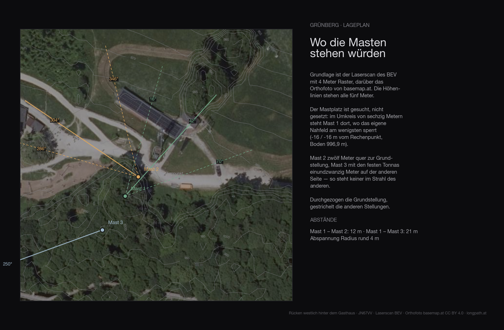
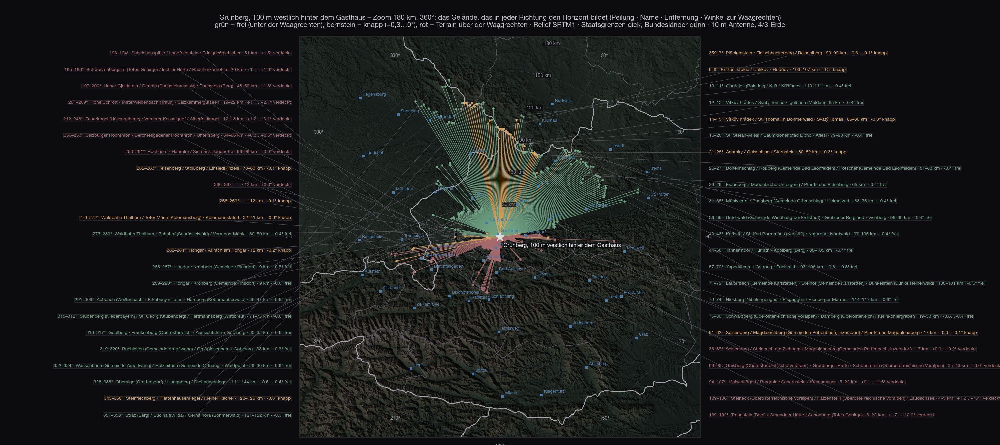
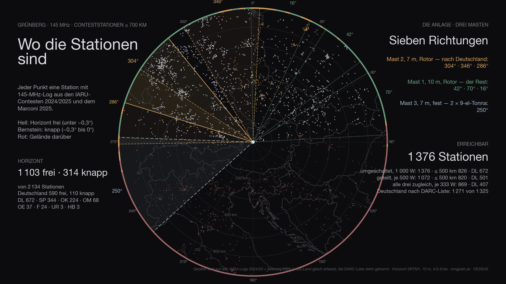
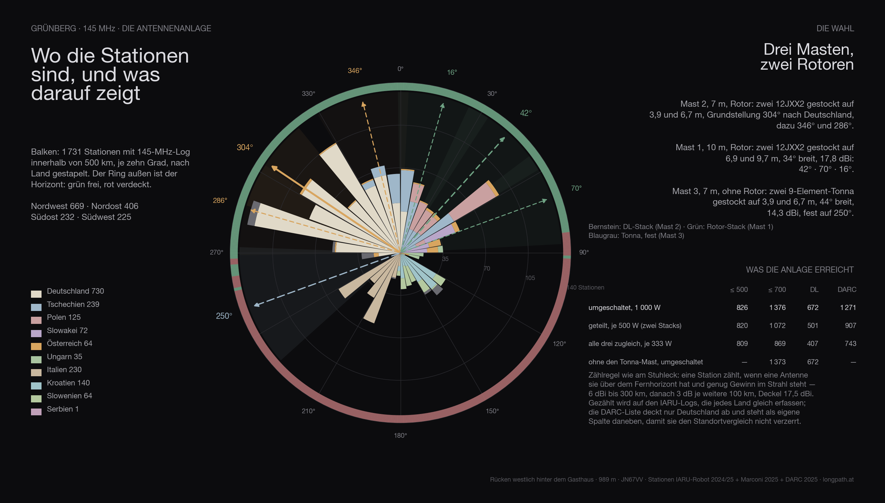

Después del [Feuerkogel](/es/blog/feuerkogel-horizont/), la montaña del otro lado del lago: el **Grünberg sobre Gmunden**, **989 metros**, JN67VV. No es una cumbre sino un lomo — diez minutos en teleférico desde Gmunden, la hostería está en el extremo superior. Calculé para el punto **cien metros al oeste detrás de la casa**, porque de todos los puntos del lomo es el que tiene la vista más libre hacia el oeste. Tampoco cambia mucho: toda la loma queda dentro de dos centésimas de grado.

## Cómo

El método es el mismo en todos los emplazamientos de la serie: **modelo del terreno SRTM**, un rayo por grado hasta 500 kilómetros, diez metros de altura de antena, curvatura terrestre con el radio 4/3, nombres de los obstáculos de la Wikipedia. Está explicado en detalle en el [artículo del Feuerkogel](/es/blog/feuerkogel-horizont/#cómo). Además, el **escaneo láser del BEV** para los primeros 140 metros alrededor del sitio y los registros de concurso superpuestos.

Tres clases: **libre** significa más de tres décimas de grado por debajo de la horizontal, **justo** entre −0,3° y cero, **cerrado** significa terreno por encima de la horizontal.

## Alrededor

Dos mitades, como en el Feuerkogel — solo que cortadas de otra manera.

**De 92° por el sur hasta 256° está cerrado.** Y no un poco: el **Traunstein** se levanta tres kilómetros al sur, 1691 metros, y sube **+12°** en el cielo. Eso no es una muesca, es una pared de 139° a 192°. A su izquierda el Hochsalm y la Kremsmauer, a su derecha el Höllengebirge y el Dachstein, todo entre +1° y +4°. Además dos puntas pequeñas: la Seisenburg junto a Steinbach am Ziehberg (83–90°, +0,2°) y, apenas, el Hochstaufen en el Chiemgau (258–261°, 74 km, +0,3°).

**De 262° por el norte hasta 80° está abierto** — con matices. Realmente libre, 0,3 a 0,6 grados bajo la horizontal, está de 285° a 344° (Selva de Baviera, 30 a 145 km) y de 40° a 80° (Mühlviertel y Waldviertel, Prealpes). Entre medias hay puntos justos: el Hongar a 282–284° (12 km, −0,2°), la Selva de Bohemia a 345–350° y 0–9° (Lusen, Plöckenstein, 100 a 120 km, −0,1 a −0,3°), el Sternstein a 21–25° (81 km, −0,2°). Justo significa aquí: bajo la horizontal, pero por un pelo.

| Dirección | Qué pone el horizonte | Distancia | Ángulo |
|---|---|---|---|
| 83–⁠90° | Seisenburg / Magdalenaberg | 17 km | +0,0…⁠+0,2° |
| 92–⁠107° | Hochsalm | 5–22 km | +0,1…⁠+1,6° |
| 109–⁠136° | Steineck, Katzenstein, Laudachsee | 4–5 km | +1,2…⁠+4,4° |
| 139–⁠192° | **Traunstein** | 3 km | +1,7…⁠+12,0° |
| 193–⁠209° | Dachstein: Scheichenspitze, Gjaidstein, Hohe Schrott | 19–51 km | +1,1…⁠+2,1° |
| 212–⁠246° | Höllengebirge: Kranabethsattel, Feuerkogel, Rieder Hütte, Hochlecken | 12–18 km | +1,2…⁠+3,1° |
| 250–⁠261° | Alpes de Berchtesgaden, Hochstaufen | 64–99 km | +0,0…⁠+0,5° |

## El sitio

El terreno de los primeros 136 metros alrededor del sitio procede del **escaneo láser del BEV** con retícula de cuatro metros — árboles, edificios y lomas incluidos. El suelo en el mástil está a **996,9 metros**.

| Altura de antena | Direcciones que bloquea el campo cercano |
|---|---|
| 6 m | 131° |
| 8 m | ninguna |
| 10 m | ninguna |
| 12 m | ninguna |
| 15 m | ninguna |

Con diez metros de mástil el sitio está **libre de su propio campo cercano en las 360 direcciones**. Lo que queda cerrado desde aquí lo cierra el terreno lejano, no el sitio.

## El mapa

El abanico verde es más ancho que en el Feuerkogel, porque se suma el oeste: nada de la propia montaña se interpone. En cambio no llega tan hondo — 989 en vez de 1591 metros, y se nota en el ángulo: el horizonte aquí queda a −0,3…−0,6°, en el Feuerkogel a −0,6…−0,95°.

## Hasta 700 kilómetros

<figure class="zoomkarte" data-basis="/karten/horizont/gruenberg-horizont-" data-min="200" data-max="700" data-schritt="100" data-start="200">
  
  <figcaption>
    <button type="button" data-zoom="-1" aria-label="Reducir el radio 100 km">−</button>
    Radio 200 km
    <button type="button" data-zoom="+1" aria-label="Ampliar el radio 100 km">+</button>
  </figcaption>
</figure>

Más lejos ya no estorba nada — la curvatura de la Tierra se encarga, como ya se calculó para el Feuerkogel. De las 78 sierras de la [vista general hasta 800 kilómetros](/karten/gruenberg-horizont-uebersicht-800km.pdf) exactamente una asoma sobre la horizontal, y está en Austria: el **Ötscher**, 103 km a 91°, con +0,15°. Todo lo de Alemania, Chequia, Polonia queda debajo — la propia Selva de Baviera, que forma la vista hacia el norte, ya está a −0,4°.

Ambos mapas en PDF: [zoom 180 km](/karten/gruenberg-horizont-zoom-180km.pdf) con todos los nombres de las montañas y [vista general 800 km](/karten/gruenberg-horizont-uebersicht-800km.pdf) con la lista numerada.

## Las estaciones

De las 2 134 estaciones que aparecen en los registros hasta 700 kilómetros, **1 417 están por encima del horizonte** — Alemania 700 de 701. Ese es el techo: ninguna antena, por grande que sea, lo supera.

La cifra tiene dos mitades. **Realmente libres** — el horizonte más de tres décimas de grado por debajo de la horizontal — son 1 103 estaciones, 590 de ellas en Alemania. Las otras 314 quedan **justas**: entre −0,3° y cero, en la sombra rasante de un borde. Algo se hace, pero con pérdida de tres a ocho decibelios según el día. Se dan ambas cifras porque solo juntas describen el emplazamiento. A los 137 grados libres se suman 44 grados justos.

## Las antenas

En todos los emplazamientos se calcula la misma instalación que en el Stuhleck, con **tres mástiles**:

- **Mástil 2**, 7 metros, rotor: dos 12JXX2 apiladas a 3,9 y 6,7 m — la pila que mira a Alemania.
- **Mástil 1**, 10 metros, rotor: dos 12JXX2 apiladas a 6,9 y 9,7 m, 34° de ancho, 17,8 dBi.
- **Mástil 3**, 7 metros, sin rotor: dos Tonna de 9 elementos apiladas a 3,9 y 6,7 m, 44° de ancho, 14,3 dBi — fijas en una dirección.

Las posiciones no están supuestas, sino buscadas: para Grünberg salen **304° / 346° / 286°** en la pila DL, **42° / 70° / 16°** en la pila del rotor y **250°** para las Tonna fijas.

La alimentación pasa por un conmutador. Con los 1 000 vatios completos en el sistema con el que se trabaja, la instalación alcanza **1 376 estaciones** (Alemania 672, según la lista DARC 1 271). Repartida entre las dos pilas con rotor, 500 vatios cada una, son 1 072; repartida entre los tres sistemas a la vez, solo 869 — tres direcciones cuestan más potencia de la que aportan en cobertura. El mástil con las Tonna aporta por sí solo 3 estaciones que de otro modo faltarían.

## En tres dimensiones

<figure class="szene">
  <iframe src="/standort-3d.html?ort=gruenberg&v=1" title="Grünberg en 3D: terreno del escaneo láser con ortofoto, los dos mástiles y las direcciones de radiación" loading="lazy" allowfullscreen></iframe>
  <figcaption>Arrastra para girar, la rueda hace zoom. Los deslizadores giran las dos pilas, los botones saltan a las posiciones calculadas. <a href="/standort-3d.html?ort=gruenberg">Abrir a pantalla completa</a></figcaption>
</figure>

La misma vista para cada emplazamiento: el terreno procede del escaneo láser del BEV, encima va la ortofoto y sobre ella los tres mástiles con sus alturas calculadas — dos pilas con rotor y, en gris azulado, las Tonna fijas. Las etiquetas del borde son ciudades: claro significa por encima del horizonte.

## La comparación

Todos los emplazamientos de la serie con **la misma instalación, la misma regla de recuento y los mismos registros** — solo así las cifras son comparables. Alcanzable significa: horizonte por debajo de la horizontal y ganancia suficiente para la distancia (6 dBi hasta 300 km, después 3 dB por cada 100 km), con 1 000 vatios en el sistema con el que se trabaja.

El recuento se hace sobre los **registros IARU 2024/2025 y el Marconi 2025**: registran todos los países por igual. La lista DARC cubre solo Alemania — va en columna aparte, si no, cualquier emplazamiento que mire al oeste gana solo por los datos.

| Emplazamiento | alcanzadas | Alemania | lista DARC | ≤ 500 km | Acceso |
|---|---:|---:|---:|---:|---|
| Traisner Hütte · 1 304 m | 1 378 | 543 | 988 | 875 | telesilla y luego a pie |
| **Grünberg** · 989 m | 1 376 | 672 | 1 271 | 826 | teleférico, posada |
| Stuhleck · 1 770 m | 1 298 | 307 | 569 | 921 | coche hasta arriba |
| Feuerkogelhaus · 1 591 m | 1 258 | 571 | 1 056 | 726 | teleférico, posada |
| Braunsberg · 337 m | 1 124 | 443 | 814 | 740 | coche hasta arriba |
| Gaisberg · 1 272 m | 1 036 | 620 | 1 199 | 618 | coche hasta arriba |
| Hochkar · 1 478 m | 438 | 321 | 559 | 247 | coche hasta arriba |
| Loser · 1 585 m | 0 | 0 | 0 | 0 | coche hasta arriba |

Grünberg ocupa así el **puesto 2 de 8**.

Quien conozca los artículos anteriores de la serie encontrará allí otras cifras: se calcularon con la primera configuración — una pila Yagi y una pila de cuads con 69° de anchura de haz. Desde que la elección recayó en dos pilas estrechas de 12JXX2, el orden cambia: más ganancia y menos anchura favorece a los sitios cuyas estaciones se concentran en una dirección y perjudica a los que están abiertos en todo el horizonte. Las Tonna fijas del mástil 3 recuperan parte de esa anchura.

## Los datos

| | |
|---|---|
| Emplazamiento | Grünberg — Rücken westlich hinter dem Gasthaus |
| Coordenadas | 47,89829 N / 13,82024 O · 989 m · JN67VV |
| Acceso | teleférico, posada en el sitio |
| Horizonte libre | 268°–82° |
| Grados libres / justos / cerrados | 137° / 44° / 179° |
| Estaciones ≤ 700 km | 1 103 libres, 314 justas, de 2 134 |
| Alemania (IARU) | 590 libres, 110 justas, de 701 |
| Alemania (lista DARC) | 1 324 por debajo de la horizontal de 1 325 |
| Instalación | tres mástiles · mástil 1 10 m (2 × 12JXX2 a 6,9/9,7 m, rotor) · mástil 2 7 m (2 × 12JXX2 a 3,9/6,7 m, rotor) · mástil 3 7 m (2 × Tonna 9 el a 3,9/6,7 m, fijo) |
| Posiciones | DL-Stack 304° / 346° / 286° · Rotor-Stack 42° / 70° / 16° · Tonna fest 250° |
| conmutada · 1 000 W | 1 376 · ≤ 500 km 826 · DL 672 · DARC 1 271 |
| repartida · 500 W cada una | 1 072 · ≤ 500 km 820 · DL 501 |
| las tres a la vez · 333 W | 869 · ≤ 500 km 809 · DL 407 |
| sin el mástil de las Tonna | 1 373 en vez de 1 376 |
| Σ kilómetros | 595 729 km |
| recuento estricto | solo direcciones por debajo de −0,3°: 836 · ≤ 500 km 634 · DL 416 |

## Qué significa

Hacia Alemania el Grünberg está **abierto por todas partes, Múnich incluido**: Núremberg −0,61°, Colonia −0,59°, Stuttgart −0,60°, Fráncfort −0,50°, Múnich −0,45°, Erfurt −0,44°, Berlín −0,36°, Passau −0,41°. Solo se pone justo hacia Rosenheim (−0,08°, el Hongar) y hacia Sajonia — Dresde −0,19°, Leipzig −0,26° — donde la Selva de Bohemia llega casi a la horizontal.

Comparado con el Feuerkogel: allí el norte está medio grado más hondo, pero Múnich ha desaparecido detrás de la propia loma. Aquí todo es más plano, pero nada está cerrado. Para el grueso de las estaciones alemanas — Baviera, Franconia, Baden-Wurtemberg — el Grünberg es así el emplazamiento más equilibrado; para los trayectos largos hacia el norte el Feuerkogel es el mejor.

Hacia el sur no hay nada que sacar, y no sorprende a quien haya mirado una vez desde la terraza hacia el Traunstein.

## Reserva

Cálculo, no medición — modelo del terreno de treinta metros de malla, sin árboles, sin edificios, atmósfera estándar. El lomo del Grünberg está arbolado; dónde exactamente la antena supera los árboles lo decide el terreno más que cualquier décima de grado de esta tabla.
