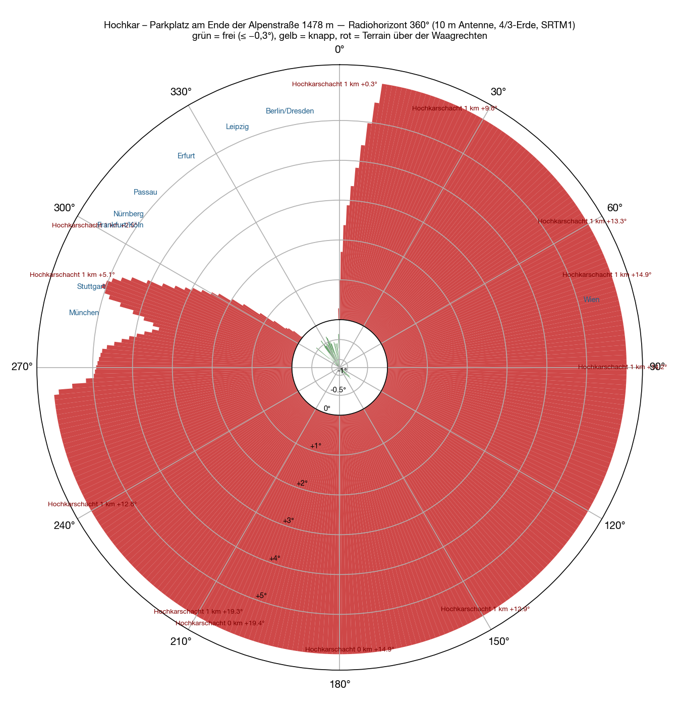
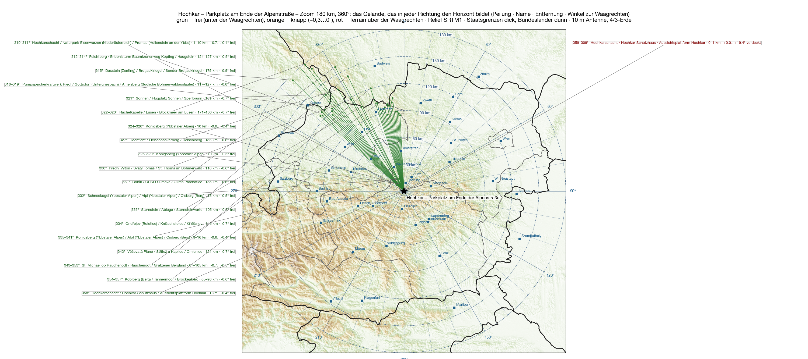
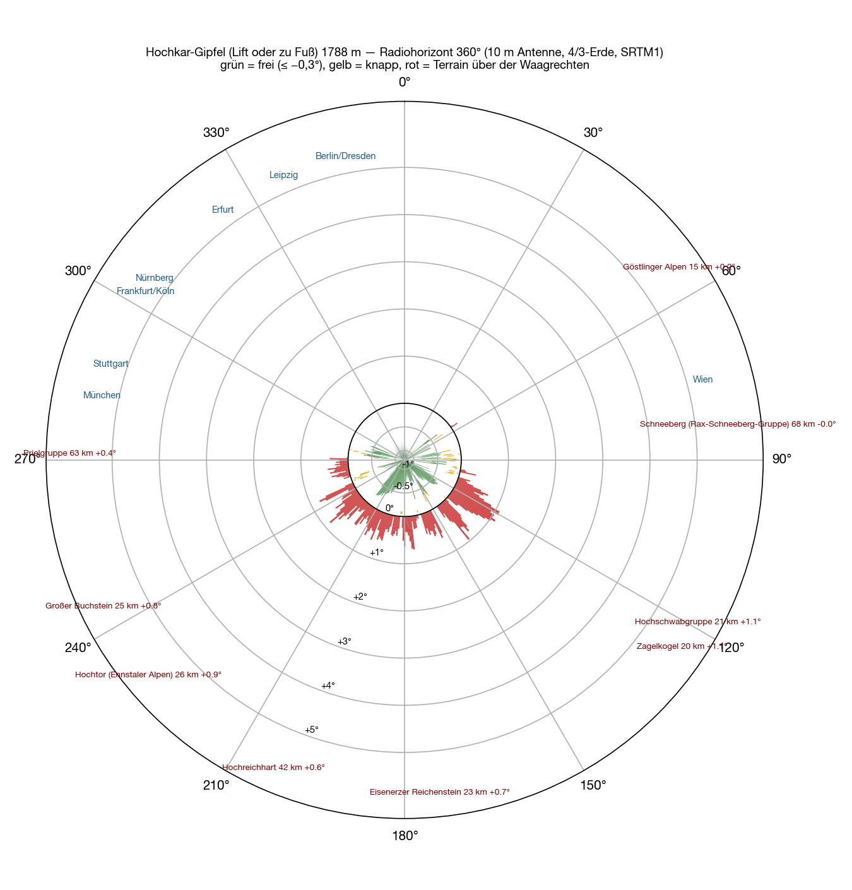

El cuarto emplazamiento, y el primero fuera del Salzkammergut: el **Hochkar** junto a Göstling an der Ybbs, 1808 metros, con la **Hochkar Alpenstraße** hasta la estación de esquí. La carretera de peaje termina en el Hochkarhof a **1478 metros**, JN77LR — más alto no se llega en coche en la Baja Austria. Exactamente ese punto es el calculado: el aparcamiento al final de la carretera.

El método como en el [Feuerkogel](/es/blog/feuerkogel-horizont/#cómo), el [Grünberg](/es/blog/gruenberg-horizont/) y el [Loser](/es/blog/loser-horizont/): modelo del terreno SRTM, un rayo por grado, antena de diez metros, Tierra 4/3, nombres de la Wikipedia. Además una malla de 400 metros alrededor del aparcamiento, para ver si una esquina es mejor que otra.

## Alrededor

El aparcamiento está en una hondonada. Hacia el sur y el suroeste se alza la cresta del Hochkar con la cumbre, a 400–1200 metros, **+12° a +19°**. Hacia el este los lomos de la estación de esquí, 600 metros, +8° a +15°. Hacia el norte y el noreste otro lomo a 600–900 metros, +1° a +13°. Hacia el oeste, donde están Múnich y Stuttgart, una loma a 900 metros con +3° a +5°.

**Libre solo hay una cuña de 310° a 358°** — pero buena: −0,4 a −0,8°, formada por el Königsberg a nueve kilómetros y más allá por la Selva de Bohemia y la Selva de Baviera a 100–175 kilómetros. Es la dirección de Passau, Erfurt, Leipzig, Berlín y Dresde.

| Dirección | Qué pone el horizonte | Distancia | Ángulo |
|---|---|---|---|
| 0–⁠59° | lomos al norte y noreste del aparcamiento | 0,6–0,9 km | +1…⁠+13° |
| 60–⁠149° | lomos de la estación de esquí hacia el este | 0,6–1,0 km | +7…⁠+15° |
| 150–⁠239° | **cresta y cumbre del Hochkar** | 0,3–1,2 km | +12…⁠+19° |
| 240–⁠299° | loma al oeste del aparcamiento | 0,1–0,9 km | +2,8…⁠+13° |
| 300–⁠309° | la misma loma, desvaneciéndose | 0,9 km | +0,1…⁠+2,5° |
| 310–⁠358° | **libre** — Königsberg, Selva de Bohemia, Selva de Baviera | 9–175 km | −0,4…⁠−0,8° |

La malla alrededor del aparcamiento no cambia nada: dentro del aparcamiento todos los puntos son iguales. Solo mejora 400 metros pista arriba, a 1640 metros — y allí no llega ningún coche.

## El mapa

## La cumbre

Como en el Loser, la buena vista está 330 metros de desnivel por encima del aparcamiento. Desde la **cumbre del Hochkar**, 1808 metros, está **libre de 282° por el norte hasta 52°**, −0,3 a −1,1°: Múnich −0,53°, Stuttgart −0,46°, Núremberg −1,03°, Colonia −0,99°, Erfurt −0,74°, Berlín −0,79°, Dresde −0,75°. Hacia el este y el sur cierran el Dürrenstein, el Hochschwab y los Alpes del Enns, +0,2 a +1,1°, con huecos justos hacia el Rax y el Schneeberg. Un emplazamiento de noroeste de primera — con el remonte o a pie, no en coche.

## Hasta 700 kilómetros

<figure class="zoomkarte" data-basis="/karten/horizont/hochkar-horizont-" data-min="200" data-max="700" data-schritt="100" data-start="200">
  
  <figcaption>
    <button type="button" data-zoom="-1" aria-label="Reducir el radio 100 km">−</button>
    Radio 200 km
    <button type="button" data-zoom="+1" aria-label="Ampliar el radio 100 km">+</button>
  </figcaption>
</figure>

De las 78 sierras de la [vista general hasta 800 kilómetros](/karten/hochkar-horizont-uebersicht-800km.pdf) ninguna asoma sobre la horizontal desde el aparcamiento que no desaparezca de todos modos tras la hondonada. Ambos mapas en PDF: [zoom 180 km](/karten/hochkar-horizont-zoom-180km.pdf) y [vista general 800 km](/karten/hochkar-horizont-uebersicht-800km.pdf).

## Qué significa

Desde el coche el Hochkar es un **emplazamiento de una sola dirección**: Passau −0,77°, Erfurt −0,56°, Berlín −0,59°, Dresde −0,55°, Hannover −0,51°, Kassel −0,70°, Dortmund −0,71° — todo lo que queda entre 310° y 358° funciona casi tan bien como desde el Feuerkogel. Pero Núremberg (+0,47°), Colonia (+0,82°), Fráncfort (+1,7°), Múnich (+3,4°) y Stuttgart (+5,0°) están detrás de la loma del oeste, y el grueso de las estaciones alemanas de VHF está justo ahí. Para un concurso no basta; para contactos dirigidos al este de Alemania es un horizonte muy hondo.

Quien suba a la cumbre tiene el mejor horizonte de noroeste de estos cuatro emplazamientos. Desde el aparcamiento, el [Grünberg](/es/blog/gruenberg-horizont/) y el [Feuerkogel](/es/blog/feuerkogel-horizont/) siguen siendo las direcciones para Alemania.

## Reserva

Cálculo, no medición. La hondonada es un problema de corta distancia — lomos a 300–900 metros, malla de treinta metros: el orden de magnitud es correcto, el grado suelto no. Los nombres de Wikipedia de los obstáculos cercanos en los mapas son la entrada más próxima en cada caso, no siempre el propio lomo.
