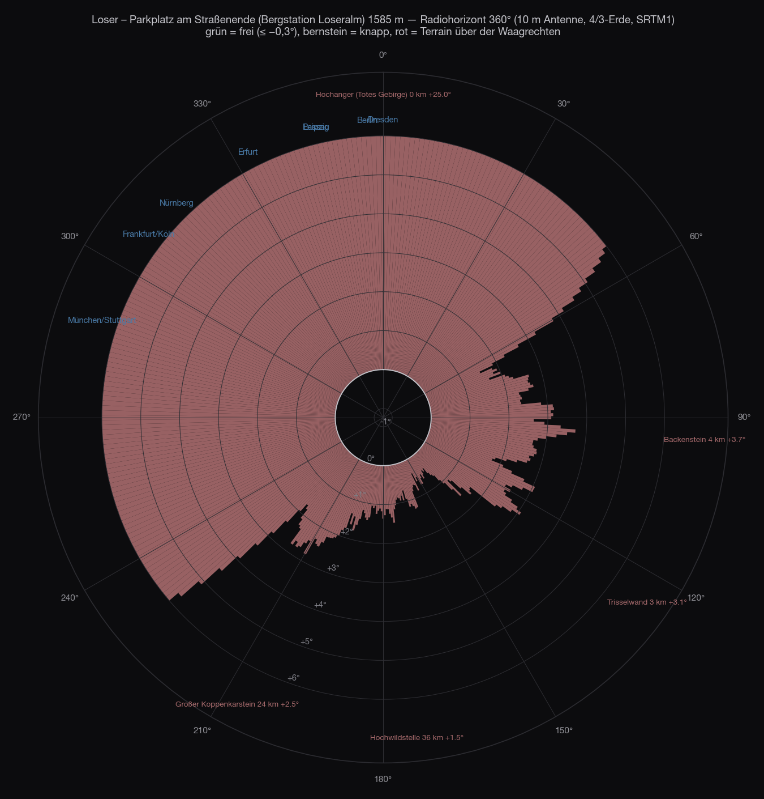
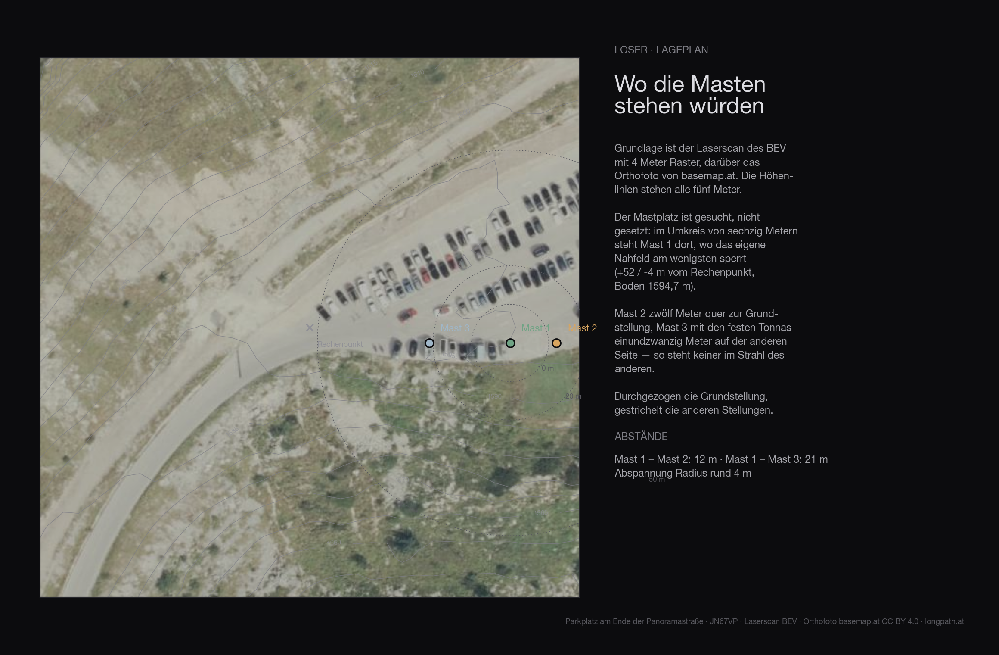
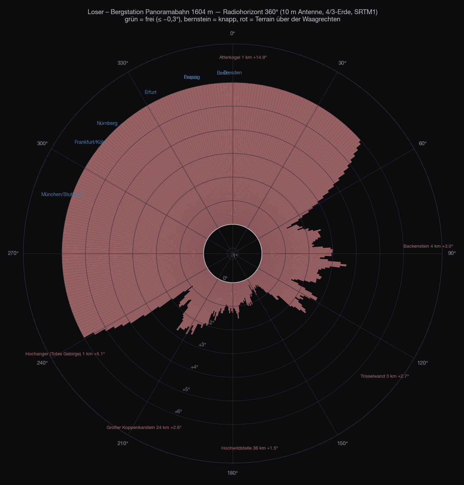
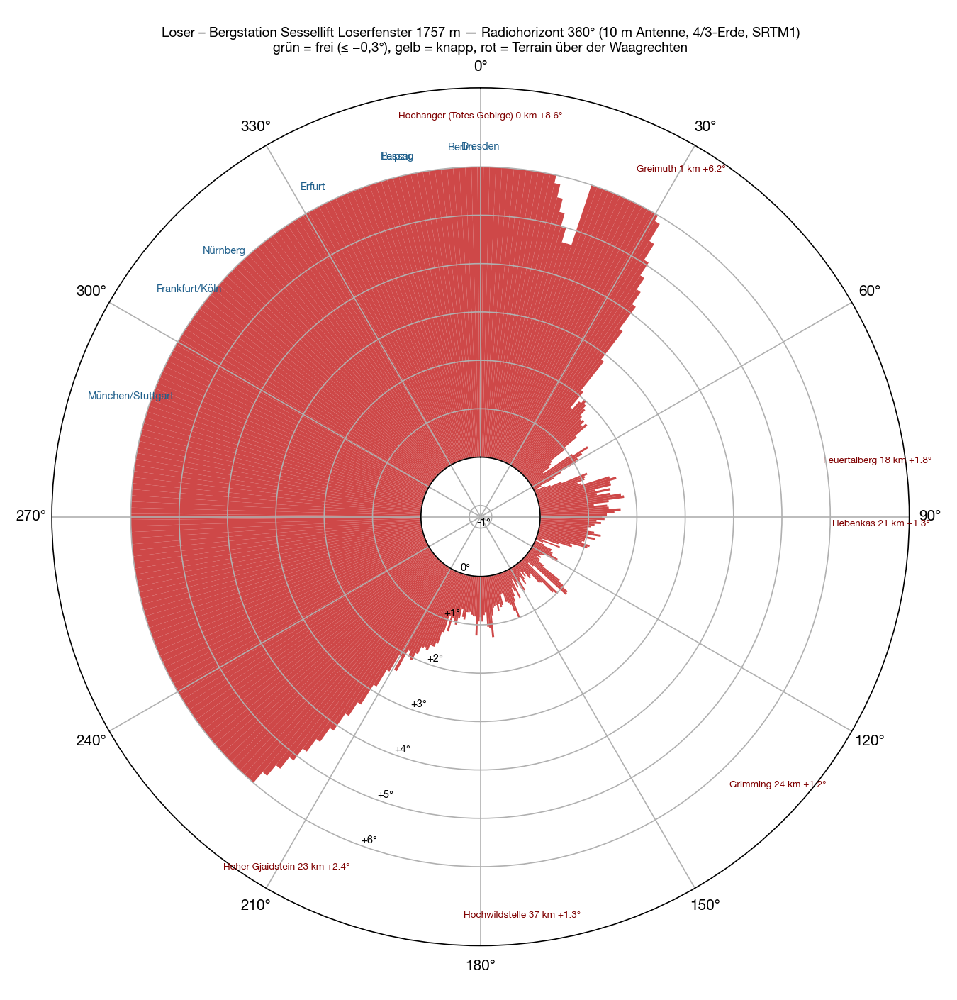
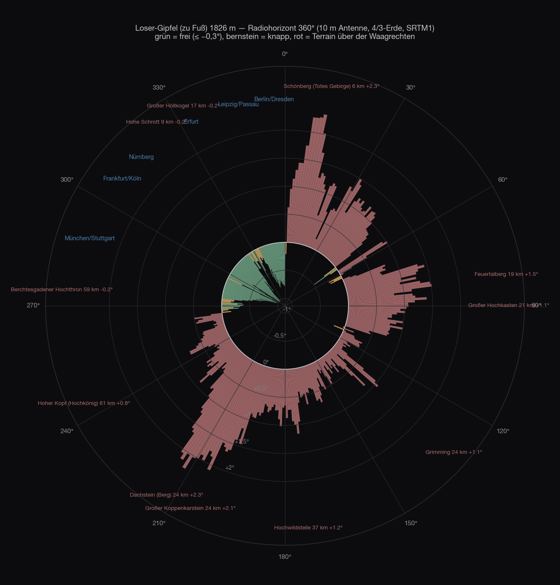
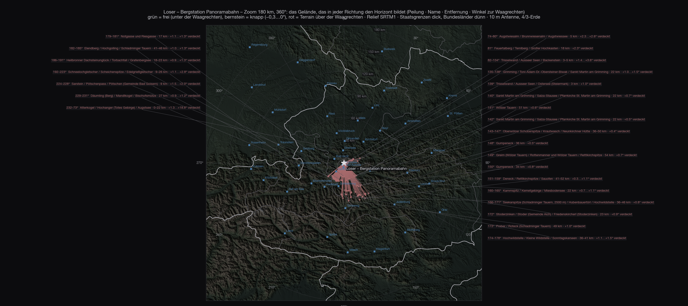
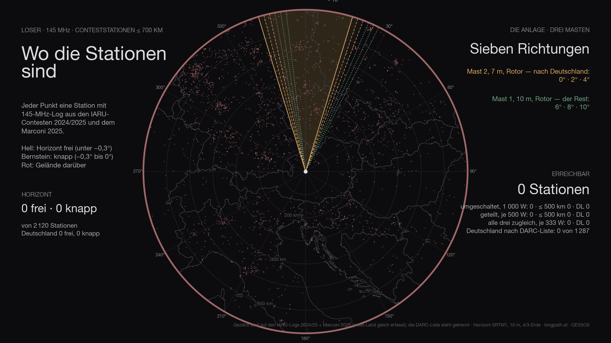
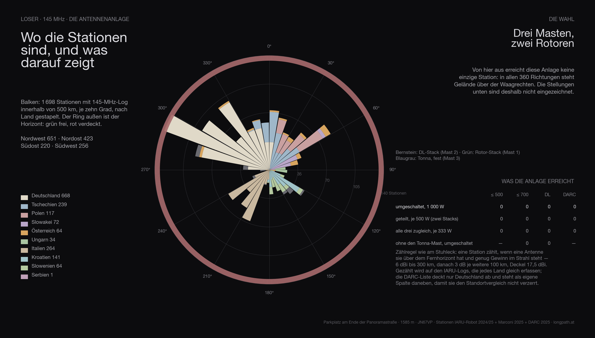

El tercer emplazamiento tras el [Feuerkogel](/es/blog/feuerkogel-horizont/) y el [Grünberg](/es/blog/gruenberg-horizont/), y el primero con carretera: la **Loser Panoramastraße** sube desde Altaussee hasta **1585 metros**, arriba un aparcamiento con zona para dar la vuelta, el restaurante de montaña, la estación superior de la góndola Panoramabahn. Más abajo, junto a la Loserhütte, un segundo aparcamiento a 1506 metros. Subes en coche, montas, listo — esa era la idea.

Pero al Loser no solo sube la carretera. La góndola **Panoramabahn** va de Altaussee a **1604 metros**, y por encima termina el **telesilla Loserfenster** a **1757 metros** — una estación superior suele estar algo más alta y más libre que el aparcamiento. Así que lo calculé todo: aparcamientos, carretera, las dos estaciones y la cumbre.

## Cómo

El método es el mismo que en los [cinco emplazamientos anteriores](/es/blog/feuerkogel-horizont/#cómo): modelo del terreno SRTM, un rayo por grado, antena a diez metros, tierra 4/3, hasta 500 kilómetros, los nombres de los obstáculos de la Wikipedia. Lo nuevo es el segundo paso de la [última entrada](/es/blog/feuerkogel-stationen/): los 3215 logs de concurso de los concursos IARU de 2024 y 2025 recalculados para este emplazamiento — para cada estación, rumbo, distancia y la pregunta de si el horizonte en su dirección está libre. Esta vez no solo para un punto, sino para **toda la carretera**, punto por punto, además de las dos estaciones y la cumbre.

## Alrededor

No hay segunda mitad. **Los 360 rumbos están cerrados.** El aparcamiento está en una hondonada bajo la cumbre del Loser: hacia el norte y el oeste el terreno sube cincuenta, sesenta metros en cien — eso son **+15° a +27°** justo en la dirección en la que está Alemania. Hacia el este el Bräuning Zinken y la Trisselwand, +1,5 a +4°. Solo hacia el sureste, entre 120° y 180°, el horizonte baja a +0,4…+1,5° — allí están los Tauern y el Dachstein a cuarenta, cincuenta kilómetros. Es la dirección de Graz y Eslovenia, no la de Núremberg.

Desde el aparcamiento de la Loserhütte, ochenta metros más abajo, la imagen es la misma: 360 rumbos cerrados, hacia Alemania +15 a +22°, Múnich +8,5°, Rosenheim +4,6°.

| Dirección | Qué pone el horizonte | Distancia | Ángulo |
|---|---|---|---|
| 240–⁠60° | la **loma del Loser** y el collado del Augstsee justo encima del aparcamiento | 0,1–0,4 km | +4…⁠+27° |
| 60–⁠120° | Bräuning Zinken, Trisselwand | 0,3–4 km | +1,5…⁠+3,8° |
| 120–⁠180° | Tauern de Wölz, Sölkpass, Hochwildstelle | 36–50 km | +0,4…⁠+1,5° |
| 180–⁠240° | Elendberg, Koppenkarstein, Dachstein | 22–41 km | +1,0…⁠+2,5° |

## El sitio

El terreno de los primeros 136 metros alrededor del sitio procede del **escaneo láser del BEV** con retícula de cuatro metros — árboles, edificios y lomas incluidos. El suelo en el mástil está a **1594,7 metros**.

| Altura de antena | Direcciones que bloquea el campo cercano |
|---|---|
| 6 m | 196° |
| 8 m | 178° |
| 10 m | 164° |
| 12 m | 152° |
| 15 m | 145° |

Incluso con diez metros de mástil el campo cercano bloquea aún **164 grados** — además de lo que cierre el horizonte lejano.

## La carretera

La pregunta era si en algún punto de la carretera va mejor. Así que para **157 puntos de la carretera** de OpenStreetMap calculé 41 rumbos cada uno, de 270° por el norte hasta 30°, más los ángulos hacia treinta ciudades alemanas. La respuesta es inequívoca: **en ninguno.** Toda la carretera va por la ladera sur y este de la montaña, y la montaña siempre queda al norte. El punto menos malo está a 1238 metros en las curvas bajo la Loserhütte — allí Núremberg y Colonia bajan a +0,8°, Múnich a +2,7°, Berlín se queda en +17°. Todo sigue por encima de la horizontal.

## Los cuatro sitios del Loser superiores

Dos remontes terminan arriba en el Loser, los dos justo bajo la cresta. Las coordenadas de las estaciones vienen de OpenStreetMap, las alturas del modelo del terreno: góndola 47,66137 N / 13,78712 E, telesilla 47,66389 N / 13,78130 E.

### La góndola

**Los 360 rumbos están cerrados.** La estación está al pie de la loma del Hochanger, que baja hacia el este desde la cumbre del Loser: hacia el norte y el oeste el terreno sube entre sesenta y doscientos metros en cien a setecientos metros. Eso son **+14° a +19° hacia Alemania** — y Salzburgo igual, +17°.

| Dirección | Qué forma el horizonte | Distancia | Ángulo |
|---|---|---|---|
| 330–⁠60° | collado del Augstsee, **Atterkogel** | 0,1–1 km | +3…⁠+16° |
| 60–⁠140° | Backenstein, **Trisselwand** | 0,2–23 km | +1,0…⁠+3,6° |
| 140–⁠200° | Grimming, Kammspitz, Tauern de Wölz, Hochwildstelle | 9–54 km | +0,3…⁠+1,7° |
| 200–⁠240° | Dachstein, Sarstein | 0,6–27 km | +0,9…⁠+5,1° |
| 240–⁠330° | la **loma sobre la Loserhütte**, Hochanger | 0,1–1 km | +5,5…⁠+18,8° |

Múnich +17,2°, Núremberg +16,4°, Berlín +14,3°, Praga +12,5°, Linz +10,3°. Hacia el este la Trisselwand tampoco ayuda: Viena +2,2°, Bratislava +2,5°, Budapest +3,0°, Graz +2,5°. Lo más plano es el sureste, donde solo quedan los Tauern a cuarenta, cincuenta kilómetros — Zagreb +0,7°, Liubliana +1,1°. Por poco, pero cerrado.

¿Qué significa en estaciones? Dentro de 700 kilómetros hay 2249 estaciones de concurso con log. **Con horizonte libre, la estación de la góndola no alcanza ni una sola.** Contando con generosidad, incluyendo todo hasta +0,5° de ángulo de horizonte — eso es difracción sobre la arista, unos pocos decibelios, no un muro —, son 22: once eslovenos, siete croatas. Hasta +1,0° son 120, casi todos en Croacia y Eslovenia. Ni un alemán, ni un checo, ni un polaco.

### El telesilla

Ciento cincuenta metros más arriba, y hacia el norte no cambia nada: el Hochanger está a cien metros de la estación, **+9° a +20°**, Múnich +20,4°, Núremberg +18,7°, Berlín +9,2°, Praga +6,6°. La cresta simplemente aún no está superada — eso solo ocurre en la cumbre, otros ochenta metros de desnivel más arriba.

Lo que cambia es el sureste. De 110° a 170° el horizonte queda solo **+0,1° a +1,0°** por encima de la horizontal: Graz +0,4°, Zagreb +0,4°, Liubliana +0,6°, Viena +1,0°. Sigue cerrado, pero tan por poco que funciona con difracción. En estaciones: con horizonte libre otra vez **cero**; hasta +0,5° entonces **188** (Croacia 73, Eslovenia 29, Eslovaquia 24); hasta +1,0° **436**, entre ellas 137 croatas, 65 italianos, 62 eslovenos. Sería, si uno quiere, un emplazamiento hacia el sureste para la región del Adriático — con un hándicap de varios decibelios en cada dirección y sin un solo log alemán al alcance. Y si el telesilla funciona en septiembre hay que preguntarlo antes.

## La cumbre

Solo arriba del todo cambia la imagen. Desde la **cumbre del Loser**, 1838 metros, media hora a pie desde la estación superior, la cresta queda atrás: **libre de 269° por el norte hasta 359°**, −0,3 a −1,0°. Múnich −0,97°, Núremberg −1,02°, Colonia −1,01°, Berlín −0,75°, Passau −0,77°, Dresde −0,77°. Justos solo Rosenheim (−0,55°, detrás del Untersberg) y Erfurt (−0,17°, el Großer Höllkogel a 333°). Hacia el noreste cierra el Schönberg (+2,3°), hacia el sur todo lo demás. Un emplazamiento de noroeste — tan bueno como el Feuerkogel en esa dirección, pero sin coche y sin techo.

El Loserfenster, a 1781 metros, unos minutos bajo la cumbre, sería el compromiso: Núremberg, Colonia, Berlín libres, Múnich con +2,4° detrás de la cresta.

## Las estaciones de radio

El diagrama dice lo que dicen los mapas, solo que en una cifra. Las dos estaciones superiores: cero. La [cumbre del Loser](#la-cumbre), media hora a pie por encima del telesilla: **853 estaciones** con horizonte libre, 696 de ellas en Alemania. Y el [Feuerkogelhaus](/es/blog/feuerkogel-stationen/), al que también sube un teleférico: **1388**.

La estación superior que mira a Alemania no está en el Loser. Está en el Feuerkogel.

## El mapa

## Hasta 700 kilómetros

<figure class="zoomkarte" data-basis="/karten/horizont/loser-horizont-" data-min="200" data-max="700" data-schritt="100" data-start="200">
  
  <figcaption>
    <button type="button" data-zoom="-1" aria-label="Reducir el radio 100 km">−</button>
    Radio 200 km
    <button type="button" data-zoom="+1" aria-label="Ampliar el radio 100 km">+</button>
  </figcaption>
</figure>

El mapa muestra lo que dicen las cifras: los trazos desde el aparcamiento terminan entre cien metros y cincuenta kilómetros, por mucho que se amplíe el radio. En la [vista general hasta 800 kilómetros](/karten/loser-horizont-uebersicht-800km.pdf) solo el Hochgolling (43 km, 182°, +1,5°) de 78 sierras asoma sobre la horizontal, y queda al sur.

Ambos mapas en PDF: [zoom 180 km](/karten/loser-horizont-zoom-180km.pdf) y [vista general 800 km](/karten/loser-horizont-uebersicht-800km.pdf).

En el zoom se ve lo cortos que son los trazos: hacia el norte y el oeste terminan a cien metros, en la loma sobre la Loserhütte. Solo hacia el sureste llegan hasta los Tauern.

Las direcciones obstruidas se dibujan al menos hasta el seis por ciento del radio para que se vean — los trazos reales medirían cien metros. Los dos mapas en PDF: [zoom 180 km](/karten/loser-bergstation-zoom-180km.pdf) con los nombres de las montañas y [vista general 800 km](/karten/loser-bergstation-uebersicht-800km.pdf) con la lista numerada — 78 macizos y cumbres, de los que exactamente uno, el Hochgolling a 183°, asoma de verdad por encima de la horizontal. Todos los demás han desaparecido tras la loma junto a la estación antes siquiera de contar.

## Las estaciones

De las 2 120 estaciones de los registros, **ninguna está por encima del horizonte**. No es un error de redondeo: en las 360 direcciones hay terreno por encima de la horizontal.

## Las antenas

La instalación del Stuhleck no sirve de nada aquí: tres mástiles, dos rotores, 1 000 vatios — y ni una sola estación, porque el horizonte está por encima de la horizontal en todas las direcciones. El cálculo se muestra igualmente para que la comparación sea honesta.

## En tres dimensiones

<figure class="szene">
  <iframe src="/standort-3d.html?ort=loser&v=1" title="Loser en 3D: terreno del escaneo láser con ortofoto, los dos mástiles y las direcciones de radiación" loading="lazy" allowfullscreen></iframe>
  <figcaption>Arrastra para girar, la rueda hace zoom. Los deslizadores giran las dos pilas, los botones saltan a las posiciones calculadas. <a href="/standort-3d.html?ort=loser">Abrir a pantalla completa</a></figcaption>
</figure>

La misma vista para cada emplazamiento: el terreno procede del escaneo láser del BEV, encima va la ortofoto y sobre ella los tres mástiles con sus alturas calculadas — dos pilas con rotor y, en gris azulado, las Tonna fijas. Las etiquetas del borde son ciudades: claro significa por encima del horizonte.

## La comparación

Todos los emplazamientos de la serie con **la misma instalación, la misma regla de recuento y los mismos registros** — solo así las cifras son comparables. Alcanzable significa: horizonte por debajo de la horizontal y ganancia suficiente para la distancia (6 dBi hasta 300 km, después 3 dB por cada 100 km), con 1 000 vatios en el sistema con el que se trabaja. **Las dos antenas grandes van sobre rotor** — por eso se cuenta lo alcanzable a lo largo de todo el concurso, no lo que cubre una posición fija.

El recuento se hace sobre los **registros IARU 2024/2025 y el Marconi 2025**: registran todos los países por igual. La lista DARC cubre solo Alemania — va en columna aparte, si no, cualquier emplazamiento que mire al oeste gana solo por los datos.

| Emplazamiento | alcanzadas | Alemania | lista DARC | ≤ 500 km | Acceso |
|---|---:|---:|---:|---:|---|
| Stuhleck · 1 770 m | 1 549 | 326 | 569 | 962 | coche hasta arriba |
| Traisner Hütte · 1 304 m | 1 482 | 569 | 988 | 877 | telesilla y luego a pie |
| Grünberg · 989 m | 1 417 | 700 | 1 271 | 826 | teleférico, posada |
| Feuerkogelhaus · 1 591 m | 1 302 | 588 | 1 056 | 726 | teleférico, posada |
| Braunsberg · 337 m | 1 172 | 454 | 814 | 740 | coche hasta arriba |
| Gaisberg · 1 272 m | 1 055 | 628 | 1 199 | 618 | coche hasta arriba |
| Hochkar · 1 478 m | 438 | 321 | 559 | 247 | coche hasta arriba |
| **Loser** · 1 585 m | 0 | 0 | 0 | 0 | coche hasta arriba |

Loser ocupa así el **puesto 8 de 8**.

Quien conozca los artículos anteriores de la serie encontrará allí otras cifras: se calcularon con la primera configuración — una pila Yagi y una pila de cuads con 69° de anchura de haz. Desde que la elección recayó en dos pilas estrechas de 12JXX2, el orden cambia: más ganancia y menos anchura favorece a los sitios cuyas estaciones se concentran en una dirección y perjudica a los que están abiertos en todo el horizonte. Las Tonna fijas del mástil 3 recuperan parte de esa anchura.

## Los datos

| | |
|---|---|
| Emplazamiento | Loser — Parkplatz am Ende der Panoramastraße |
| Coordenadas | 47,66047 N / 13,78493 O · 1 585 m · JN67VP |
| Acceso | carretera hasta arriba |
| Horizonte libre | ninguna dirección |
| Grados libres / justos / cerrados | 0° / 0° / 360° |
| Estaciones ≤ 700 km | 0 libres, 0 justas, de 2 120 |
| Alemania (IARU) | 0 libres, 0 justas, de 689 |
| Alemania (lista DARC) | 0 por debajo de la horizontal de 1 287 |
| Instalación | tres mástiles · mástil 1 10 m (2 × 12JXX2 a 6,9/9,7 m, rotor) · mástil 2 7 m (2 × 12JXX2 a 3,9/6,7 m, rotor) · mástil 3 7 m (2 × Tonna 9 el a 3,9/6,7 m, fijo) |
| Posiciones | — |
| conmutada · 1 000 W | 0 · ≤ 500 km 0 · DL 0 · con tres posiciones fijas por rotor 0 |
| repartida · 500 W cada una | 0 · ≤ 500 km 0 · DL 0 |
| las tres a la vez · 333 W | 0 · ≤ 500 km 0 · DL 0 |
| sin el mástil de las Tonna | 0 en vez de 0 |
| Σ kilómetros | 0 km |
| recuento estricto | solo direcciones por debajo de −0,3°: 0 · ≤ 500 km 0 · DL 0 |

## Qué significa

Desde el coche el Loser no es un emplazamiento de concurso — en ninguna dirección, y menos hacia Alemania. La Panoramastraße no tiene ningún punto mejor, los remontes terminan bajo la cresta. Quien quiera operar hacia el norte desde aquí sube la estación a la cumbre y recibe a cambio un horizonte de −0,75 a −1,0° de Múnich a Dresde. Para todo lo demás, el [Grünberg](/es/blog/gruenberg-horizont/) y el [Feuerkogel](/es/blog/feuerkogel-horizont/) son las mejores direcciones.

## Reserva

Cálculo, no medición. Precisamente a corta distancia — la loma a cien metros del aparcamiento — el resultado depende de la malla de treinta metros del modelo del terreno; el orden de magnitud es correcto, el grado suelto no. Si en el aparcamiento queda algún rincón que mire alrededor de la loma, se ve mejor en el sitio que en el cálculo.

El modelo del terreno tiene una malla de treinta metros, no conoce ni la propia estación ni el restaurante de al lado y supone la atmósfera estándar. En un emplazamiento cerrado +14° hacia el norte, nada de eso cambia nada. Las cifras de estaciones son logs, no estaciones, y tienen dos años.
