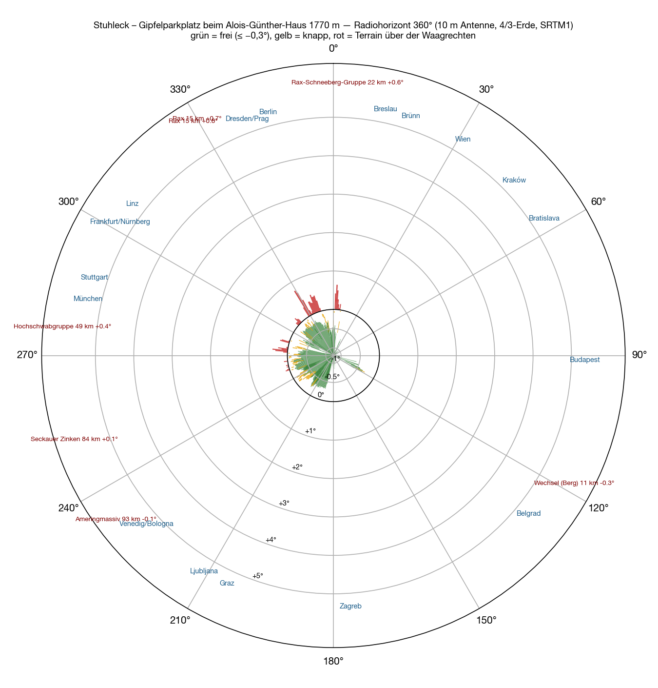

Cinco emplazamientos están calculados, y los cinco tenían la misma pregunta: hasta dónde llega Alemania. El **Stuhleck** le da la vuelta a la pregunta. Con **1782 metros** es la cumbre más alta de los Fischbacher Alpen, está en el borde oriental de los Alpes, y al este de él, hasta los Tatras, no hay nada más alto. En la cima está el **Alois-Günther-Haus**, al lado un aparcamiento de grava al que sube una carretera — el emplazamiento al que no hay que ir andando, esta vez en lo más alto. En el concurso IARU de 2025 una estación hizo desde aquí 155 contactos con cinco vatios y una Yagi de diez elementos. Ese fue el motivo para calcularlo.

## Cómo

El método es el mismo que en los [cinco emplazamientos anteriores](/es/blog/feuerkogel-horizont/#cómo): modelo del terreno SRTM, un rayo por grado, antena a diez metros, tierra 4/3, hasta 500 kilómetros, los nombres de los obstáculos de la Wikipedia; más el segundo paso de la [entrada del Feuerkogel](/es/blog/feuerkogel-stationen/), los 3215 logs de concurso de los concursos IARU de 2024 y 2025 recalculados para este emplazamiento. Lo nuevo es el tercer paso: para los últimos cien metros — el refugio, el aparcamiento, la cruz de la cumbre — el modelo de superficie por escaneo láser de la Oficina Federal austríaca de Metrología y Topografía, malla de un metro, medio metro de precisión. El modelo del terreno no conoce ningún tejado; el escaneo láser los conoce todos.

El punto de referencia es el aparcamiento junto al refugio, 47,57444 N / 15,79055 E, locator JN77VN. El escaneo láser da 1779 metros para el aparcamiento y 1786 para la cumbrera del refugio.

## El horizonte

**De 11° a 226° el horizonte está libre**, 215 grados seguidos, y no por poco: de −0,3° a −1,1° bajo la horizontal. Lo que lo forma está lejos — el Altvater a 298 kilómetros, la Gran Fatra a 286, los Bajos Tatras a 322, el Papuk a 269, el Snežnik a 243. Viena queda a −1,04°, Bratislava a −1,07°, Budapest a −1,05°, Belgrado a −1,11°, Zagreb a −0,88°, Liubliana a −0,52°, Graz a −0,75°. Eso no es una ventana, es medio círculo.

| Dirección | Qué forma el horizonte | Distancia | Ángulo |
|---|---|---|---|
| 11–⁠117° | Altvater, Gran Fatra, Bajos Tatras, Bakony | 150–320 km | −1,1…⁠−0,3° |
| 119–⁠226° | Papuk, Medvednica, Pohorje, Snežnik, Karavanke | 100–270 km | −1,1…⁠−0,3° |
| 227–⁠273° | Amering, Gleinalpe, Zirbitzkogel, Wildfeld, Trenchtling | 40–120 km | −0,3…⁠+0,1° |
| 274–⁠280° | **Hochschwab** | 49 km | +0,0…⁠+0,4° |
| 285–⁠290° | **Hohe Veitsch** | 30 km | +0,0…⁠+0,2° |
| 291–⁠305° | Dürrenstein, Tonion, Ötscher | 35–60 km | −0,6…⁠−0,3° |
| 311–⁠316° | **Schneealpe** | 21 km | +0,1…⁠+0,2° |
| 328–⁠344° | **Rax** | 15 km | +0,0…⁠+0,8° |
| 2–⁠8° | **Schneeberg** | 22 km | +0,1…⁠+0,6° |

La otra mitad no está cerrada, solo no está libre. Cuatro montañas están al noroeste y al norte apenas por encima de la horizontal: el Hochschwab con +0,4°, la Veitsch con +0,2°, la Schneealpe con +0,2° y la Rax con +0,8° — y el Schneeberg con +0,6° al norte. Detrás quedan Salzburgo (+0,25°), Stuttgart (+0,1°), Budweis, Praga y Dresde (+0,4° cada una), Leipzig (+0,5°), Berlín (+0,2°), Poznań (+0,1°). Son pérdidas por difracción de tres a ocho decibelios, no un muro — en el Feuerkogel el Traunstein con +0,27° era el mismo caso. En medio queda la única ventana alemana: **291° a 305°**, entre la Veitsch y la Schneealpe, Núremberg −0,46°, Ratisbona −0,54°, Wurzburgo −0,53°, Passau −0,49°. Múnich queda a 283° y −0,20°, libre por poco.

## Dentro de 500 kilómetros

Quien quiera saber qué funciona en VHF sin restricciones tiene aquí una lista corta. Libre, por debajo de −0,3°: todo de **11° a 117°** — Breslavia, Brno, Ostrava, Cracovia, Žilina, Bratislava, Košice, Győr, Budapest, Debrecen, Szeged, es decir Moravia, el sur de Polonia, Eslovaquia, Hungría y el oeste de Ucrania; todo de **119° a 226°** — Timișoara, Novi Sad, Belgrado, Pécs, Sarajevo, Split, Zagreb, Rijeka, Ancona, Graz, Liubliana, Bolonia; la ventana **291° a 305°** hacia Franconia; y **352° a 1°** hacia Szczecin. Justo, entre −0,3° y 0°: la llanura del Po de 227° a 242° (Trieste, Klagenfurt, Venecia, Verona), Múnich, Linz, Erfurt, Pilsen. No libre, pero por debajo de +0,8°: Salzburgo, Stuttgart, Budweis, Praga, Dresde, Leipzig, Berlín, Poznań. Por encima de +0,8° no hay nada. De los 1274 logs dentro de 500 kilómetros, 1035 tienen el horizonte bajo la horizontal, 215 quedan entre 0° y +0,5°, 24 entre +0,5° y +0,8°, ni uno solo por encima.

## Las estaciones

Dentro de 700 kilómetros hay 2127 estaciones de concurso con log. **El Stuhleck alcanza 1741 de ellas con horizonte libre** — más que cualquier emplazamiento anterior, y de 18 países en vez de diez: SP 347, DL 343, I 340, OK 152, 9A 151, OM 87, S5 64, OE 53, UR 46, YO 41, HA 38, YU 30. Las 386 restantes quedan en la sombra de difracción de las cuatro montañas, DL 196, OK 87, SP 56 — todas por debajo de +0,8°. Ningún emplazamiento de la serie tiene tantas estaciones, y ninguno un reparto tan uniforme: el Feuerkogel tenía dos bloques, Alemania y Polonia; el Stuhleck los tiene en todo el contorno.

Eso tiene un precio, y se llama Alemania. 343 logs alemanes libres, 196 detrás de la Rax — el Feuerkogelhaus tiene 622, la Traisner Hütte 596. Quien quiera sumar kilómetros alemanes en el concurso está mejor allí. Quien quiera Italia, Croacia, Serbia, Eslovaquia y Ucrania está en el sitio correcto, y los kilómetros no son más cortos: la suma de las distancias de todas las estaciones alcanzables es de 754 000 en el Stuhleck y de 627 000 en el Feuerkogelhaus.

## Las antenas

El plan del Feuerkogel — dos cuadros fijos hacia Alemania, la Yagi para el resto — aquí no encaja. Dos cuadros mirando ambos a Alemania darían 360 estaciones. Los dos bloques más grandes quedan exactamente enfrentados: Moravia y el sur de Polonia a 20°, la llanura del Po a 216°. **Cuadro 1 a 20°**, abajo a ocho metros: Brno, Ostrava, Cracovia, Viena, Žilina, 546 estaciones. **Cuadro 2 a 216°**, arriba a 11,8 metros: Liubliana, Trieste, Venecia, Bolonia, Rijeka, Graz, 434 estaciones — Italia recibe el puesto de arriba porque la llanura del Po, a −0,1° hasta −0,3°, necesita cada metro de altura y el este, a −1,0°, ninguno. Juntos 980, el 56 por ciento.

En el mástil 2 van dos Yagis de 12 elementos una sobre otra, a 6,4 y 9,7 metros, montadas por el centro del boom y girando juntas sobre el tubo del rotor — aquí no hay ningún tejado que estorbe a la de abajo. El stack tiene tres posiciones. **312°** es la que no se puede omitir: la ventana alemana, Núremberg, Ratisbona, Passau, Linz, Erfurt, 225 estaciones a 509 kilómetros de media — y desde ahí veinte grados más allá, hacia 335° a 345° a través de la Rax, donde esperan Praga, Dresde y Berlín con cuatro a ocho decibelios. **72°** es el hueco entre los cuadros: Bratislava, Košice, Leópolis, 132 estaciones, entre ellas 46 logs ucranianos. **280°** trae Múnich, Innsbruck y Suiza, 136. Quien prefiera coleccionar países antes que Baviera toma **150°** en vez de 280°: Sarajevo, Split, el norte de Bosnia, 95. Con las tres posiciones son 1473 de las 1741 estaciones alcanzables, el 85 por ciento, 663 000 kilómetros en suma — más de lo que tiene el Feuerkogelhaus en total.

El escaneo láser decide dónde van los mástiles. La cumbre es una loma plana; aparcamiento, cruz y refugio quedan dentro de cinco metros de desnivel; el refugio está al sureste del aparcamiento, la cumbrera siete metros por encima. Desde el centro del aparcamiento una antena a diez metros paga hasta ocho decibelios entre 121° y 175° — el norte de Croacia, Bosnia. Treinta metros más al oeste, sobre la loma entre el aparcamiento y la cruz, el refugio ha pasado a 100° y ya no hace nada: los dos cuadros están libres en sus sectores, también el de abajo a ocho metros, y el stack solo pierde entre 96° y 119° — Budapest, Szeged — cuatro decibelios arriba y siete abajo, una dirección que ninguna de sus tres posiciones necesita. Ahí van los mástiles, a doce metros uno de otro, el mástil 1 a doce metros de la cruz y 42 del refugio, el mástil 2 a diecinueve y 51. El coche se queda en el aparcamiento, 45 metros de cable, de uno a dos decibelios. El Stuhleck es el primer emplazamiento de la serie en el que ningún tejado importa.

## En tres dimensiones

<figure class="szene">
  <iframe src="/stuhleck-3d.html" title="Cumbre del Stuhleck en 3D: ortofoto sobre el terreno del escaneo láser con el stack de Yagis en el rotor 1, el stack de cuadros en el rotor 2, el coche, la estación superior del Steinbachalmbahn y el sector prohibido hacia el telesilla" loading="lazy" allowfullscreen></iframe>
  <figcaption>Arrastrar gira, la rueda acerca. Los botones fijan las direcciones fijas — stack de Yagis 302° / 18° / 86°, stack de cuadros 20° / 116° / 120° / 136° / 200° —, los deslizadores cualquier otra; debajo, por stack, las estaciones, países y ciudades en el haz principal y un aviso si una dirección cae en el sector prohibido. «Drehen» hace girar la vista lentamente, «Stopp» la detiene; «Bergstation» gira hacia el telesilla. <a href="/stuhleck-3d.html">Abrir a pantalla completa</a></figcaption>
</figure>

La ortofoto de basemap.at está tendida sobre el terreno del escaneo láser, un píxel son veinte centímetros, los mástiles, los cuadros y el stack están a escala. Lo que muestra la escena no es la vista — esa sale del modelo del terreno —, sino lo que hay en los primeros ciento cincuenta metros: el refugio, el aparcamiento, la cruz, la loma — y a 120 metros al suroeste la estación superior del Steinbachalmbahn, una nave con techo de dieciocho por siete metros sobre pilares, ocho metros de alto, con los dos ramales del cable que bajan al valle por dos pilonas. Vista desde las antenas, su cubierta queda entre cinco y ocho grados por debajo de la horizontal; no estorba en ningún sector, y el botón «Bergstation» lo muestra desde los mástiles. Nada de eso estorba. La escena muestra la instalación tal como queda planeada al final — dos stacks en dos rotores, el stack de Yagis en reposo hacia Alemania, más el sector rojo; cómo se llegó a eso está en las dos secciones siguientes.

## Dos sitios, una prohibición

Tras la primera hoja llegó una segunda marca: no la loma, sino el prado al sur del refugio, a 34 metros de su esquina sur y 153 de la estación superior — el **emplazamiento B**. Y una condición que antes no estaba en el cálculo: **hacia el telesilla no se transmite**, ni tampoco girado 180 grados, porque el lóbulo trasero de una Yagi no debe apuntar al remonte. Así que se calcularon los dos de nuevo, con el mismo escaneo láser y la misma regla.

La regla, en grados: estación superior y línea tal como se ven desde el mástil de la Yagi, más 17 grados — medio haz de la 12JXX2 — a cada lado. Desde la loma (A) son **de 215° a 262°**, girado **de 35° a 82°**. Desde el prado (B), desde donde el remonte queda justo al oeste, **de 244° a 288°** y **de 64° a 108°**. Ningún haz principal puede entrar, tampoco el de los cuadros; con sus 69 grados tienen su propio margen, más ancho.

Lo que hay en los sectores rojos es distinto en cada sitio. Desde A, hacia delante es Italia: Trieste, Venecia, Bolonia, Verona, Milán, 281 logs italianos, más Eslovenia — 298 estaciones que la Yagi alcanza de otro modo. Hacia atrás son Polonia, Eslovaquia, Ucrania y Chequia: Ostrava, Cracovia, Žilina, Bratislava, Košice, Leópolis, 267. Desde B, hacia delante queda el oeste: Múnich, Innsbruck, Salzburgo, Zúrich, Milán, 157 estaciones, 49 de ellas alemanas; hacia atrás Hungría, la Eslovaquia oriental, Rumanía, Ucrania — Košice, Budapest, Debrecen, Cluj, 119.

Recalculado bajo la regla, el plan cambia. En la loma, el cuadro 2 pasa de 216° a **294°** — Núremberg, Ratisbona, Passau, Múnich, Linz: la ventana alemana recibe así la antena fija de arriba, a 11,8 metros —, el cuadro 1 se queda en 20°, y el stack tiene sus tres posiciones en el sur, **138°, 172°, 212°**: Belgrado, Zagreb, Split, Rijeka, Liubliana, Trieste. 1342 estaciones por debajo de tres decibelios, 131 menos que sin la regla. En el prado, el refugio queda justo al norte, con la cumbrera nueve metros por encima del suelo: el cuadro inferior, a ocho metros, ya no ve nada de 343° a 18°, el superior pierde allí cuatro decibelios, la Yagi superior nueve, y la Yagi inferior está ciega de 259° a 45° — trece decibelios. El mejor plan invierte los cuadros: **216°** abajo para Italia, **42°** arriba por encima del refugio hacia Brno y Cracovia, el stack en **118°, 164°, 294°**. 1325 estaciones.

Sin la prohibición, la loma es claramente el mejor sitio, 1473 frente a 1331. Con ella los dos quedan casi igualados — A pierde su dirección italiana, B pierde en cambio el oeste, y el norte al refugio. Lo que la cifra no muestra: en el prado, la Yagi inferior del stack está ciega hacia el norte y el oeste, allí queda una Yagi sola con dos decibelios y medio menos, y todo lo alemán tiene que pasar por el cuadro superior. La loma sigue siendo el sitio donde trabajan las cuatro antenas.

Al calcular surgió una segunda pregunta: Alemania es el país con más estaciones — ¿le corresponde el cuadro o una Yagi fija? La respuesta dio la vuelta al plan una vez más; está en la sección siguiente.

El [plano de situación con los dos emplazamientos](/karten/stuhleck-lageplan-standorte-a-b.pdf) tiene las distancias al refugio, a la estación superior y a las pilonas para el mástil 1, el mástil 2 y el punto del prado.

## La elección

La consigna era clara: todo contacto lejano vale más que uno cercano, pero la mayoría de los QSO están en Alemania, y allí hay muchas estaciones pequeñas — poder alcanzarlas importa más que el último kilómetro. Así que un cálculo más, con una regla de recuento que lo refleje: una estación cuenta si una antena la tiene por encima del horizonte lejano, con menos de tres decibelios de pérdida en el campo cercano y con la ganancia necesaria en el haz — seis dBi hasta 300 kilómetros, desde ahí tres decibelios por cada cien kilómetros. Las estaciones pequeñas, menos de cincuenta QSO en su mejor concurso, necesitan cuatro decibelios más; las grandes, tres menos. Para Alemania se sumaron a los logs de la IARU las listas de concursos del DARC: 1070 estaciones hasta 750 kilómetros, 567 de ellas pequeñas. Luego 42 combinaciones: dos cuadros o dos Yagis fijas, un stack fijo, cuadro y Yagi mezclados — contra un stack de Yagis, un stack de cuadros o una antena sola en el rotor, también la Yagi de 14 elementos de ANJO como candidata.

El resultado da la vuelta al primer plan. **Las dos 12JXX2 van apiladas en el mástil 2, posición de reposo 302°** — Ratisbona, Núremberg, Passau, Bayreuth, Hof, con 17,8 dBi, Múnich en el borde del haz con trece, que basta para doscientos kilómetros. **Los dos cuadros van apilados en el rotor del mástil 1**, 69 grados de ancho, 14,5 dBi, tres posiciones: **20°** Breslavia, Brno, Ostrava, Cracovia, Viena — el segundo gran bloque, 405 estaciones; **108°** Budapest, Belgrado, Hungría, Serbia; **200°** Zagreb, Rijeka, Liubliana, Trieste, Venecia, hasta donde lo permite la prohibición. El entorno cercano está en dos bloques anchos que una antena ancha atiende sin girar constantemente; la lejanía necesita la ganancia que solo tiene el stack — y Alemania necesita ambas cosas.

Y el stack de Yagis recibe su propio rotor. La posición de reposo sigue siendo 302°, pero dos posiciones más recogen lo que antes ninguna antena alcanzaba con ganancia: **330°** Praga, Dresde, Leipzig, Berlín — el noreste alemán detrás del Rax — y **266°** Innsbruck, Zúrich, Bolzano, pegado al borde de la prohibición. Es la mayor ganancia individual de todo el cálculo: 994 estaciones hasta 500 kilómetros y 1351 hasta 750, frente a 968 y 1205 con el stack fijo y 872 y 987 con el primer plan. En Alemania 419 de las 1070, 130 de ellas pequeñas — el primer plan tenía 159 y 49, porque un cuadro con doce dBi ya no alcanza una estación pequeña más allá de cuatrocientos kilómetros.

Los cuadros separados en dos direcciones, espalda con espalda en el rotor, eran la otra idea — descartada, y la potencia dice por qué. Con mil vatios que van a todas las antenas a la vez, cada sistema recibe su parte: dos sistemas a 500 vatios, tres a 333. Dos cuadros en dos direcciones tienen entonces doce dBi cada uno con 333 vatios, el stack de cuadros 14,5 con 500 — 4,3 decibelios de diferencia por dirección, y la regla de recuento convierte eso en 520 en vez de 871 estaciones hasta 750 kilómetros. Y ambas cosas son más débiles que la instalación que transmite por un solo sistema a la vez y escucha por los demás: mil vatios al stack que esté activo dan las 1351. Transmitir por una antena, escuchar por todas — esa es la regla que sale de las cifras. Quien aun así transmita siempre por todas y solo conmute la escucha obtiene con 500 vatios por stack otras posiciones óptimas: el stack de Yagis sigue en reposo en 302°, pero va a **18°** (Cracovia, Žilina) y **86°** (Košice, Budapest) en vez de a Sajonia y Suiza, porque la lejanía detrás del Rax ya no se alcanza con media potencia; los cuadros en 20°, 136°, 200°. Eso da 854 y 950 estaciones, Alemania 226, 64 de ellas pequeñas — un tercio menos que con el conmutador, en Alemania casi la mitad. Si el stack de Yagis se queda siempre en 302° y solo gira el stack de cuadros (20°, 116°, 200°), son 783 y 817 — Alemania igual, las setenta que faltan son Cracovia y Košice con la ganancia de la Yagi. Un divisor desigual, dos tercios para el stack de Yagis, daría 1010 hasta 750 kilómetros y 262 alemanas.

Los mástiles son más cortos de lo pensado: diez metros para los cuadros, siete y medio para las Yagis. En la loma eso no cambia nada — el escaneo láser recalculado para cada altura da a ocho metros las mismas cifras que a trece, porque en todas las direcciones solo el refugio está en el campo cercano, y ninguna posición apunta allí mucho tiempo. Lo que cuenta es el stack, no la altura: un mástil con una sola antena cuesta cien estaciones en el entorno cercano. El mástil 1 en la loma, a doce metros de la cruz, lleva los cuadros a 6,4 y 9,7 metros; el mástil 2, doce metros más al noroeste, las Yagis a 4,0 y 7,5 — desde el mástil de los cuadros el de las Yagis queda a 328°, fuera de toda posición del cuadro, y desde el mástil de las Yagis los cuadros quedan a 148°, detrás del stack en reposo. El mástil de las Yagis se arriostra a 3,3 metros, por debajo del rotor y de la Yagi inferior, para que ningún viento pase entre los elementos.

El [plano de situación en PDF, revisión 4](/karten/stuhleck-lageplan-antennenanlage.pdf) tiene la instalación tal como queda: coordenadas, alturas de mástil, direcciones, distancias, fuentes.

## Los datos

| | |
|---|---|
| Emplazamiento | aparcamiento de la cumbre junto al Alois-Günther-Haus, municipio de Spital am Semmering, JN77VN |
| Mástil 1 | 47,574278 N / 15,790072 E · 10 m · 2 × cuadro apilados a 6,4 y 9,7 m, rotor · 20° / 108° / 200° |
| Mástil 2 | 47,574368 N / 15,789992 E · 7,5 m · 2 × 12JXX2 apiladas a 4,0 y 7,5 m, rotor · 302° (reposo) / 330° / 266° |
| Suelo | 1780 m (escaneo láser), cruz de la cumbre 1782 m, cumbrera del refugio 1786,9 m |
| Distancias | refugio 42 / 51 m · cruz 12 / 19 m · estación superior del Steinbachalmbahn 120 / 121 m · coche 45 m |
| Emplazamiento B | 47,573805 N / 15,790728 E · prado al sur del refugio, suelo 1778 m · refugio 34 m · estación superior 153 m · cruz 72 m |
| Prohibición hacia el telesilla | desde el mástil del rotor 220°–265° y 40°–85° (estación superior y línea ± 17°, hacia delante y girado 180°); desde el emplazamiento B 244°–288° y 64°–108° |
| Horizonte | libre 11°–226°, 291°–305°, 352°–1°; justo 227°–273°, 281°–284°, 306°–327°; sobre la horizontal 274°–280°, 285°–290°, 311°–316°, 328°–344°, 2°–8°, como máximo +0,8° |
| Estaciones ≤ 700 km | 1741 libres de 2127, 386 en la sombra de difracción, 18 países, Σ 754 000 km |
| Primer plan | cuadros fijos 20° / 216°, stack de Yagis 312° / 72° / 280°: 1473 de 1741 en el haz principal (85 %), Σ 663 000 km; con prohibición 20° / 294° y 138° / 172° / 212°: 1342 |
| Instalación | stack de Yagis 302° / 330° / 266°, stack de cuadros 20° / 108° / 200°, transmitiendo por un sistema a la vez: 994 estaciones hasta 500 km, 1351 hasta 750 km (regla de recuento con alcance y tamaño); Alemania 419 de 1070, 130 de ellas pequeñas — stack de Yagis fijo 968 / 1205 y 349 / 107, primer plan 872 / 987 y 159 / 49 |
| 1000 W a todas a la vez | dos sistemas a 500 W, posiciones reoptimizadas: Yagi 302° / 18° / 86°, cuadros 20° / 136° / 200° → 854 / 950, Alemania 226 / 64 · divisor 2:1 para el stack de Yagis: 830 / 1010, Alemania 262 / 80 · tres sistemas a 333 W con cuadros en dos direcciones: 520 / 520 — por eso nada de espalda con espalda |

El [plano de situación en PDF](/karten/stuhleck-lageplan-antennenanlage.pdf) lo tiene todo en una hoja, vista general y detalle, con coordenadas, alturas de mástil, distancias y fuentes — tal como se puede presentar.

## La comparación

Seis emplazamientos, una cifra. El Stuhleck va delante, pero las barras también dicen con qué: su parte alemana es la más pequeña de la serie, la italiana y la del sureste de Europa las más grandes. La Traisner Hütte y el Feuerkogelhaus son los emplazamientos para Alemania; el Stuhleck es el emplazamiento para Europa. Lo que uno quiere hay que saberlo antes.

## Los mapas

En el zoom se ve lo desiguales que son los trazos: hacia el este y el sur salen del mapa, hacia el noroeste terminan a quince o cincuenta kilómetros en la Rax, la Schneealpe, la Veitsch, el Hochschwab.

<figure class="zoomkarte" data-basis="/karten/horizont/stuhleck-horizont-" data-min="200" data-max="700" data-schritt="100" data-start="200">
  
  <figcaption>
    <button type="button" data-zoom="-1" aria-label="Reducir el radio 100 km">−</button>
    Radio 200 km
    <button type="button" data-zoom="+1" aria-label="Aumentar el radio 100 km">+</button>
  </figcaption>
</figure>

Los dos mapas en PDF: [zoom 180 km](/karten/stuhleck-horizont-zoom-180km.pdf) con los nombres de las montañas y [vista general 800 km](/karten/stuhleck-horizont-uebersicht-800km.pdf) con la lista numerada — de los macizos del contorno solo el Schneeberg y el Hochschwab asoman por encima de la horizontal, todos los demás forman el horizonte desde abajo.

## Reserva

El modelo del terreno tiene una malla de treinta metros; para la cumbre misma está el escaneo láser a un metro, para el resto la atmósfera estándar. Las cifras de estaciones son logs, no estaciones, y tienen dos años. Si se puede subir en coche hasta el refugio no lo dice ningún mapa; la carretera es una pista forestal y el refugio pertenece al Club Alpino. Y el Steinbachalmbahn termina 120 metros al suroeste de la cruz de la cumbre — si funciona en septiembre es una pregunta para la empresa del remonte, no para el modelo del terreno.

Lo que dice el cálculo: el Stuhleck es la montaña desde la que se ve Europa. Alemania se ve desde otras.
