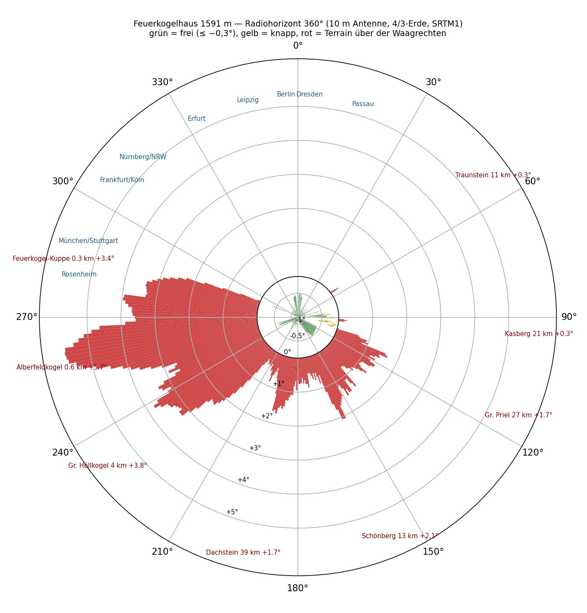
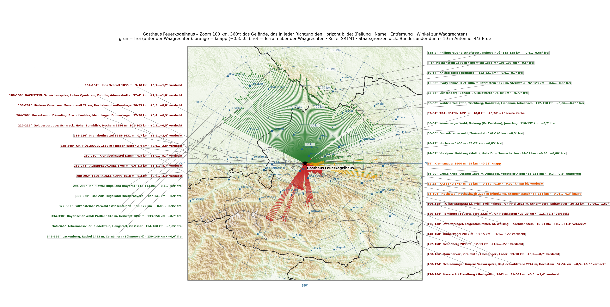

Ein UKW-Contest wird nicht am Gerät gewonnen, sondern am Standort. Auf zwei Metern zählt, wie tief die Antenne über den Horizont hinausschauen kann — jedes Zehntelgrad, das ein Berg davor wegnimmt, kostet Reichweite in genau dieser Richtung. Das **Gasthaus Feuerkogelhaus** auf dem Höllengebirge über Ebensee, **1 591 Meter**, JN67UT, ist ein Kandidat für die nächste Saison. Bevor ich mit Mast und Yagi hinauffahre, wollte ich wissen, was der Platz wirklich sieht.

Also habe ich es gerechnet. Nicht geschätzt, nicht von der Karte abgelesen: gerechnet.

## Wie

Grundlage ist das **SRTM-Geländemodell der NASA** mit einem Höhenwert alle dreißig Meter. Von der Position des Gasthauses aus läuft für jedes ganze Grad der Kompassrose ein Strahl nach außen — in den ersten drei Kilometern alle zwanzig Meter abgetastet, weiter draußen alle hundert, bis 500 Kilometer. Für jeden Punkt ergibt sich der Winkel, unter dem er von einer **zehn Meter hohen Antenne** aus erscheint, die Erdkrümmung mit dem üblichen 4/3-Radius für Funkwellen eingerechnet. Der höchste Winkel entlang des Strahls ist der Horizont in dieser Richtung.

Ein Wert unter null heißt: die Antenne schaut über alles hinweg, das Gelände liegt unter der Waagrechten. Ein Wert über null heißt: dort steht ein Berg in der Sichtlinie. Dazwischen, von −0,3° bis 0°, nenne ich es knapp.

Ein kleines Werkzeug dafür entsteht gerade als Teil meines Contest-Loggers; die Kacheln des Geländemodells hatte der Rechner ohnehin schon geladen. Die Namen der Berge kommen aus der Wikipedia, gesucht nach dem jeweiligen Hindernispunkt.

## Rundum

Das Bild ist eindeutig, und es hat zwei Hälften.

**Von 294° über Nord bis 52° ist der Horizont frei**, dazu von 55° bis 83°. Das Gelände, das ihn dort bildet, liegt **75 bis 172 Kilometer** entfernt — Bayerischer Wald, Böhmerwald, Mühl- und Waldviertel, die Voralpen — und bleibt **0,5 bis 0,95 Grad unter der Waagrechten**. In dieser Hälfte steht genau ein Berg im Weg: der **Traunstein**, 10,8 Kilometer, bei 54°, mit +0,26°. Eine zwei Grad breite Kerbe, links und rechts davon ist es sofort wieder −0,7°. Der Kasberg bei 94° macht dasselbe noch einmal, mit +0,25°.

**Von 106° über Süd bis 293° ist zu.** Das Tote Gebirge, der Dachstein, die Tauern — und vor allem der eigene Berg.

| Richtung | Was den Horizont setzt | Entfernung | Winkel |
|---|---|---|---|
| 106–⁠138° | Totes Gebirge: Großer Priel, Feuertalberg, Feigentalhimmel | 16–29 km | +0,7…⁠+1,7° |
| 140–⁠166° | Rinnerkogel, Schönberg, Loser | 12–18 km | +0,5…⁠+2,1° |
| 168–⁠180° | Schladminger Tauern: Hochwildstelle, Hochgolling | 52–66 km | +0,5…⁠+1,0° |
| 186–⁠198° | Dachstein: Gjaidstein, Scheichenspitze, Dirndln | 37–41 km | +1,1…⁠+1,6° |
| 200–⁠216° | Radstädter Tauern, Ankogel, Goldberggruppe mit Sonnblick und Hocharn | 72–103 km | +0,3…⁠+0,8° |
| 218–⁠248° | Kranabethsattel, **Großer Höllkogel** | 0,7–4 km | +1,2…⁠+3,8° |
| 250–⁠278° | **Alberfeldkogel** | 0,6–1,3 km | +3,3…⁠+5,7° |
| 280–⁠292° | die **Feuerkogel-Kuppe** neben dem Haus | 0,3 km | +0,6…⁠+3,4° |

Der größte Störer ist keiner der großen Namen. Es ist der **Alberfeldkogel, 600 Meter vom Haus entfernt**, mit fast sechs Grad — und die Kuppe des Feuerkogels selbst, 300 Meter neben der Terrasse. Alles, was dahinter liegt, kann man vergessen: der **Großglockner** stünde mit +0,73° eigentlich über der Waagrechten, aber in seiner Peilung steht der Kranabethsattel-Kamm des Höllengebirges mit +2,2° davor. Der Watzmann, der Hochkönig, der Großvenediger: dasselbe Schicksal. Zugspitze, Marmolata, Ortler, Bernina, Mont Blanc liegen ohnehin unter dem Horizont.

## Die Karte

Jeder Strich ist ein Grad. Nach Norden laufen die grünen Striche bis zum Bayerischen Wald und zum Böhmerwald, weil dort erst etwas kommt, das den Horizont bildet. Nach Süden hören die roten nach zwölf, zwanzig, vierzig Kilometern auf — und nach Westen nach ein paar hundert Metern.

## Bis 800 Kilometer

Die Frage kam auf, ob weiter draußen noch etwas stört: der Harz, das Erzgebirge, die Tatra. Die Antwort steckt in der Erdkrümmung. Mit dem 4/3-Radius liegt der Boden in 500 Kilometern **14,7 Kilometer** unter der Waagrechten, in 800 Kilometern **37,7 Kilometer**. Kein Berg Europas kommt da hinauf. Jenseits von rund 250 Kilometern kann nichts mehr über den Horizont ragen — und tatsächlich ist der fernste Störer, der es noch schafft, die Goldberggruppe in 103 Kilometern.

<figure class="zoomkarte" data-basis="/karten/horizont/feuerkogel-horizont-" data-min="200" data-max="700" data-schritt="100" data-start="200">
  
  <figcaption>
    <button type="button" data-zoom="-1" aria-label="Radius um 100 km verkleinern">−</button>
    Radius 200 km
    <button type="button" data-zoom="+1" aria-label="Radius um 100 km vergrößern">+</button>
  </figcaption>
</figure>

Die Karte lässt sich mit Plus und Minus von 200 auf 700 Kilometer aufziehen — der grüne Fächer nach Norden wächst dabei nicht mit, weil der Horizont dort nun einmal bei 75 bis 172 Kilometern liegt. Der bernsteinfarbene Fächer nach Westen ist das Gegenteil: dort liegt der Horizont 300 Meter bis 4 Kilometer vom Haus — ein Strich dieser Länge wäre auf der Karte unsichtbar, deshalb sind verdeckte Richtungen auf mindestens sechs Prozent des Radius gezogen. Was die Karte damit zeigt, ist nicht die Entfernung, sondern dass dort zu ist. Auf der [Übersicht bis 800 Kilometer](/karten/feuerkogelhaus-horizont-uebersicht-800km.pdf) stehen 78 Gebirge und Gipfel mit ihrem Winkel: Riesengebirge −1,2°, Hohe Tatra −1,55°, Harz −1,7°, Eifel −2,0°, Apuseni −2,3°. Alle unter der Waagrechten, alle unsichtbar. Zwei Ausreißer hat die Rechnung erst in der Nachprüfung geliefert: der **Hochgolling** (177°, 61 km, +0,98°) und die **Hochalmspitze** (199°, 95 km, +0,75°) ragen tatsächlich über den Horizont — ihre Gipfel lagen genau zwischen zwei der Grad-Strahlen. Nach Süden ändert das nichts, dort ist ohnehin zu.

Beide Karten als PDF, zum Hineinzoomen und Ausdrucken: [Zoom 180 km](/karten/feuerkogelhaus-horizont-zoom-180km.pdf) mit allen Bergnamen und [Übersicht 800 km](/karten/feuerkogelhaus-horizont-uebersicht-800km.pdf) mit der nummerierten Liste.

## Was das heißt

Für einen Contest zählt, wo die Gegenstationen sitzen — und die sitzen zum größten Teil in Deutschland. Von Franken über Nordrhein-Westfalen bis Berlin und Sachsen ist der Horizont vom Feuerkogelhaus aus so frei, wie er auf einem Berg nur sein kann: Nürnberg −0,9°, Köln −0,9°, Erfurt −0,8°, Berlin −0,6°, Passau −1,0°.

Der wunde Punkt liegt bei 281° bis 292°: **München, Stuttgart, Rosenheim**. Genau dort steht die Feuerkogel-Kuppe vor dem Haus. Die Rechnung zeigt aber auch den Ausweg: **200 bis 300 Meter westlich, oben auf der Kuppe** — 1 610 Meter — sind München (−0,35°) und Stuttgart (−0,88°) offen, ohne dass nach Norden etwas verloren geht. Rosenheim und das Allgäu bleiben hinter dem Alberfeldkogel, das gibt der Berg nicht her.

## Vorbehalt

Das ist eine Rechnung, keine Messung. Das Geländemodell kennt weder Bäume noch Gebäude noch den Sendemast der Bergstation, es hat dreißig Meter Raster, und die Ausbreitung nimmt die Standardatmosphäre an — ein Tropo-Abend rechnet anders. Was die Rechnung sicher sagt: wohin man nicht einmal versuchen muss, und wohin sich jedes Dezibel lohnt.

Der Rest wird gemessen — oben, mit Antenne.
