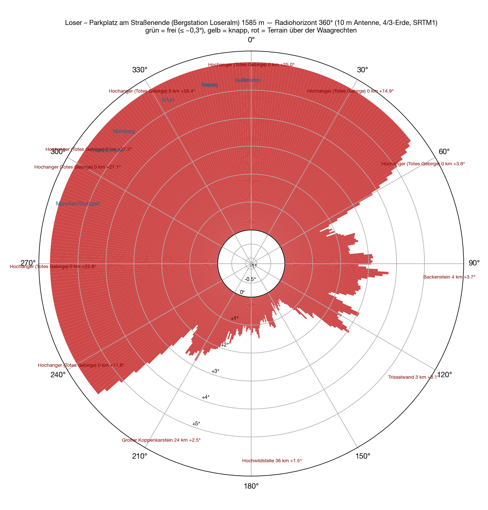
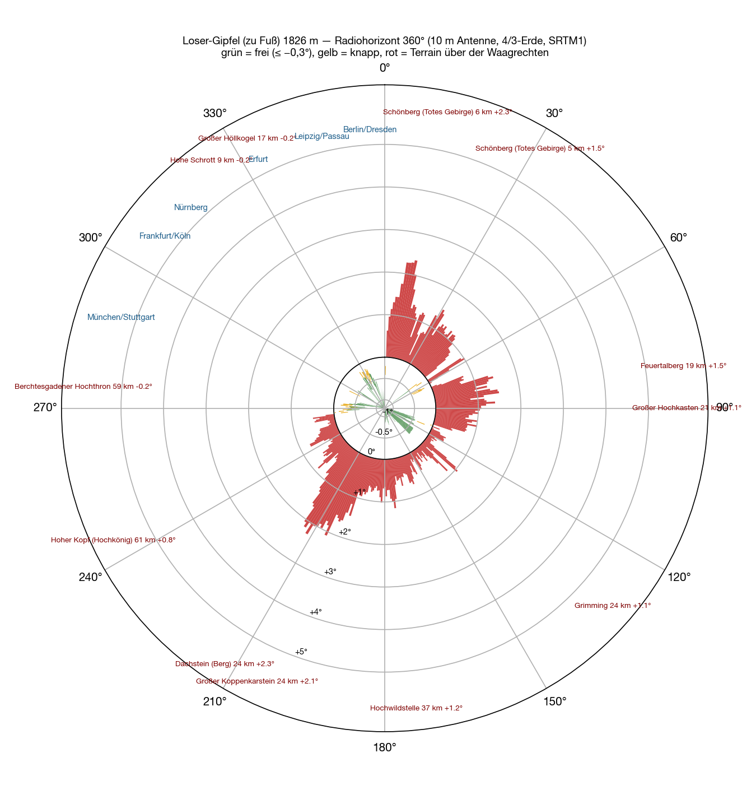

Der dritte Standort nach [Feuerkogel](/blog/feuerkogel-horizont/) und [Grünberg](/blog/gruenberg-horizont/), und der erste mit Straße: die **Loser Panoramastraße** führt von Altaussee auf **1 585 Meter**, oben ein Parkplatz mit Umkehrplatz, das Bergrestaurant, die Bergstation der Panoramabahn. Darunter, bei der Loserhütte, ein zweiter Parkplatz auf 1 506 Metern. Man fährt mit dem Auto hin, baut auf, fertig — so war der Gedanke.

Die Rechnung ist dieselbe wie bisher: SRTM-Geländemodell, ein Strahl je Grad, zehn Meter Antenne, 4/3-Erde, [Methode beim Feuerkogel](/blog/feuerkogel-horizont/#wie). Diesmal aber nicht nur für einen Punkt, sondern für **die ganze Straße**, Stützpunkt für Stützpunkt.

## Rundum

Es gibt keine zweite Hälfte. **Alle 360 Peilungen sind zu.** Der Parkplatz liegt in einer Mulde unter der Loser-Kuppe: nach Norden und Westen steigt das Gelände innerhalb von hundert Metern um fünfzig, sechzig Meter an — das sind **+15° bis +27°** in genau die Richtung, in der Deutschland liegt. Nach Osten die Bräuning Zinken und die Trisselwand, +1,5 bis +4°. Nur nach Südosten, zwischen 120° und 180°, kommt der Horizont auf +0,4 bis +1,5° herunter — dort stehen Tauern und Dachstein in vierzig, fünfzig Kilometern. Das ist die Richtung nach Graz und Slowenien, nicht nach Nürnberg.

Vom Parkplatz Loserhütte, achtzig Meter tiefer, ist es dasselbe Bild: 360 Peilungen zu, nach Deutschland +15 bis +22°, München +8,5°, Rosenheim +4,6°.

| Richtung | Was den Horizont setzt | Entfernung | Winkel |
|---|---|---|---|
| 240–⁠60° | die **Loser-Kuppe** und der Augstsee-Sattel direkt über dem Parkplatz | 0,1–0,4 km | +4…⁠+27° |
| 60–⁠120° | Bräuning Zinken, Trisselwand | 0,3–4 km | +1,5…⁠+3,8° |
| 120–⁠180° | Wölzer Tauern, Sölkpass, Hochwildstelle | 36–50 km | +0,4…⁠+1,5° |
| 180–⁠240° | Elendberg, Koppenkarstein, Dachstein | 22–41 km | +1,0…⁠+2,5° |

## Die Straße

Die Frage war, ob es irgendwo an der Straße besser geht. Also für **157 Straßenpunkte** aus OpenStreetMap je 41 Peilungen von 270° über Nord bis 30° und die Winkel zu dreißig deutschen Städten gerechnet. Die Antwort ist eindeutig: **nirgends.** Die ganze Straße liegt an der Süd- und Ostflanke des Berges, und der Berg steht immer im Norden. Die am wenigsten schlechte Stelle liegt auf 1 238 Metern in den Kehren unterhalb der Loserhütte — dort kommen Nürnberg und Köln auf +0,8° herunter, München auf +2,7°, Berlin bleibt bei +17°. Immer noch alles über der Waagrechten.

Auch die Bahnen helfen nicht: die Bergstation der **Panoramabahn** (1 604 m) steht hundert Meter neben dem Parkplatz und sieht dasselbe, +14 bis +18°. Die Bergstation des **Sessellifts Loserfenster** (1 757 m) liegt zwar hundertfünfzig Meter höher, aber immer noch unter dem Kamm: +7 bis +20°.

## Der Gipfel

Erst ganz oben ändert sich das Bild. Vom **Loser-Gipfel**, 1 838 Meter, eine halbe Stunde zu Fuß von der Bergstation, ist der Kamm überwunden: **von 269° über Nord bis 359° frei**, −0,3 bis −1,0°. München −0,97°, Nürnberg −1,02°, Köln −1,01°, Berlin −0,75°, Passau −0,77°, Dresden −0,77°. Knapp nur Rosenheim (−0,55°, hinter dem Untersberg) und Erfurt (−0,17°, der Große Höllkogel bei 333°). Nach Nordosten macht der Schönberg zu (+2,3°), nach Süden alles andere. Ein Nordwest-Platz — so gut wie der Feuerkogel in diese Richtung, aber ohne Auto und ohne Dach.

Das Loserfenster auf 1 781 Metern, ein paar Minuten unter dem Gipfel, wäre der Kompromiss: Nürnberg, Köln, Berlin frei, München mit +2,4° hinter dem Kamm.

## Bis 700 Kilometer

<figure class="zoomkarte" data-basis="/karten/horizont/loser-horizont-" data-min="200" data-max="700" data-schritt="100" data-start="200">
  
  <figcaption>
    <button type="button" data-zoom="-1" aria-label="Radius um 100 km verkleinern">−</button>
    Radius 200 km
    <button type="button" data-zoom="+1" aria-label="Radius um 100 km vergrößern">+</button>
  </figcaption>
</figure>

Die Karte zeigt, was die Zahlen sagen: die Striche vom Parkplatz aus enden nach hundert Metern bis fünfzig Kilometern, egal wie weit man den Radius aufzieht. Auf der [Übersicht bis 800 Kilometer](/karten/loser-horizont-uebersicht-800km.pdf) ragt von 78 Gebirgen nur der Hochgolling (43 km, 182°, +1,5°) über die Waagrechte, und der ist nach Süden.

Beide Karten als PDF: [Zoom 180 km](/karten/loser-horizont-zoom-180km.pdf) und [Übersicht 800 km](/karten/loser-horizont-uebersicht-800km.pdf).

## Was das heißt

Vom Auto aus ist der Loser kein Contest-Standort — in keine Richtung, am wenigsten nach Deutschland. Die Panoramastraße hat keine bessere Stelle, die Bahnen enden unter dem Kamm. Wer hier nach Norden funken will, trägt die Station auf den Gipfel und bekommt dafür einen Horizont, der von München bis Dresden −0,75 bis −1,0° tief liegt. Für alles andere sind [Grünberg](/blog/gruenberg-horizont/) und [Feuerkogel](/blog/feuerkogel-horizont/) die besseren Adressen.

## Vorbehalt

Rechnung, keine Messung. Gerade im Nahbereich — die Kuppe hundert Meter neben dem Parkplatz — hängt das Ergebnis am Dreißig-Meter-Raster des Geländemodells; die Größenordnung stimmt, das einzelne Grad nicht. Ob am Parkplatz noch eine Ecke ist, die um die Kuppe herumschaut, sieht man vor Ort besser als in der Rechnung.
