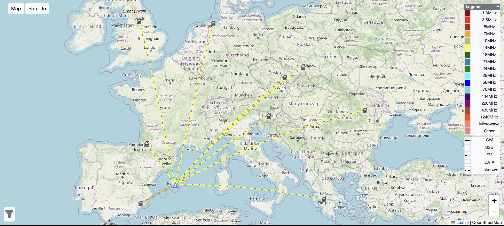

Der **Puig de Santa Magdalena** steht allein in der Ebene über **Inca**, mitten auf Mallorca. **305 Meter**, Referenz **EA6/MA-060**, zwei Punkte, Locator **JM19lr**. Bis zum Gipfel führt eine Straße; vom Parkplatz sind es noch ein paar hundert Meter zu Fuß. Ein Berg ist das nicht, aber ein Gipfel — und oben steht man frei, mit Blick über die ganze Insel bis zur Küste.

## Das Gerät

Diesmal nicht der KX2, sondern der **IC-705** — als **EA6/OE5SOS/P**. Am Nachmittag lief er auf **14,276 MHz** in USB.

## Die Verbindungen

**Zwölf QSOs**, alle in SSB: elf auf 20 Metern, eines auf 40 Metern. Von der Insel aus liegt ganz Europa im Fächer nach Nordosten — England, die Niederlande, Polen, Tschechien, Slowenien, Moldau, Griechenland; dazu Navarra und, als einzige auf 40 Metern, Andalusien.

