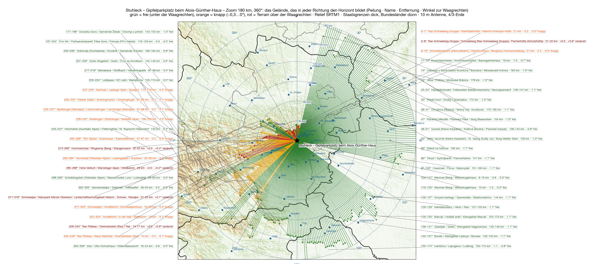

Fünf Standorte sind gerechnet, und alle fünf hatten dieselbe Frage: wie weit nach Deutschland. Das **Stuhleck** dreht die Frage um. Es ist mit **1 782 Metern** der höchste Berg der Fischbacher Alpen, steht am Ostrand der Alpen, und östlich von ihm kommt bis zur Tatra nichts mehr, das höher wäre. Auf dem Gipfel steht das **Alois-Günther-Haus**, daneben ein Schotterparkplatz, zu dem eine Straße hinaufführt — der Standort, zu dem man nicht gehen muss, diesmal ganz oben. Im IARU-Contest 2025 hat von hier eine Station mit fünf Watt und einer Zehn-Element-Yagi 155 Verbindungen gemacht. Das war der Anlass, ihn zu rechnen.

## Wie

Die Methode ist dieselbe wie bei den [fünf Standorten davor](/blog/feuerkogel-horizont/#wie): SRTM-Geländemodell, ein Strahl je Grad, zehn Meter Antenne, 4/3-Erde, 500 Kilometer weit, die Namen der Hindernisse aus der Wikipedia; dazu der zweite Schritt aus dem [Feuerkogel-Beitrag](/blog/feuerkogel-stationen/), die 3 215 Contestlogs der IARU-Conteste 2024 und 2025 auf den Standort umgerechnet. Neu ist der dritte Schritt: für die letzten hundert Meter — das Haus, den Parkplatz, das Gipfelkreuz — das Laserscan-Oberflächenmodell des Bundesamts für Eich- und Vermessungswesen, ein Meter Raster, ein halber Meter genau. Das Geländemodell kennt kein Dach; der Laserscan kennt jedes.

Der Standpunkt ist der Parkplatz beim Haus, 47,57444 N / 15,79055 O, Locator JN77VN. Der Laserscan sagt 1 779 Meter für den Parkplatz und 1 786 für den First des Hauses.

## Der Horizont

**Von 11° bis 226° ist der Horizont frei**, 215 Grad am Stück, und zwar nicht knapp: −0,3° bis −1,1° unter der Waagrechten. Was ihn bildet, steht weit weg — der Altvater in 298 Kilometern, die Große Fatra in 286, die Niedere Tatra in 322, der Papuk in 269, der Snežnik in 243. Wien liegt bei −1,04°, Bratislava bei −1,07°, Budapest bei −1,05°, Belgrad bei −1,11°, Zagreb bei −0,88°, Ljubljana bei −0,52°, Graz bei −0,75°. Das ist kein Fenster, das ist ein halber Kreis.

| Richtung | Was den Horizont setzt | Entfernung | Winkel |
|---|---|---|---|
| 11–⁠117° | Altvater, Große Fatra, Niedere Tatra, Bakony | 150–320 km | −1,1…⁠−0,3° |
| 119–⁠226° | Papuk, Medvednica, Pohorje, Snežnik, Karawanken | 100–270 km | −1,1…⁠−0,3° |
| 227–⁠273° | Amering, Gleinalpe, Zirbitzkogel, Wildfeld, Trenchtling | 40–120 km | −0,3…⁠+0,1° |
| 274–⁠280° | **Hochschwab** | 49 km | +0,0…⁠+0,4° |
| 285–⁠290° | **Hohe Veitsch** | 30 km | +0,0…⁠+0,2° |
| 291–⁠305° | Dürrenstein, Tonion, Ötscher | 35–60 km | −0,6…⁠−0,3° |
| 311–⁠316° | **Schneealpe** | 21 km | +0,1…⁠+0,2° |
| 328–⁠344° | **Rax** | 15 km | +0,0…⁠+0,8° |
| 2–⁠8° | **Schneeberg** | 22 km | +0,1…⁠+0,6° |

Die andere Hälfte ist nicht zu, sie ist nur nicht frei. Vier Berge stehen im Nordwesten und Norden knapp über der Waagrechten: der Hochschwab mit +0,4°, die Veitsch mit +0,2°, die Schneealpe mit +0,2° und die Rax mit +0,8° — und der Schneeberg mit +0,6° im Norden. Dahinter liegen Salzburg (+0,25°), Stuttgart (+0,1°), Budweis, Prag und Dresden (je +0,4°), Leipzig (+0,5°), Berlin (+0,2°), Poznań (+0,1°). Das sind Beugungsverluste von drei bis acht Dezibel, keine Mauer — am Feuerkogel war der Traunstein mit +0,27° derselbe Fall. Dazwischen bleibt das eine deutsche Fenster: **291° bis 305°**, zwischen Veitsch und Schneealpe hindurch, Nürnberg −0,46°, Regensburg −0,54°, Würzburg −0,53°, Passau −0,49°. München liegt bei 283° und −0,20°, knapp frei.

## Innerhalb von 500 Kilometern

Wer wissen will, was auf UKW ohne Einschränkung geht, bekommt hier eine kurze Liste. Frei, unter −0,3°: alles von **11° bis 117°** — Breslau, Brünn, Ostrava, Kraków, Žilina, Bratislava, Košice, Győr, Budapest, Debrecen, Szeged, also Mähren, Südpolen, die Slowakei, Ungarn und die Westukraine; alles von **119° bis 226°** — Timișoara, Novi Sad, Belgrad, Pécs, Sarajevo, Split, Zagreb, Rijeka, Ancona, Graz, Ljubljana, Bologna; das Fenster **291° bis 305°** nach Franken; und **352° bis 1°** nach Szczecin. Knapp, zwischen −0,3° und 0°: die Po-Ebene von 227° bis 242° (Triest, Klagenfurt, Venedig, Verona), München, Linz, Erfurt, Pilsen. Nicht frei, aber unter +0,8°: Salzburg, Stuttgart, Budweis, Prag, Dresden, Leipzig, Berlin, Poznań. Über +0,8° ist nichts. Von den 1 274 Logs innerhalb von 500 Kilometern haben 1 035 den Horizont unter der Waagrechten, 215 liegen bei 0° bis +0,5°, 24 bei +0,5° bis +0,8°, kein einziger darüber.

## Die Stationen

Innerhalb von 700 Kilometern stehen 2 127 Contest-Stationen mit Log. **1 741 davon erreicht das Stuhleck mit freiem Horizont** — mehr als jeder Standort davor, und aus 18 Ländern statt aus zehn: SP 347, DL 343, I 340, OK 152, 9A 151, OM 87, S5 64, OE 53, UR 46, YO 41, HA 38, YU 30. Die 386 übrigen liegen im Beugungsschatten der vier Berge, DL 196, OK 87, SP 56 — und zwar alle unter +0,8°. Kein Standort der Reihe hat so viele Stationen, und keiner hat eine so gleichmäßige Verteilung: Der Feuerkogel hatte zwei Blöcke, Deutschland und Polen; das Stuhleck hat rundum welche.

Das hat einen Preis, und er heißt Deutschland. 343 deutsche Logs frei, 196 hinter der Rax — das Feuerkogelhaus hat 622, die Traisner Hütte 596. Wer im Contest deutsche Kilometer sammeln will, ist dort besser. Wer Italien, Kroatien, Serbien, die Slowakei und die Ukraine will, ist hier richtig, und die Kilometer sind nicht kürzer: die Summe der Entfernungen aller erreichbaren Stationen ist am Stuhleck 754 000, am Feuerkogelhaus 627 000.

## Die Antennen

Der Plan vom Feuerkogel — zwei feste Quads nach Deutschland, die Yagi für den Rest — passt hier nicht. Zwei Quads, die beide nach Deutschland schauen, brächten 360 Stationen. Die zwei größten Blöcke liegen genau gegenüber: Mähren und Südpolen bei 20°, die Po-Ebene bei 216°. **Quad 1 auf 20°**, unten auf acht Metern: Brünn, Ostrava, Kraków, Wien, Žilina, 546 Stationen. **Quad 2 auf 216°**, oben auf 11,8 Metern: Ljubljana, Triest, Venedig, Bologna, Rijeka, Graz, 434 Stationen — Italien bekommt den oberen Platz, weil die Po-Ebene bei −0,1° bis −0,3° jeden Meter Höhe braucht und der Osten bei −1,0° keinen. Zusammen 980, 56 Prozent.

Auf Mast 2 sitzen zwei 12-Element-Yagis übereinander, auf 6,4 und 9,7 Metern, mittig am Boom und gemeinsam auf dem Drehrohr — hier gibt es kein Dach, das der unteren im Weg stünde. Der Stack hat drei Stellungen. **312°** ist die, die man nicht weglassen kann: das deutsche Fenster, Nürnberg, Regensburg, Passau, Linz, Erfurt, 225 Stationen mit 509 Kilometern im Schnitt — und von dort aus zwanzig Grad weiter nach 335° bis 345° durch die Rax, wo Prag, Dresden und Berlin mit vier bis acht Dezibel warten. **72°** ist die Lücke zwischen den Quads: Bratislava, Košice, Lwiw, 132 Stationen, darunter 46 ukrainische Logs. **280°** bringt München, Innsbruck und die Schweiz, 136. Wer lieber Länder sammelt als Bayern, nimmt statt 280° die **150°**: Sarajevo, Split, Nordbosnien, 95. Mit den drei Stellungen sind es 1 473 der 1 741 erreichbaren Stationen, 85 Prozent, 663 000 Summenkilometer — mehr, als das Feuerkogelhaus insgesamt hat.

Der Laserscan entscheidet, wo die Masten stehen. Der Gipfel ist eine flache Kuppe, Parkplatz, Gipfelkreuz und Haus liegen innerhalb von fünf Höhenmetern; das Haus steht südöstlich vom Parkplatz, der First sieben Meter darüber. Von der Parkplatzmitte aus kostet es eine Antenne auf zehn Metern zwischen 121° und 175° bis zu acht Dezibel — Nordkroatien, Bosnien. Dreißig Meter weiter westlich, auf der Kuppe zwischen Parkplatz und Gipfelkreuz, ist das Haus auf 100° gerückt und tut nichts mehr: beide Quads sind in ihren Sektoren frei, auch der untere auf acht Metern, und der Stack verliert nur zwischen 96° und 119° — Budapest, Szeged — vier Dezibel oben und sieben unten, eine Richtung, die keine seiner drei Stellungen braucht. Dort stehen die Masten, zwölf Meter auseinander, Mast 1 zwölf Meter vom Gipfelkreuz und 42 vom Haus, Mast 2 neunzehn und 51. Das Auto bleibt am Parkplatz, 45 Meter Kabel, ein bis zwei Dezibel. Das Stuhleck ist der erste Standort der Reihe, an dem kein Dach eine Rolle spielt.

## In drei Dimensionen

<figure class="szene">
  <iframe src="/stuhleck-3d.html" title="Stuhleck-Gipfel in 3D: Orthofoto auf dem Laserscan-Gelände mit beiden Masten, den Antennen, dem Auto und der Bergstation der Steinbachalmbahn" loading="lazy" allowfullscreen></iframe>
  <figcaption>Ziehen dreht, das Rad zoomt, die Knöpfe stellen die Yagi, „Bergstation“ schwenkt zur Seilbahn. <a href="/stuhleck-3d.html">Im Vollbild öffnen</a></figcaption>
</figure>

Das Orthofoto von basemap.at liegt auf dem Laserscan-Gelände, ein Pixel ist zwanzig Zentimeter, die Masten, die Quads und der Stack sind maßstäblich. Was die Szene zeigt, ist nicht die Aussicht — die kommt aus dem Geländemodell —, sondern das, was in den ersten hundertfünfzig Metern steht: das Haus, der Parkplatz, das Gipfelkreuz, die Kuppe — und 120 Meter südwestlich die Bergstation der Steinbachalmbahn, ein Dachbau von achtzehn mal sieben Metern auf Stützen, acht Meter hoch, mit den beiden Seilsträngen, die über zwei Stützen ins Tal gehen. Von den Antennen aus liegt ihr Dach fünf bis acht Grad unter der Waagrechten; sie steht in keinem Sektor im Weg, und der Knopf „Bergstation“ zeigt das aus der Sicht der Masten. Nichts davon ist im Weg.

## Die Daten

| | |
|---|---|
| Standort | Gipfelparkplatz beim Alois-Günther-Haus, Gemeinde Spital am Semmering, JN77VN |
| Mast 1 | 47,574278 N / 15,790072 O · 13,5 m · Quad 1 auf 20° (8 m), Quad 2 auf 216° (11,8 m) |
| Mast 2 | 47,574368 N / 15,789992 O · 10 m · 2 × 12JXX2 auf 6,4 und 9,7 m, Rotor · 312° / 72° / 280° |
| Boden | 1 780 m (Laserscan), Gipfelkreuz 1 782 m, First des Hauses 1 786,9 m |
| Entfernungen | Haus 42 / 51 m · Gipfelkreuz 12 / 19 m · Bergstation Steinbachalmbahn 120 / 121 m · Auto 45 m |
| Horizont | frei 11°–226°, 291°–305°, 352°–1°; knapp 227°–273°, 281°–284°, 306°–327°; über der Waagrechten 274°–280°, 285°–290°, 311°–316°, 328°–344°, 2°–8°, höchstens +0,8° |
| Stationen ≤ 700 km | 1 741 frei von 2 127, 386 im Beugungsschatten, 18 Länder, Σ 754 000 km |
| Plan | Quads 980, drei Yagi-Stellungen 493, zusammen 1 473 (85 %), Σ 663 000 km |

Der [Lageplan als PDF](/karten/stuhleck-lageplan-antennenanlage.pdf) hat alles auf einem Blatt, Übersicht und Detail, mit Koordinaten, Entfernungen und Quellen — so, wie man ihn vorlegen kann.

## Der Vergleich

Sechs Standorte, eine Zahl. Das Stuhleck führt, aber die Balken sagen auch, womit: der deutsche Anteil ist der kleinste der Reihe, der italienische und der südosteuropäische die größten. Die Traisner Hütte und das Feuerkogelhaus sind die Deutschland-Standorte, das Stuhleck ist der Europa-Standort. Was man will, muss man vorher wissen.

## Die Karten

Auf dem Zoom sieht man, wie ungleich die Striche sind: nach Osten und Süden laufen sie aus der Karte hinaus, nach Nordwesten enden sie nach fünfzehn bis fünfzig Kilometern an der Rax, der Schneealpe, der Veitsch, dem Hochschwab.

<figure class="zoomkarte" data-basis="/karten/horizont/stuhleck-horizont-" data-min="200" data-max="700" data-schritt="100" data-start="200">
  
  <figcaption>
    <button type="button" data-zoom="-1" aria-label="Radius um 100 km verkleinern">−</button>
    Radius 200 km
    <button type="button" data-zoom="+1" aria-label="Radius um 100 km vergrößern">+</button>
  </figcaption>
</figure>

Beide Karten als PDF: [Zoom 180 km](/karten/stuhleck-horizont-zoom-180km.pdf) mit den Bergnamen und [Übersicht 800 km](/karten/stuhleck-horizont-uebersicht-800km.pdf) mit der nummerierten Liste — von den Gebirgen rundum ragen nur Schneeberg und Hochschwab über die Waagrechte, alle anderen bilden den Horizont von unten.

## Vorbehalt

Das Geländemodell hat dreißig Meter Raster; für den Gipfel selbst steht der Laserscan mit einem Meter dagegen, für den Rest die Standardatmosphäre. Die Stationszahlen sind Logs, keine Stationen, und zwei Jahre alt. Ob man mit dem Auto bis zum Haus darf, sagt keine Karte; die Straße ist eine Forststraße, und das Haus gehört dem Alpenverein. Und die Steinbachalmbahn endet 120 Meter südwestlich vom Gipfelkreuz — ob sie im September fährt, ist eine Frage an die Bergbahnen, nicht an das Geländemodell.

Was die Rechnung sagt: Das Stuhleck ist der Berg, von dem man Europa sieht. Deutschland sieht man von anderen.
