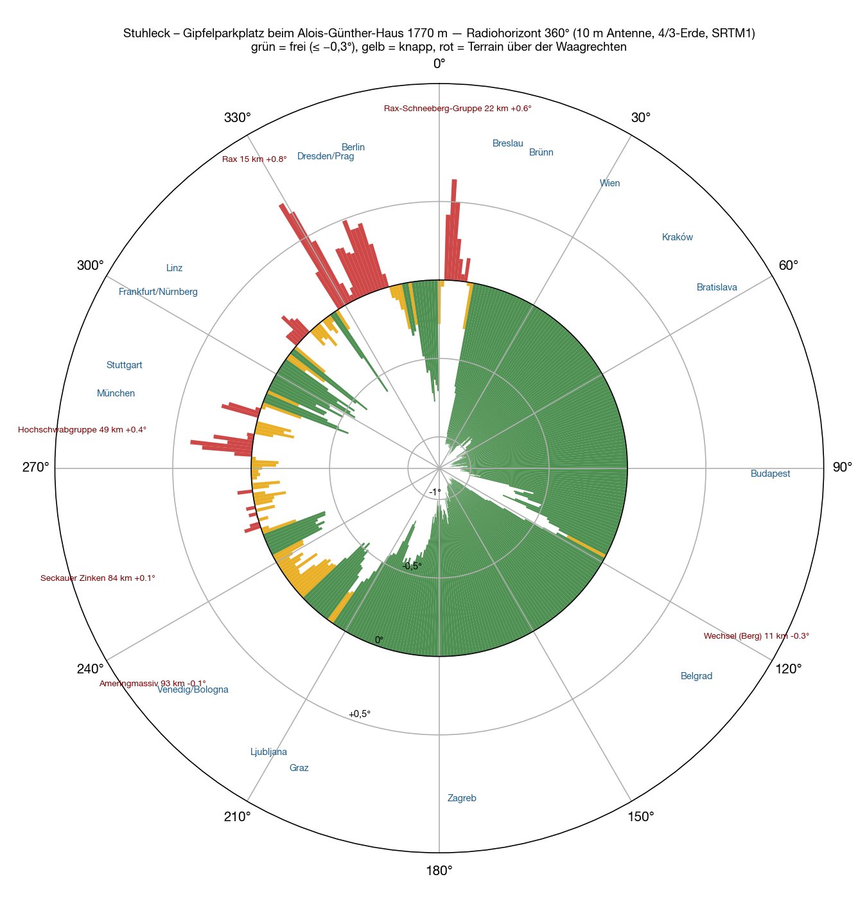
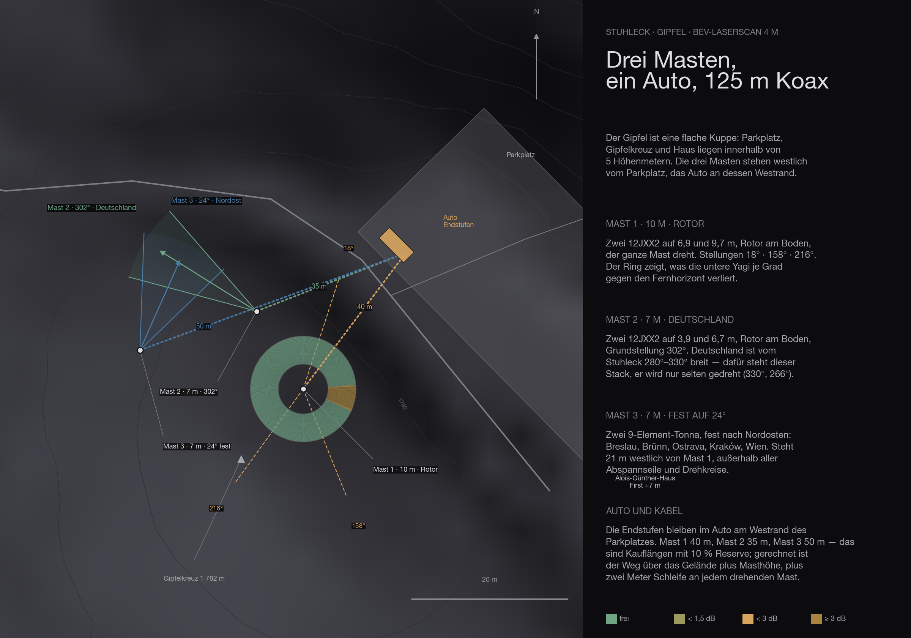
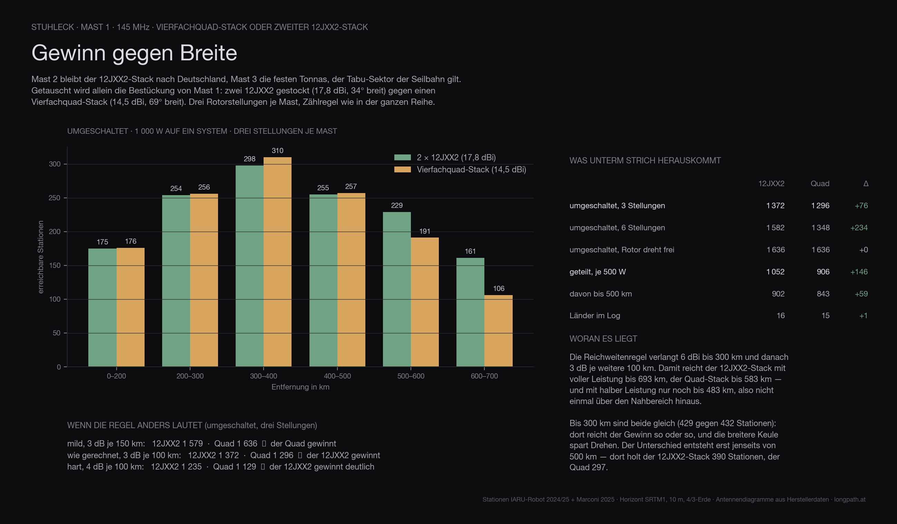
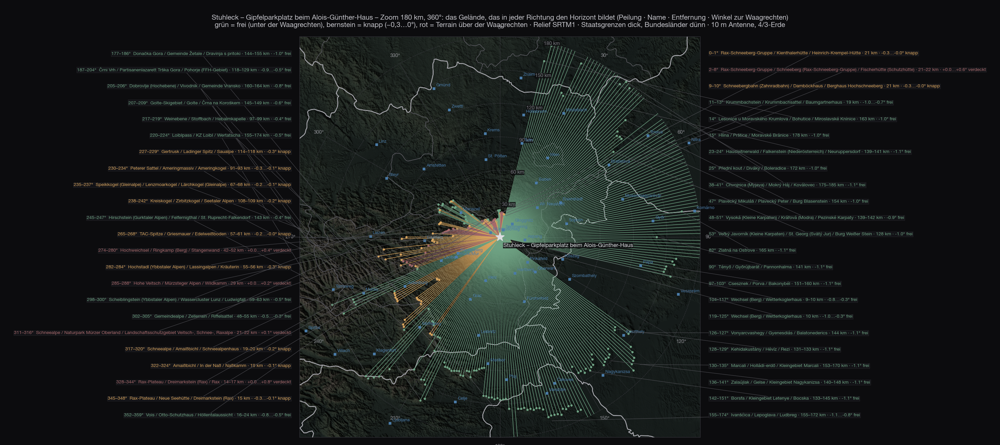
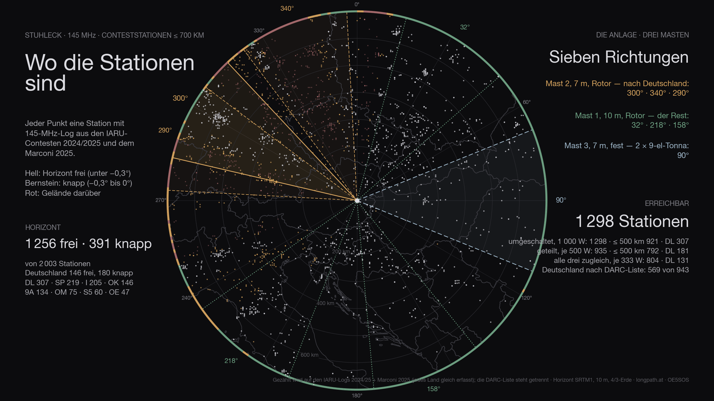
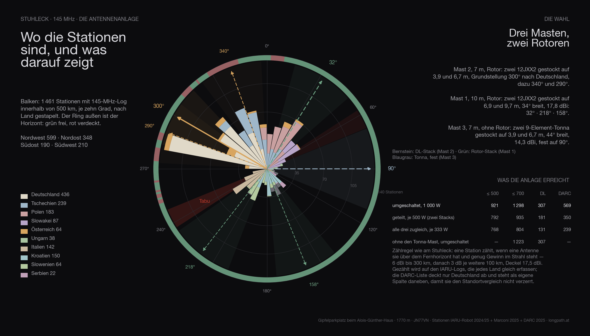

Fünf Standorte sind gerechnet, und alle fünf hatten dieselbe Frage: wie weit nach Deutschland. Das **Stuhleck** dreht die Frage um. Es ist mit **1 782 Metern** der höchste Berg der Fischbacher Alpen, steht am Ostrand der Alpen, und östlich von ihm kommt bis zur Tatra nichts mehr, das höher wäre. Auf dem Gipfel steht das **Alois-Günther-Haus**, daneben ein Schotterparkplatz, zu dem eine Straße hinaufführt — der Standort, zu dem man nicht gehen muss, diesmal ganz oben. Im IARU-Contest 2025 hat von hier eine Station mit fünf Watt und einer Zehn-Element-Yagi 155 Verbindungen gemacht. Das war der Anlass, ihn zu rechnen.

## Wie

Die Methode ist dieselbe wie bei den [fünf Standorten davor](/blog/feuerkogel-horizont/#wie): SRTM-Geländemodell, ein Strahl je Grad, zehn Meter Antenne, 4/3-Erde, 500 Kilometer weit, die Namen der Hindernisse aus der Wikipedia; dazu der zweite Schritt aus dem [Feuerkogel-Beitrag](/blog/feuerkogel-stationen/), die 3 215 Contestlogs der IARU-Conteste 2024 und 2025 auf den Standort umgerechnet. Neu ist der dritte Schritt: für die letzten hundert Meter — das Haus, den Parkplatz, das Gipfelkreuz — das Laserscan-Oberflächenmodell des Bundesamts für Eich- und Vermessungswesen, ein Meter Raster, ein halber Meter genau. Das Geländemodell kennt kein Dach; der Laserscan kennt jedes.

Der Standpunkt ist der Parkplatz beim Haus, 47,57444 N / 15,79055 O, Locator JN77VN. Der Laserscan sagt 1 779 Meter für den Parkplatz und 1 786 für den First des Hauses.

## Rundum

**Von 11° bis 226° ist der Horizont frei**, 215 Grad am Stück, und zwar nicht knapp: −0,3° bis −1,1° unter der Waagrechten. Was ihn bildet, steht weit weg — der Altvater in 298 Kilometern, die Große Fatra in 286, die Niedere Tatra in 322, der Papuk in 269, der Snežnik in 243. Wien liegt bei −1,04°, Bratislava bei −1,07°, Budapest bei −1,05°, Belgrad bei −1,11°, Zagreb bei −0,88°, Ljubljana bei −0,52°, Graz bei −0,75°. Das ist kein Fenster, das ist ein halber Kreis.

| Richtung | Was den Horizont setzt | Entfernung | Winkel |
|---|---|---|---|
| 11–⁠117° | Altvater, Große Fatra, Niedere Tatra, Bakony | 150–320 km | −1,1…⁠−0,3° |
| 119–⁠226° | Papuk, Medvednica, Pohorje, Snežnik, Karawanken | 100–270 km | −1,1…⁠−0,3° |
| 227–⁠273° | Amering, Gleinalpe, Zirbitzkogel, Wildfeld, Trenchtling | 40–120 km | −0,3…⁠+0,1° |
| 274–⁠280° | **Hochschwab** | 49 km | +0,0…⁠+0,4° |
| 285–⁠290° | **Hohe Veitsch** | 30 km | +0,0…⁠+0,2° |
| 291–⁠305° | Dürrenstein, Tonion, Ötscher | 35–60 km | −0,6…⁠−0,3° |
| 311–⁠316° | **Schneealpe** | 21 km | +0,1…⁠+0,2° |
| 328–⁠344° | **Rax** | 15 km | +0,0…⁠+0,8° |
| 2–⁠8° | **Schneeberg** | 22 km | +0,1…⁠+0,6° |

Die andere Hälfte ist nicht zu, sie ist nur nicht frei. Vier Berge stehen im Nordwesten und Norden knapp über der Waagrechten: der Hochschwab mit +0,4°, die Veitsch mit +0,2°, die Schneealpe mit +0,2° und die Rax mit +0,8° — und der Schneeberg mit +0,6° im Norden. Dahinter liegen Salzburg (+0,25°), Stuttgart (+0,1°), Budweis, Prag und Dresden (je +0,4°), Leipzig (+0,5°), Berlin (+0,2°), Poznań (+0,1°). Das sind Beugungsverluste von drei bis acht Dezibel, keine Mauer — am Feuerkogel war der Traunstein mit +0,27° derselbe Fall. Dazwischen bleibt das eine deutsche Fenster: **291° bis 305°**, zwischen Veitsch und Schneealpe hindurch, Nürnberg −0,46°, Regensburg −0,54°, Würzburg −0,53°, Passau −0,49°. München liegt bei 283° und −0,20°, knapp frei.

## Der Platz

Das Gelände der ersten 136 Meter rund um den Platz kommt aus dem **Laserscan des BEV** mit vier Meter Raster — Bäume, Gebäude und Kuppen inbegriffen. Der Boden am Mast liegt bei **1777,9 Metern**.

| Antennenhöhe | Richtungen, die das Nahfeld sperrt |
|---|---|
| 6 m | 65° |
| 8 m | 56° |
| 10 m | keine |
| 12 m | keine |
| 15 m | keine |

Mit zehn Metern Mast ist der Platz **in allen 360 Richtungen frei vom eigenen Nahfeld**. Was von hier aus zu ist, macht das Gelände in der Ferne zu, nicht der Platz selbst.

## Innerhalb von 500 Kilometern

Wer wissen will, was auf UKW ohne Einschränkung geht, bekommt hier eine kurze Liste. Frei, unter −0,3°: alles von **11° bis 117°** — Breslau, Brünn, Ostrava, Kraków, Žilina, Bratislava, Košice, Győr, Budapest, Debrecen, Szeged, also Mähren, Südpolen, die Slowakei, Ungarn und die Westukraine; alles von **119° bis 226°** — Timișoara, Novi Sad, Belgrad, Pécs, Sarajevo, Split, Zagreb, Rijeka, Ancona, Graz, Ljubljana, Bologna; das Fenster **291° bis 305°** nach Franken; und **352° bis 1°** nach Szczecin. Knapp, zwischen −0,3° und 0°: die Po-Ebene von 227° bis 242° (Triest, Klagenfurt, Venedig, Verona), München, Linz, Erfurt, Pilsen. Nicht frei, aber unter +0,8°: Salzburg, Stuttgart, Budweis, Prag, Dresden, Leipzig, Berlin, Poznań. Über +0,8° ist nichts. Von den 1 274 Logs innerhalb von 500 Kilometern haben 1 035 den Horizont unter der Waagrechten, 215 liegen bei 0° bis +0,5°, 24 bei +0,5° bis +0,8°, kein einziger darüber.

## Zwei Plätze, ein Tabu

Nach dem ersten Blatt kam eine zweite Markierung: nicht die Kuppe, sondern die Wiese südlich des Hauses, 34 Meter von seiner Südecke, 153 von der Bergstation — **Standort B**. Und eine Bedingung dazu, die vorher nicht in der Rechnung war: **Richtung Seilbahn wird nicht gesendet**, und auch nicht 180 Grad gedreht, weil die Rückkeule einer Yagi nicht auf die Bahn zeigen soll. Also noch einmal beides gerechnet, mit demselben Laserscan und derselben Regel.

Die Regel, in Grad: Bergstation und Trasse, wie sie vom Yagi-Mast aus erscheinen, plus 17 Grad — die halbe Keule der 12JXX2 — zu beiden Seiten. Von der Kuppe (A) sind das **215° bis 262°**, gedreht **35° bis 82°**. Von der Wiese (B), von der aus die Bahn genau im Westen liegt, **244° bis 288°** und **64° bis 108°**. Kein Hauptstrahl darf hinein, auch keiner der Quads; die haben mit 69 Grad ihren eigenen, breiteren Rand.

Was in den roten Sektoren liegt, ist an beiden Plätzen etwas anderes. Von A aus ist es vorwärts Italien: Triest, Venedig, Bologna, Verona, Mailand, 281 italienische Logs, dazu Slowenien — 298 Stationen, die die Yagi sonst erreicht. Rückwärts sind es Polen, die Slowakei, die Ukraine und Tschechien: Ostrava, Kraków, Žilina, Bratislava, Košice, Lwiw, 267. Von B aus liegt vorwärts der Westen: München, Innsbruck, Salzburg, Zürich, Mailand, 157 Stationen, darunter 49 deutsche; rückwärts Ungarn, die Ostslowakei, Rumänien, die Ukraine — Košice, Budapest, Debrecen, Cluj, 119.

Unter der Regel neu gerechnet, sieht der Plan anders aus. Auf der Kuppe geht Quad 2 von 216° auf **294°** — Nürnberg, Regensburg, Passau, München, Linz: das deutsche Fenster bekommt damit die feste Antenne oben auf 11,8 Metern —, Quad 1 bleibt auf 20°, und der Stack hat seine drei Stellungen im Süden, **138°, 172°, 212°**: Belgrad, Zagreb, Split, Rijeka, Ljubljana, Triest. 1 342 Stationen unter drei Dezibel, 131 weniger als ohne die Regel. Auf der Wiese steht das Haus genau im Norden, sein First neun Meter über dem Boden: die untere Quad auf acht Metern sieht von 343° bis 18° nichts mehr, die obere verliert dort vier Dezibel, die obere Yagi neun, und die untere Yagi ist von 259° bis 45° blind — dreizehn Dezibel. Der beste Plan dreht die Quads um: **216°** unten für Italien, **42°** oben über das Haus hinweg nach Brünn und Kraków, der Stack auf **118°, 164°, 294°**. 1 325 Stationen.

Ohne Tabu ist die Kuppe klar der bessere Platz, 1 473 gegen 1 331. Mit Tabu rücken beide fast gleich — A verliert seine Italien-Richtung, B verliert stattdessen den Westen und den Norden ans Haus. Was die Zahl nicht zeigt: Auf der Wiese ist die untere Yagi des Stacks nach Norden und Westen blind, dort bleibt eine Einzel-Yagi mit zweieinhalb Dezibel weniger, und alles Deutsche muss über die obere Quad gehen. Die Kuppe bleibt der Platz, an dem alle vier Antennen arbeiten.

Beim Rechnen kam eine zweite Frage auf: Deutschland ist das Land mit den meisten Stationen — gehört dorthin die Quad oder eine feste Yagi? Die Antwort hat den Plan noch einmal umgedreht; sie steht im nächsten Abschnitt.

Der [Lageplan mit beiden Standorten](/karten/stuhleck-lageplan-standorte-a-b.pdf) hat die Entfernungen zu Haus, Bergstation und Stützen für Mast 1, Mast 2 und den Punkt auf der Wiese.

## Die Wahl

Die Vorgabe war klar: Jede weite Verbindung ist besser als eine nahe, aber die meisten QSOs sind in Deutschland zu holen, und dort sitzen viele kleine Stationen — die erreichen zu können ist wichtiger als der letzte Kilometer. Also noch einmal gerechnet, mit einer Zählregel, die das abbildet: Eine Station zählt, wenn eine Antenne sie über dem Fernhorizont, unter drei Dezibel Nahfeldverlust und mit dem nötigen Gewinn im Strahl hat — sechs dBi bis 300 Kilometer, ab da drei Dezibel je hundert Kilometer. Kleine Stationen, unter fünfzig QSO im besten Contest, brauchen vier Dezibel mehr, große drei weniger. Für Deutschland kamen zu den IARU-Logs die DARC-Contestlisten dazu: 1 070 Stationen bis 750 Kilometer, 567 davon klein. Dann 42 Kombinationen: zwei Quads oder zwei Yagis fest, ein Stack fest, Quad und Yagi gemischt — gegen Yagi-Stack, Quad-Stack oder eine einzelne Antenne auf dem Rotor, auch die 14-Element-Yagi von ANJO als Kandidat.

Das Ergebnis dreht den ersten Plan um. **Die beiden 12JXX2 kommen gestockt auf Mast 2, Grundstellung 302°** — Regensburg, Nürnberg, Passau, Bayreuth, Hof, mit 17,8 dBi, München am Keulenrand mit dreizehn, was für zweihundert Kilometer reicht. **Die beiden Quads kommen gestockt auf den Rotor von Mast 1**, 69 Grad breit, 14,5 dBi, drei Stellungen: **20°** Breslau, Brünn, Ostrava, Kraków, Wien — der zweite große Block, 405 Stationen; **108°** Budapest, Belgrad, Ungarn, Serbien; **200°** Zagreb, Rijeka, Ljubljana, Triest, Venedig, so weit es das Tabu erlaubt. Der Nahbereich liegt in zwei breiten Blöcken, die eine breite Antenne ohne ständiges Nachdrehen bedient; die Ferne braucht den Gewinn, den nur der Stack hat — und Deutschland braucht beides.

Und der Yagi-Stack bekommt seinen eigenen Rotor. Grundstellung bleibt 302°, aber zwei weitere Stellungen holen, was bisher keine Antenne mit Gewinn erreicht hat: **330°** Prag, Dresden, Leipzig, Berlin — der deutsche Nordosten hinter der Rax — und **266°** Innsbruck, Zürich, Bozen, hart an der Tabu-Kante. Das ist der größte Einzelgewinn der ganzen Rechnung: 994 Stationen bis 500 Kilometer und 1 351 bis 750, gegen 968 und 1 205 mit festem Stack und 872 und 987 beim ersten Plan. In Deutschland 419 der 1 070, davon 130 kleine — beim ersten Plan waren es 159 und 49, weil eine Quad mit zwölf dBi jenseits von vierhundert Kilometern keine kleine Station mehr erreicht.

Die Quads getrennt in zwei Richtungen, Rücken an Rücken auf dem Rotor, waren die andere Überlegung — verworfen, und die Leistung sagt warum. Geht die Leistung auf alle Antennen zugleich, bekommt jedes System seinen Teil: zwei Systeme je die Hälfte, drei je ein Drittel. Zwei Quads in zwei Richtungen haben dann je zwölf dBi mit einem Drittel, der Quad-Stack 14,5 mit der Hälfte — 4,3 Dezibel Unterschied je Richtung, und die Zählregel macht daraus 520 statt 871 Stationen bis 750 Kilometer. Und beides ist schwächer als die Anlage, die nur auf ein System zugleich sendet und mit den anderen hört: die ganze Leistung auf den Stack, der gerade dran ist, ergeben die 1 351. Senden auf eine Antenne, hören auf allen — das ist die Regel, die aus der Rechnung folgt. Wer trotzdem immer auf allen sendet und nur das Hören umschaltet, bekommt mit halber Leistung je Stack andere beste Stellungen: der Yagi-Stack bleibt in Grundstellung 302°, geht aber statt nach Sachsen und in die Schweiz nach **18°** (Kraków, Žilina) und **86°** (Košice, Budapest), weil die Ferne hinter der Rax mit halber Leistung ohnehin nicht mehr geht; die Quads auf 20°, 136°, 200°. Das gibt 854 und 950 Stationen, Deutschland 226, davon 64 kleine — ein Drittel weniger als mit dem Umschalter, in Deutschland fast die Hälfte. Bleibt der Yagi-Stack immer auf 302° stehen und dreht nur der Quad-Stack (20°, 116°, 200°), sind es 783 und 817 — Deutschland dasselbe, die siebzig fehlenden sind Kraków und Košice mit dem Yagi-Gewinn. Ein ungleicher Teiler, zwei Drittel für den Yagi-Stack, brächte 1 010 bis 750 Kilometer und 262 deutsche.

Die Masten sind kürzer als gedacht: zehn Meter für die Quads, siebeneinhalb für die Yagis. Auf der Kuppe macht das nichts aus — der Laserscan für jede Höhe neu gerechnet gibt bei acht Metern dieselben Zahlen wie bei dreizehn, weil nach allen Seiten nur das Haus im Nahfeld steht, und dorthin zeigt keine Stellung lange. Was zählt, ist der Stack, nicht die Höhe: ein Mast mit nur einer Antenne kostet hundert Stationen im Nahbereich. Mast 1 auf der Kuppe, zwölf Meter vom Gipfelkreuz, trägt die Quads auf 6,4 und 9,7 Metern; Mast 2, zwölf Meter weiter nordwestlich, die Yagis auf 4,0 und 7,5 — vom Quad-Mast aus liegt der Yagi-Mast bei 328°, außerhalb jeder Quad-Stellung, und vom Yagi-Mast aus liegen die Quads bei 148°, in Grundstellung hinter dem Stack. Abgespannt wird der Yagi-Mast bei 3,3 Metern, unter Rotor und unterer Yagi, damit kein Seil durch die Elemente läuft.

Der [Lageplan als PDF, Stand 5](/karten/stuhleck-lageplan-antennenanlage.pdf) hat die Anlage so, wie sie steht: alle drei Masten mit Koordinaten, Höhen, Richtungen und Abspannradien, die Entfernungen zu Haus, Gipfelkreuz, Bergstation und Fahrzeug, die drei Koaxwege mit ihren Längen und die Quellen.

**Nachtrag, 29. September: auch auf Mast 1 zwei Yagis.** Statt des Quad-Stacks kommt ein zweiter 12JXX2-Stack auf den Rotor von Mast 1, auf 6,4 und 9,7 Metern, wie am Feuerkogel. Die Keule wird schmaler, 34 statt 69 Grad, und hat 3,3 Dezibel mehr. Die drei Stellungen, nach derselben Regel gerechnet und außerhalb des Tabus: **18°** Breslau, Brünn, Wien, Poznań; **158°** Sarajevo, Split, Banja Luka, Skopje; **216°** Ljubljana, Rijeka, Triest, Venedig, Bologna. Geteilt auf beide Stacks sind es **948 Stationen statt 894**, Deutschland 316 wie vorher, und 330 000 statt 270 000 Kilometer — der Gewinn trägt weiter. Umgeschaltet sind es 1 308 statt 1 331: Im Nahbereich holt die breite Quad mehr, 1 006 gegen 869 bis 500 Kilometer, die Yagis holen dafür die Ferne. Das Blatt oben und die 3D-Szene zeigen schon beide Yagi-Stacks; der Text darüber beschreibt noch den Plan mit den Quads.

Bleibt die Frage, die der Tausch aufwirft: **Hätte der Vierfachquad-Stack auf Mast 1 nicht mehr gebracht?**
Er ist mit 69 Grad doppelt so breit wie der 12JXX2-Stack mit 34 — eine Rotorstellung deckt also doppelt so
viel Himmel ab. Dafür hat er 3,3 Dezibel weniger Gewinn.

Gerechnet mit allem anderen gleich — Mast 2 bleibt der 12JXX2-Stack nach Deutschland, Mast 3 die festen
Tonnas, der Tabu-Sektor gilt — sieht es so aus:

| | 2 × 12JXX2 | Vierfachquad | Unterschied |
|---|---:|---:|---:|
| umgeschaltet, drei Stellungen | 1 372 | 1 296 | +76 |
| umgeschaltet, sechs Stellungen | 1 582 | 1 348 | +234 |
| umgeschaltet, Rotor dreht frei | 1 636 | 1 636 | 0 |
| geteilt, je 500 W | 1 052 | 906 | +146 |
| davon bis 500 km | 902 | 843 | +59 |

**Bis 300 Kilometer sind beide gleich** — 429 gegen 432 Stationen. Dort reicht der Gewinn so oder so, und
die breitere Keule spart Drehen. Der Unterschied entsteht jenseits von 500 Kilometern: dort holt der
12JXX2-Stack 390 Stationen, der Quad 297. Der Grund steht in der Reichweitenregel: 6 dBi bis 300 km, danach
3 dB je weitere 100 km. Damit reicht der 12JXX2-Stack mit voller Leistung bis 693 Kilometer, der Quad bis
583 — und mit halber Leistung nur noch bis 483, also nicht einmal über den Nahbereich hinaus.

Zwei Einschränkungen, die ehrlich dazugehören. Erstens: **Mit einem Rotor, der frei dreht, sind beide
gleichwertig** (1 636 Stationen) — die Breite ersetzt nur das Drehen, und drehen kann der Rotor ohnehin.
Zweitens hängt das Ergebnis an der Regel: Wäre sie milder angesetzt — 3 dB je 150 statt je 100 Kilometer —,
läge der Quad mit 1 636 gegen 1 579 vorn. Die Regel ist eine Annahme, keine Messung.

Für den Betrieb hier bleibt es trotzdem beim zweiten 12JXX2-Stack: Es wird mit festen Stellungen gearbeitet,
nicht mit dauernd drehendem Rotor, und bei geteilter Leistung fällt der Quad-Stack hinter die 500-Kilometer-
Marke zurück.

## Masten und Abspannung

<figure class="szene">
  <iframe src="/stuhleck-masten-3d.html?v=9" title="Stuhleck-Gipfel in 3D mit drei Masten: zweimal zwei 12JXX2 auf Rotor am Boden und zwei 9-Element-Tonnas fest auf 24°, alle Abspannseile mit Länge und Winkel" loading="lazy" allowfullscreen></iframe>
  <figcaption>Ziehen dreht, das Rad zoomt. Links die Länge und der Winkel jedes Seils, gerechnet auf dem Laserscan-Gelände, und die Prüfung der Abstände. <a href="/stuhleck-masten-3d.html">Im Vollbild öffnen</a></figcaption>
</figure>

Die Anlage steht auf drei Masten. **Mast 1** und **Mast 2** tragen je zwei 12JXX2, der Rotor steht am Boden und dreht den ganzen Mast, oben läuft er durch das Oberlager. Boom und Elemente überstreichen dabei einen Kreis von 2,85 Metern Radius, und durch diesen Kreis darf kein Seil laufen; darum hängen alle Seile unter der unteren Yagi. **Mast 1**, der Rotor-Stack, ist zehn Meter hoch, Yagis auf 6,9 und 9,7 Metern, Seile am Oberlager auf 6,4 und an einem zweiten Lager auf 3,3 Metern, Anker fünf Meter vom Mast, 47 Meter Seil. Die Höhe hat einen Grund: Der Laserscan zeigt, dass der Stack erst ab etwa zehn Metern nach Osten über das Alpenhaus schaut — 43 Stationen in Ungarn und Rumänien mehr als mit sieben Metern, zwölf Meter brächten nur noch 16 dazu. **Mast 2**, der Deutschland-Stack, braucht das nicht: Zwischen 260 und 350 Grad ist von sechs bis zwölf Metern jede Höhe gleich gut, also sieben Meter, Yagis auf 3,9 und 6,7 Metern, Oberlager auf 3,4 Metern, Anker dreieinhalb Meter, 16 Meter Seil. Er wird von Hand gedreht, mit Klemme und Marken am Mastfuß für 302°, 330° (Prag, Dresden, Berlin) und 266° (München, Innsbruck); Mast 1 dreht frei, außer Richtung Seilbahn.

**Mast 3** trägt zwei 9-Element-Tonnas fest auf **24°** — Breslau, Brünn, Ostrava, Kraków, Wien, nach Deutschland der größte Block. Er ist ebenfalls sieben Meter hoch, ohne Rotor, die Tonnas auf 3,9 und 6,7 Metern, und steht rund 21 Meter westlich von Mast 1; er ist nur einmal abgespannt, auf 6,3 Metern knapp unter der oberen Tonna, drei Seile seitlich am Boom vorbei, Anker fünfeinhalb Meter, 28 Meter Seil. Gespeist wird er über einen Umschalter: Rotor allein, Tonna allein oder beide geteilt. Solange Stationen rufen, läuft der Rotor mit voller Leistung; über den ganzen Contest bringt die Tonna kaum Punkte, fest geteilt würde sie ein Fünftel kosten. In ruhigen Phasen, nachts oder am Sonntagvormittag, schaltet man auf „beide“ und ruft in drei Richtungen zugleich: Deutschland, Nordost und den Rotor irgendwo sonst, im Mittel mit rund vierzig Prozent mehr Stationen in Reichweite.

Mast 1 und Mast 2 stehen 11,7 Meter auseinander, Mast 3 gut 21 Meter von Mast 1. Kein Seil kommt einer Yagi näher als 0,4 Meter, in jeder Stellung der beiden Rotoren, und die Seile der Masten bleiben mehr als sechs Meter voneinander weg. Die Seile sind aus Kunststoff, damit sie das Diagramm nicht stören. Das Auto mit den Geräten steht am Westrand des Parkplatzes; dorthin sind es am Boden entlang, den Mast hinauf und mit Schleife und Reserve 40 Meter Koax von Mast 1, 35 von Mast 2 und 50 von Mast 3, mit Ecoflex 15 also 1,0 bis 1,5 dB.

## Stuhleck und Feuerkogel

Für den Feuerkogel ist die Anlage inzwischen auch gerechnet, [zweimal zwei Yagis](/blog/feuerkogel-antennen/), einer fest nach Deutschland, einer auf dem Rotor. Damit lassen sich beide Standorte mit ihrer eigenen Anlage und derselben Regel vergleichen:

| | Stuhleck | Feuerkogelhaus |
|---|---|---|
| Stationen frei ≤ 700 km | **1 741** | 1 388 |
| Länder | **18** | 10 |
| Deutschland frei (DARC) | 606 von 943 | **1 107 von 1 319** |
| Anlage, umgeschaltet | **1 308** | 1 183 |
| davon bis 500 km | **869** | 717 |
| davon Deutschland (DARC) | 551 | **1 035** |
| Anlage, geteilt | **948** | 895 |
| davon Deutschland (DARC) | 316 | **710** |
| Σ Kilometer frei | **754 000** | 627 000 |

Das Stuhleck hat mehr Stationen, mehr Länder und den besseren Nahbereich. Der Feuerkogel erreicht mit seiner Anlage fast doppelt so viele deutsche Stationen, weil vor dem deutschen Norden dort kein Berg steht. Geteilt auf beide Stacks liegt das Stuhleck knapp vorn, 948 gegen 895. Beide Anlagen sind jetzt zweimal zwei 12JXX2. Wer deutsche Stationen sammelt, fährt auf den Feuerkogel, wer Länder und Kilometer im Süden und Osten sammelt, aufs Stuhleck.

## Die Standortwahl

Am Ende zählen im Contest Kilometer. Darum noch einmal beide Standorte mit derselben Anlage, zweimal zwei 12JXX2, beide Stacks senden gleichzeitig, einer steht auf Deutschland (Feuerkogel 328°, Stuhleck 302°). Gezählt ist die Summe der Kilometer aller erreichten Stationen bis 700 km, einmal mit dem Rotor-Stack auf seinen drei besten Stellungen, einmal frei gedreht, so wie im Contest nach Cluster und Sked gedreht wird. Beim Stuhleck dazu die Variante ohne Tabu, falls die Bergbahn das Senden Richtung Seilbahn erlaubt.

| Punkte (km) | Feuerkogel | Stuhleck mit Tabu | Stuhleck ohne Tabu |
|---|---|---|---|
| halbe Leistung je Stack, Rotor auf 3 Stellungen | **327 000** (845 Stationen) | 298 000 (869) | 322 000 (890) |
| halbe Leistung je Stack, Rotor dreht frei | 415 000 (1 051) | 437 000 (1 222) | **506 000** (1 357) |
| volle Leistung je Stack, Rotor auf 3 Stellungen | **543 000** (1 240) | 463 000 (1 182) | 497 000 (1 181) |
| volle Leistung je Stack, Rotor dreht frei | 622 000 (1 375) | 681 000 (1 624) | **753 000** (1 738) |

Der Feuerkogel gewinnt nur, solange der Rotor auf wenigen Stellungen bleibt; dann trägt Deutschland alles. Wird gedreht, liegt das Stuhleck vorn, mit Tabu um 5 bis 10 Prozent, ohne Tabu um gut 20 Prozent, und der Abstand wächst mit der Leistung, weil am Stuhleck viel mehr Stationen frei zu sehen sind. Dazu kommt der Aufbau: freie Kuppe, Auto daneben, gegen Masten eng am Haus zwischen Weg, Rampe und Abbruch. Und der Plöckenstein, wo OE5BGN funkt, liegt vom Feuerkogel 107 Kilometer genau in der Richtung Prag–Berlin, vom Stuhleck 195 Kilometer hinter der Rax. Die Wahl fällt aufs Stuhleck.

## Die Karte

Auf dem Zoom sieht man, wie ungleich die Striche sind: nach Osten und Süden laufen sie aus der Karte hinaus, nach Nordwesten enden sie nach fünfzehn bis fünfzig Kilometern an der Rax, der Schneealpe, der Veitsch, dem Hochschwab.

## Bis 700 Kilometer

<figure class="zoomkarte" data-basis="/karten/horizont/stuhleck-horizont-" data-min="200" data-max="700" data-schritt="100" data-start="200">
  
  <figcaption>
    <button type="button" data-zoom="-1" aria-label="Radius um 100 km verkleinern">−</button>
    Radius 200 km
    <button type="button" data-zoom="+1" aria-label="Radius um 100 km vergrößern">+</button>
  </figcaption>
</figure>

Beide Karten als PDF: [Zoom 180 km](/karten/stuhleck-horizont-zoom-180km.pdf) mit den Bergnamen und [Übersicht 800 km](/karten/stuhleck-horizont-uebersicht-800km.pdf) mit der nummerierten Liste — von den Gebirgen rundum ragen nur Schneeberg und Hochschwab über die Waagrechte, alle anderen bilden den Horizont von unten.

## Die Stationen

Von den 2 003 Stationen, die in den Logs bis 700 Kilometer auftauchen, stehen **1 647 über dem Horizont** — Deutschland 326 von 513. Das ist die Obergrenze: mehr kann keine Antenne herausholen, egal wie groß sie ist.

Die Zahl hat aber zwei Hälften. **Wirklich frei** — der Horizont liegt mehr als drei Zehntelgrad unter der Waagrechten — sind 1 256 Stationen, davon 146 in Deutschland. Die übrigen 391 liegen **knapp**: zwischen −0,3° und null, also im Streifschatten einer Kante. Dort geht etwas, aber mit Verlust — drei bis acht Dezibel, je nach Tag. Der Beitrag nennt beide Zahlen, weil nur beide zusammen den Platz beschreiben. Von den 248 Grad, die frei sind, kommen 64 Grad knappe dazu.

## Die Anlage

Gerechnet ist überall dieselbe Anlage wie am Stuhleck, mit **drei Masten**:

- **Mast 2**, 7 Meter, Rotor: zwei 12JXX2 gestockt auf 3,9 und 6,7 m — der Stack, der nach Deutschland schaut.
- **Mast 1**, 10 Meter, Rotor: zwei 12JXX2 gestockt auf 6,9 und 9,7 m, 34° breit, 17,8 dBi.
- **Mast 3**, 7 Meter, ohne Rotor: zwei gestockte 9-Element-Tonna auf 3,9 und 6,7 m, 44° breit, 14,3 dBi — fest auf eine Richtung.

Die Stellungen sind nicht geraten, sondern gesucht: Für Stuhleck fallen sie auf **300° / 340° / 290°** am DL-Stack, **32° / 218° / 158°** am Rotor-Stack und **90°** für die festen Tonnas.

Gespeist wird über einen Umschalter. Liegen die vollen 1 000 Watt auf dem System, auf dem gerade gearbeitet wird, kommt die Anlage auf **1 298 Stationen** (Deutschland 307, nach der DARC-Liste 569). Teilt man die Leistung auf die beiden Rotor-Stacks, also 500 Watt je Stack, sind es 935; auf alle drei Systeme zugleich verteilt nur noch 804 — drei Richtungen kosten mehr Leistung, als sie an Fläche bringen. Der Tonna-Mast allein steuert 75 Stationen bei, die ohne ihn fehlen würden.

## In drei Dimensionen

<figure class="szene">
  <iframe src="/stuhleck-3d.html?v=20" title="Stuhleck-Gipfel in 3D: Orthofoto auf dem Laserscan-Gelände mit drei Masten — zweimal zwei gestockte 12JXX2 auf Rotor und zwei 9-Element-Tonnas fest auf 24° — dem Auto, der Bergstation der Steinbachalmbahn und dem Tabu-Sektor Richtung Seilbahn" loading="lazy" allowfullscreen></iframe>
  <figcaption>Ziehen dreht, das Rad zoomt. Oben links schaltest du zwischen den Standorten A (heute), C (Vorschlag) und der Südwiese um — Masten, Tabu-Sektor und Zahlen wandern mit. Die Knöpfe stellen die festen Richtungen — DL-Stack 302° / 18° / 86°, Rotor-Stack 18° / 158° / 216° —, die Regler jede andere; darunter je Stack die Stationen, Länder und Städte im Hauptstrahl und eine Warnung, wenn eine Richtung im Tabu liegt. „Drehen“ lässt die Ansicht langsam kreisen, „Stopp“ hält sie an; „Bergstation“ schwenkt zur Seilbahn. <a href="/stuhleck-3d.html">Im Vollbild öffnen</a></figcaption>
</figure>

Das Orthofoto von basemap.at liegt auf dem Laserscan-Gelände, ein Pixel ist zwanzig Zentimeter, die Masten, die Quads und der Stack sind maßstäblich. Was die Szene zeigt, ist nicht die Aussicht — die kommt aus dem Geländemodell —, sondern das, was in den ersten hundertfünfzig Metern steht: das Haus, der Parkplatz, das Gipfelkreuz, die Kuppe — und 120 Meter südwestlich die Bergstation der Steinbachalmbahn, ein Dachbau von achtzehn mal sieben Metern auf Stützen, acht Meter hoch, mit den beiden Seilsträngen, die über zwei Stützen ins Tal gehen. Von den Antennen aus liegt ihr Dach fünf bis acht Grad unter der Waagrechten; sie steht in keinem Sektor im Weg, und der Knopf „Bergstation“ zeigt das aus der Sicht der Masten. Nichts davon ist im Weg. Die Szene zeigt die Anlage, wie sie am Ende geplant ist — zwei Stacks auf zwei Rotoren, der Yagi-Stack in Grundstellung nach Deutschland, dazu der rote Sektor; wie es dazu kam, steht in den nächsten beiden Abschnitten.

## Der Vergleich

Alle Standorte dieser Reihe mit **derselben Anlage, derselben Zählregel und denselben Logs** — nur so sind die Zahlen vergleichbar. Erreichbar heißt: Horizont unter der Waagrechten und genug Gewinn für die Entfernung (6 dBi bis 300 km, danach 3 dB je weitere 100 km), bei 1 000 Watt auf dem System, mit dem gerade gearbeitet wird.

Gezählt wird auf den **IARU-Logs 2024/2025 und dem Marconi 2025**: die erfassen jedes Land gleich. Die DARC-Liste deckt nur Deutschland ab — sie steht als eigene Spalte daneben, sonst gewinnt jeder Standort, der nach Westen schaut, allein durch die Datenlage.

| Standort | erreichbar | Deutschland | DARC-Liste | ≤ 500 km | Zugang |
|---|---:|---:|---:|---:|---|
| Traisner Hütte · 1 304 m | 1 378 | 543 | 988 | 875 | Sessellift, dann zu Fuß |
| Grünberg · 989 m | 1 376 | 672 | 1 271 | 826 | Seilbahn, Gasthaus |
| **Stuhleck** · 1 770 m | 1 298 | 307 | 569 | 921 | Auto bis oben |
| Feuerkogelhaus · 1 591 m | 1 258 | 571 | 1 056 | 726 | Seilbahn, Gasthaus |
| Braunsberg · 337 m | 1 124 | 443 | 814 | 740 | Auto bis oben |
| Gaisberg · 1 272 m | 1 036 | 620 | 1 199 | 618 | Auto bis oben |
| Hochkar · 1 478 m | 438 | 321 | 559 | 247 | Auto bis oben |
| Loser · 1 585 m | 0 | 0 | 0 | 0 | Auto bis oben |

Stuhleck steht damit auf **Platz 3 von 8**.

Wer die älteren Beiträge dieser Reihe kennt, findet dort andere Zahlen: Die wurden mit der ersten Bestückung gerechnet — ein Yagi-Stack und ein Vierfachquad-Stack mit 69° Keulenbreite. Seit die Wahl auf zwei schmale 12JXX2-Stacks gefallen ist, verschiebt sich die Reihenfolge: Mehr Gewinn, weniger Breite bevorzugt die Standorte, deren Stationen in einer Richtung gebündelt liegen, und kostet die, die rundum offen sind. Die festen Tonnas auf Mast 3 holen einen Teil dieser Breite zurück.

## Die Daten

| | |
|---|---|
| Standort | Stuhleck — Gipfelparkplatz beim Alois-Günther-Haus |
| Koordinaten | 47,57444 N / 15,79055 O · 1 770 m · JN77VN |
| Zugang | Straße bis zum Platz |
| Horizont frei | 345°–1°, 9°–251°, 264°–273°, 289°–310° … |
| Grad frei / knapp / zu | 248° / 64° / 48° |
| Stationen ≤ 700 km | 1 256 frei, 391 knapp, von 2 003 |
| Deutschland (IARU) | 146 frei, 180 knapp, von 513 |
| Deutschland (DARC-Liste) | 605 unter der Waagrechten von 943 |
| Anlage | drei Masten · Mast 1 10 m (2 × 12JXX2 auf 6,9/9,7 m, Rotor) · Mast 2 7 m (2 × 12JXX2 auf 3,9/6,7 m, Rotor) · Mast 3 7 m (2 × 9-el-Tonna auf 3,9/6,7 m, fest) |
| Stellungen | DL-Stack 300° / 340° / 290° · Rotor-Stack 32° / 218° / 158° · Tonna fest 90° |
| umgeschaltet · 1 000 W | 1 298 · ≤ 500 km 921 · DL 307 · DARC 569 |
| geteilt · je 500 W | 935 · ≤ 500 km 792 · DL 181 |
| alle drei zugleich · je 333 W | 804 · ≤ 500 km 768 · DL 131 |
| ohne den Tonna-Mast | 1 223 statt 1 298 |
| Σ Kilometer | 511 695 km |
| mit strengem Maß | nur Richtungen unter −0,3°: 737 · ≤ 500 km 611 · DL 71 |

## Was das heißt

Das Stuhleck ist der Standort dieser Reihe mit dem breitesten Horizont: 248 von 360 Grad liegen mehr als drei Zehntelgrad unter der Waagrechten, achtzehn Länder sind frei erreichbar, und der Platz ist mit dem Auto erreichbar. Was fehlt, ist Deutschland: Rax, Schneeberg, Schneealpe und Hochschwab stehen zwischen 274° und 344° mit bis zu +0,8° im Weg, und dahinter liegt die Masse der deutschen Stationen.

Für einen Contest heißt das: Der Stuhleck gewinnt über die Summe — Italien, Kroatien, Slowenien, Ungarn, Slowakei, Polen, Tschechien — und verliert gegen [Grünberg](/blog/gruenberg-horizont/), [Gaisberg](/blog/gaisberg-horizont/) und [Feuerkogel](/blog/feuerkogel-horizont/), sobald nur Deutschland zählt. Mit der Anlage aus drei Masten und 1 000 Watt auf dem jeweils arbeitenden System sind es 1 298 Stationen, davon 921 innerhalb von 500 Kilometern.

## Vorbehalt

Das Geländemodell hat dreißig Meter Raster; für den Gipfel selbst steht der Laserscan mit einem Meter dagegen, für den Rest die Standardatmosphäre. Die Stationszahlen sind Logs, keine Stationen, und zwei Jahre alt. Ob man mit dem Auto bis zum Haus darf, sagt keine Karte; die Straße ist eine Forststraße, und das Haus gehört dem Alpenverein. Und die Steinbachalmbahn endet 120 Meter südwestlich vom Gipfelkreuz — ob sie im September fährt, ist eine Frage an die Bergbahnen, nicht an das Geländemodell.

Was die Rechnung sagt: Das Stuhleck ist der Berg, von dem man Europa sieht. Deutschland sieht man von anderen.
