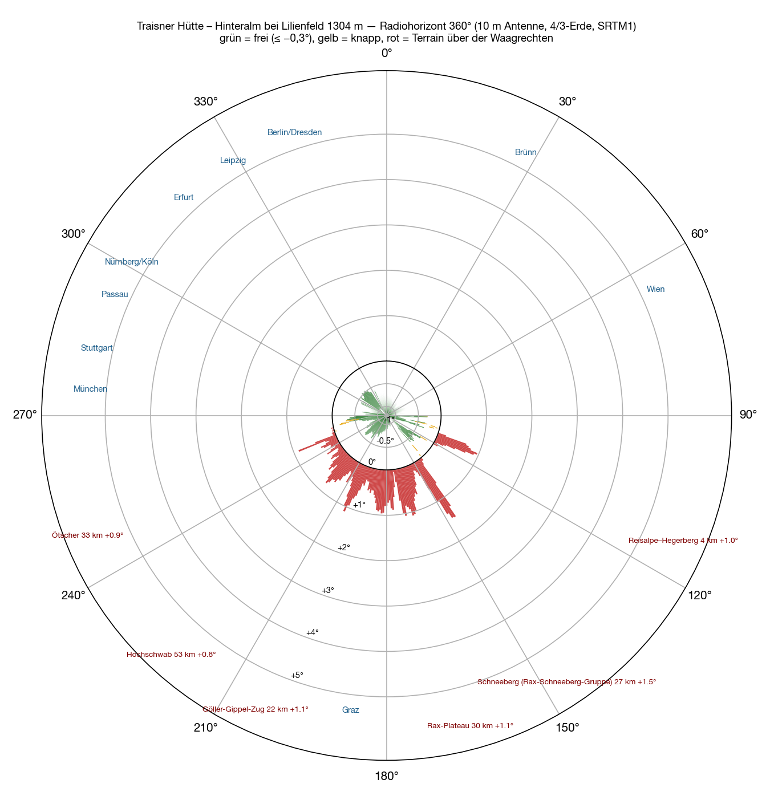

Die **Traisner Hütte** steht auf der Hinteralm, einen Kilometer südlich des Muckenkogels, hoch über Lilienfeld: 1922 von den Naturfreunden gebaut, **1 311 Meter**, JN77TX. Das Geländemodell sagt für den Punkt 1 304 Meter, die Antenne rechnet zehn Meter darüber. Die Hütte steht in der Standortliste meines Contest-Loggers — gerechnet hatte ich sie noch nie.

Eine öffentliche Straße hinauf gibt es nicht. Die Wikipedia nennt den Sessellift auf den Muckenkogel und dann 45 Minuten zu Fuß, oder zweieinhalb Stunden von Lilienfeld. OpenStreetMap kennt nur Forststraßen: Schotter bis sechzig Meter an die Hütte, ein Stück beim Lift ausdrücklich gesperrt. Ob ein Auto hinaufdarf, entscheidet nicht das Geländemodell.

Die Methode wie bei [Feuerkogel](/blog/feuerkogel-horizont/#wie), [Grünberg](/blog/gruenberg-horizont/), [Loser](/blog/loser-horizont/) und [Hochkar](/blog/hochkar-horizont/): SRTM-Geländemodell, ein Strahl je Grad, zehn Meter Antenne, 4/3-Erde, Namen aus der Wikipedia. Dazu ein Raster von 400 Metern rund um die Hütte.

## Rundum

Das Bild ist anders als bei den vier Standorten davor: rundum kommt nichts über **anderthalb Grad**. Die Hütte steht auf der Kuppe, und das einzige Hindernis in der Nähe ist die Reisalpe.

**Von 264° über Nord bis 101° ist es frei**, 198 Grad am Stück, −0,3 bis −0,96° — nur bei 91° streift der Hochstaff die Marke, mit −0,29°. Nach Westen und Nordwesten bilden die Oberösterreichischen Voralpen, der Hausruck, das Mühlviertel, der Böhmerwald und das Waldviertel den Horizont, 45 bis 156 Kilometer weit weg. Nach Norden und Osten liegt er noch weiter draußen: Böhmisch-Mährische Höhe, Pollauer Berge, Leiser Berge, Kleine und Weiße Karpaten, meist 90 bis 260 Kilometer, −0,7 bis −0,96°. Dazu kommen zwei kleinere Fenster: 106° bis 108° und 123° bis 138°, über die Dürre Wand nach Südosten.

**Zu ist es von 141° bis 252°** — aber nicht durch einen Rücken vor der Tür, sondern durch die großen Berge im Süden, alle 21 bis 122 Kilometer entfernt: Schneeberg +1,5°, Rax +1,1°, Schneealpe +1,0°, Göller und Gippel +1,1°, Hochschwab +0,8°, Ötscher +0,9°. Die einzige Ausnahme in der Nähe ist die **Reisalpe**, vier Kilometer südöstlich und knapp neunzig Meter höher: sie macht 109° bis 121° zu, mit höchstens +1,0°.

| Richtung | Was den Horizont setzt | Entfernung | Winkel |
|---|---|---|---|
| 264–⁠359° | **frei** — Oberösterreichische Voralpen, Hausruck, Mühlviertel, Böhmerwald, Waldviertel | 45–156 km | −0,3…⁠−0,8° |
| 0–⁠88° | **frei** — Böhmisch-Mährische Höhe, Pollauer Berge, Leiser Berge, Kleine und Weiße Karpaten | 90–260 km | −0,7…⁠−1,0° |
| 89–⁠101° | frei — Hochstaff, Almesbrunnberg, Unterberg | 6–24 km | −0,3…⁠−0,9° |
| 102–⁠105° | Unterberg, knapp | 16 km | −0,05…⁠−0,3° |
| 109–⁠121° | **Reisalpe** | 4 km | +0,1…⁠+1,0° |
| 123–⁠138° | frei — Dürre Wand, Öhler, Schober | 24–30 km | −0,3…⁠−0,6° |
| 141–⁠152° | **Schneeberg** | 24–31 km | +0,1…⁠+1,5° |
| 153–⁠201° | Wechsel, Rax, Schneealpe, Hohe Veitsch | 21–57 km | +0,1…⁠+1,1° |
| 202–⁠213° | Göller, Gippel, Tonion | 21–34 km | +0,3…⁠+1,1° |
| 214–⁠229° | Hochschwab-Gruppe: Aflenzer Staritzen, Seeberg | 44–62 km | +0,4…⁠+0,8° |
| 230–⁠240° | Ennstaler Alpen, Kräuterin, Gemeindealpe | 33–106 km | +0,1…⁠+0,35° |
| 241–⁠249° | Dürrenstein, Hochkar, **Ötscher** | 33–60 km | +0,2…⁠+0,9° |
| 250–⁠257° | Totes Gebirge: Warscheneck, Hochmölbing, Großer Hochkasten | 69–122 km | +0,0…⁠+0,1° |
| 258–⁠263° | Sengsengebirge, Kasberg, Höllengebirge — knapp | 98–145 km | −0,0…⁠−0,3° |

Das Raster rund um die Hütte bestätigt, was die Kuppe vermuten lässt: die Hütte selbst ist der höchste Punkt, jeder der 289 Rasterpunkte in 400 Metern Umkreis liegt gleich oder tiefer. Im ganzen Sektor von 270° über Nord bis 30° ist von der Hütte aus **keine einzige Peilung zu** — null von 41.

## Die Karte

Zwei Details am Westrand. Bei 264° bildet das **Höllengebirge** den Horizont, 145 bis 148 Kilometer weit, −0,3° — und genau auf dieser Peilung, 142 Kilometer entfernt, steht das [Feuerkogelhaus](/blog/feuerkogel-horizont/): von der Traisner Hütte aus liegt es direkt auf der Sichtlinie, −0,37°. Und bei 241° ragt das [Hochkar](/blog/hochkar-horizont/) über die Waagrechte, 60 Kilometer, +0,23°: den Gipfel sieht man, den Parkplatz nicht.

## Bergstation und Muckenkogel

Wer den Lift nimmt und nicht bis zur Hütte geht, verliert weniger, als man denkt. Die **Bergstation des Muckenkogel-Sesselliftes**, 1 114 Meter, 1,4 Kilometer nördlich: München −0,49°, Nürnberg −0,50°, Köln −0,47°, Erfurt −0,34°, Berlin −0,61°, Stuttgart −0,75°, eine von 41 Peilungen im Deutschland-Sektor zu. Der **Muckenkogel-Gipfel**, 1 248 Meter: München −0,71°, Nürnberg −0,57°, Köln −0,53°, Berlin −0,67°, alles frei. Der ganze Rücken funktioniert; die Hütte ist sein bester Punkt.

## Bis 700 Kilometer

<figure class="zoomkarte" data-basis="/karten/horizont/traisnerhuette-horizont-" data-min="200" data-max="700" data-schritt="100" data-start="200">
  
  <figcaption>
    <button type="button" data-zoom="-1" aria-label="Radius um 100 km verkleinern">−</button>
    Radius 200 km
    <button type="button" data-zoom="+1" aria-label="Radius um 100 km vergrößern">+</button>
  </figcaption>
</figure>

Von den 78 Gebirgen auf der [Übersicht bis 800 Kilometer](/karten/traisnerhuette-horizont-uebersicht-800km.pdf) ragen vier über die Waagrechte, alle im Süden: Schneeberg +1,53°, Ötscher +0,91°, Hochschwab +0,87°, Hochwechsel +0,26°. Nach Norden bildet die Böhmisch-Mährische Höhe den Horizont (Javořice, 131 km, −0,65°), nach Nordosten sogar der Altvater — der Praděd in 262 Kilometern, −0,85°. Alles andere liegt darunter: Riesengebirge −0,98°, Hohe Tatra −0,99°, Erzgebirge −1,15°, Harz −1,89°, Eifel −2,34°. Beide Karten als PDF: [Zoom 180 km](/karten/traisnerhuette-horizont-zoom-180km.pdf) und [Übersicht 800 km](/karten/traisnerhuette-horizont-uebersicht-800km.pdf).

## Was das heißt

Zum ersten Mal in dieser Reihe ist **jede der dreißig deutschen Städte** unter der Waagrechten: Stuttgart −0,82°, München −0,75°, Passau −0,73°, Berlin −0,70°, Dresden −0,70°, Hamburg −0,63°, Leipzig −0,62°, Frankfurt −0,62°, Nürnberg −0,61°, Köln −0,59°, Rosenheim −0,56°, Hannover −0,50°, Erfurt −0,49°, Kassel −0,47°. Der Feuerkogel schaut nach Nordwesten tiefer — er steht 280 Meter höher —, hat aber sein Loch Richtung München und Stuttgart. Der Grünberg ist flach, das Hochkar ein Fenster, der Loser zu. Die Traisner Hütte hat kein Loch.

Dazu der Osten, den keiner der vier anderen hatte: Wien −1,2°, Bratislava −0,82°, Brünn −0,87°, Budapest −0,58°, Krakau −0,86°, Warschau −0,80°. Zu bleiben Graz +0,68°, Klagenfurt +0,34°, Ljubljana +0,75°, Zagreb +0,11°; Innsbruck liegt mit −0,06° genau auf der Kante.

Für einen Contest ist das der Standort, den man sich wünscht: nach Deutschland, Tschechien, Polen, in die Slowakei und nach Ungarn kein Sektor, den man abschreiben muss. Was fehlt, ist der Süden — Slowenien, Kroatien und die Poebene stehen hinter Hochschwab und Totem Gebirge. Der Preis ist die Höhe, 1 311 Meter statt 1 591, und der Weg hinauf.

## Vorbehalt

Rechnung, keine Messung. Das Geländemodell kennt weder Bäume noch die Hütte selbst noch den Lift, es hat ein Raster von dreißig Metern, und die Ausbreitung nimmt eine Standardatmosphäre an. Die Reisalpe in vier Kilometern ist das einzige Nahfeld-Hindernis, alles andere liegt weit genug weg, dass das einzelne Grad stimmt. Die Wikipedia-Namen auf den Karten sind das jeweils nächstgelegene Stichwort — im Süden oft eine Hütte statt des Berges.

Der Rest wird gemessen — oben, mit Antenne.
